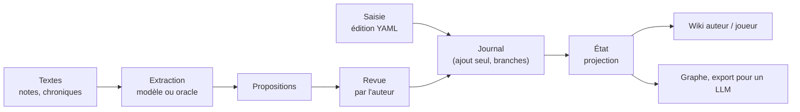

# worldkit

**Outil de worldbuilding pour un meneur de jeu qui écrit son univers de jeu de rôle** (`worldkit` est un nom provisoire).

On y construit un univers **petit ou persistant, progressivement** : on écrit des notes, des chroniques, des fiches ; l'outil en tire un **graphe versionné** de faits, que l'on lit sous forme de **wiki** (vue auteur complète, vue joueur sans les secrets) et qu'un modèle de langage peut consommer. Des **scénarios** font évoluer l'univers en **branches** ; on peut revenir sur le passé (« en fait, Aldren est mort de fièvre ») sans rien effacer.

Outil privé et local : un utilisateur, un fichier SQLite par monde, aucun service en ligne.

---

## Ce qui le distingue

- **Rien ne s'efface.** Tout changement est une *édition* inscrite dans un journal en ajout seul ; un état du monde est une projection de ce journal. Retcons, variantes et corrections créent de l'histoire, ils n'en retirent pas.
- **Le code qui décide est déterministe.** Le noyau (schéma, journal, branches, notoriété, contradictions, vues) n'appelle jamais de modèle de langage : même entrée, même sortie.
- **Le modèle de langage propose, l'auteur dispose.** L'extraction depuis des textes passe par un modèle (ou par un « oracle » de test) et ne produit que des **propositions**, qui attendent la revue de l'auteur.
- **Les contradictions sont détectées par le noyau**, jamais par un modèle : deux faits qui occupent la même *clé de fait* (Brume ne peut avoir qu'un gouvernant) sont une collision.
- **Secrets et notoriété sont natifs.** Chaque fait est `secret`, `public` ou non qualifié ; la vue joueur ne montre jamais un secret, même indirectement.



## Installation

Prérequis : **Python 3.12** ou plus récent, et Git. Les commandes ci-dessous sont pour PowerShell (Windows) ; sous Linux ou macOS, remplacer `.venv\Scripts\` par `.venv/bin/`.

```powershell
git clone https://github.com/ltimsit/WorldKit.git
cd WorldKit
python -m venv .venv
.venv\Scripts\activate
pip install -e ".[ui,dev]"
```

- `ui` : l'interface web locale (FastAPI, Uvicorn, Jinja2, markdown-it-py) ;
- `dev` : les tests (pytest, hypothesis, httpx).

Vérifier :

```powershell
worldkit --help
python -m pytest -q
```

Tous les tests doivent passer ; **aucun n'appelle un vrai modèle de langage**.

## Démarrage rapide

Construire **Valmont**, le monde de démonstration (un royaume, la ville de Brume, le baron Odon, le roi Aldren mort pendant la Chute), puis ouvrir l'interface :

```powershell
worldkit --db valmont.db world init corpus/valmont-v1/valmont/world.yaml
worldkit --db valmont.db edit apply corpus/valmont-v1/valmont/edits/base.yaml
worldkit --db valmont.db point set base
worldkit --db valmont.db serve
```

Le navigateur s'ouvre sur `http://127.0.0.1:8765/`. Le menu **Guide** mène au **guide pas à pas** ([docs/aide/guide.md](docs/aide/guide.md)) : lire un résultat, écrire un changement, essayer dans un bac à sable, ingérer un lot, faire un retcon, mesurer un extracteur, avec pour chaque cas les gestes à l'écran, la commande et la sortie attendue. Ce guide est exécuté par les tests : ce qu'il annonce est vrai.

Pour savoir ce que désigne un code affiché (une règle `R-FAI-05`, une étape `E5`, une opération `edit.apply`, un statut `pending`) : cliquer dessus, ou

```powershell
worldkit explain R-FAI-05
```

## L'interface : un banc d'essai

L'interface web est d'abord un **outil de test et de contrôle** pour les gens qui travaillent sur le projet : elle montre chaque résultat en entier, avec sa règle, ses indicateurs et son JSON brut. Ses écrans : tableau de bord, wiki et comparaison de deux lectures, graphe, branches, journal, saisie d'éditions vérifiées en direct, banc de mécanismes (une opération seule), revue des propositions, banc de pipeline (l'ingestion étape par étape, de E1 à E9), mesures de l'extraction, parcours d'acceptation, exécutions enregistrées, aide.

Les écritures faites depuis l'interface vont par défaut dans un **bac à sable** (une copie du monde) ; on le **rend réel** ensuite, après une répétition à blanc. La carte complète des écrans : [docs/aide/outils.md](docs/aide/outils.md).

Tout ce que fait l'interface passe par une **couche de service** accessible aussi en ligne de commande : `worldkit ops` liste les opérations, `worldkit call <opération> --param clé=valeur` en appelle une.

## Modèles de langage (facultatif)

Sans modèle, tout fonctionne avec l'**extracteur oracle**, qui lit les réponses attendues du corpus de test. Pour extraire avec un vrai modèle, copier `worldkit-llm.example.yaml` en `worldkit-llm.yaml` et choisir un profil :

| Adaptateur | Ce qu'il faut |
|---|---|
| `claude-code` | Claude Code installé et connecté : `claude` sur le `PATH`, dans l'extension VS Code, ou désigné par `WORLDKIT_CLAUDE_BIN` ; appelle `claude -p` |
| `anthropic-api` | une clé d'API dans la variable d'environnement `WORLDKIT_ANTHROPIC_API_KEY` (le SDK `anthropic` est installé avec worldkit) ; facturé au token. Éviter `ANTHROPIC_API_KEY` pour tout le compte : Claude Code l'utiliserait aussi, et quitterait l'abonnement |
| `ollama` | un modèle local servi par Ollama |

**Un appel à un modèle consomme du quota.** Avant toute extraction ou mesure, l'outil affiche le nombre exact d'appels et attend une confirmation ; un plafond par exécution (`max_calls_per_run`, 30 par défaut) protège des mauvaises surprises. Les réponses sont gardées en cache : relancer ne coûte rien.

## Organisation du dépôt

| Chemin | Contenu |
|---|---|
| `worldkit/core/` | le **noyau déterministe** : schéma et clés de fait, journal SQLite, projection, conflits et transposition, scénarios et rejeux, vues |
| `worldkit/ingest/` | l'ingestion : déclaration des documents, passages, pipeline en étapes, propositions, revue |
| `worldkit/periphery/` | la **périphérie probabiliste** : extracteur oracle, adaptateurs de modèles, mesure de l'extraction |
| `worldkit/service/` | la couche de service : opérations, résultats, exécutions, bacs à sable, lexique |
| `worldkit/web/` | l'interface web locale |
| `worldkit/cli.py` | la ligne de commande `worldkit` |
| `corpus/valmont-v1/` | le corpus de test : monde Valmont, documents par lots, annotations de référence (*gold*), scénarios, parcours d'acceptation |
| `docs/` | les cadres de conception et l'aide (ci-dessous) |
| `tests/` | les tests |

## Documentation

| Document | Pour quoi |
|---|---|
| [docs/aide/guide.md](docs/aide/guide.md) | **commencer ici** : guide pas à pas, testé |
| [docs/aide/outils.md](docs/aide/outils.md) | la carte des écrans : à quoi sert chacun, quand, ce qu'il écrit |
| [docs/aide/glossaire.md](docs/aide/glossaire.md) | statuts, codes de signalement, valeurs affichées |
| [docs/cadre-fondation.md](docs/cadre-fondation.md) | le modèle conceptuel : règles `R-XXX-nn`, invariants, glossaire, périmètre |
| [docs/cadre-technique.md](docs/cadre-technique.md) | les décisions techniques `T-XXX-nn`, modules, jalons |
| [docs/cadre-interface.md](docs/cadre-interface.md) | l'interface comme banc d'essai : décisions `I-XXX-nn` |
| [docs/analyse-structuration-narrative-jdr.md](docs/analyse-structuration-narrative-jdr.md) | l'historique des décisions : le *pourquoi* |
| [corpus/valmont-v1/README.md](corpus/valmont-v1/README.md) | le corpus de test et ses formats |
| [CLAUDE.md](CLAUDE.md) | les règles de travail sur le projet (pour les personnes comme pour les agents) |

En cas de divergence, le cadre de la fondation prévaut, puis le cadre technique, puis le cadre d'interface.

## Tests

```powershell
python -m pytest -q
cd corpus/valmont-v1; ..\..\.venv\Scripts\python tools/check_corpus.py
```

Trois familles (cadre technique §6) :

- **T1, exacts et bloquants** : propriétés du noyau — déterminisme, commutation des éditions indépendantes, aucun fait non public dans une vue publique… ;
- **T2, statistiques** : qualité de l'extraction mesurée contre le gold du corpus (`worldkit eval extraction`, écran **Mesures**) ;
- **T3, humains** : questions de compétence, sessions de revue chronométrées.

S'y ajoutent les **parcours d'acceptation** W00 à W17 du corpus (`worldkit walkthrough run W15`), le test du guide et le test de complétude de l'aide (tout statut, code ou écran affichable a sa définition).

## État

Jalons du noyau J0 à J8 et de l'interface I0 à I7 faits : schéma, journal, branches, ingestion, extraction par modèle, scénarios, redéfinition rétroactive, systèmes de règles et fiches, interface complète avec aide et guide. À venir : un second jet du corpus, écrit à la main, pour choisir le modèle d'extraction sur des notes réalistes. Le détail est dans [CLAUDE.md](CLAUDE.md) (« État d'avancement »).

## Contribuer

Les règles de travail sont dans [CLAUDE.md](CLAUDE.md). L'essentiel : lire le cadre concerné avant de coder et citer les identifiants de règles ; code et noms techniques en anglais, prose et documents en français ; une branche par jalon ; tous les tests verts ; mettre à jour, dans le même jalon, les cadres, l'aide (`docs/aide/`) et le guide.
