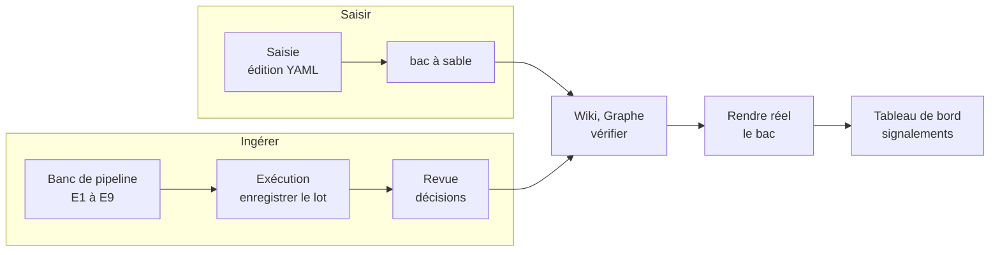

# Carte des outils

**Objet :** dire, pour chaque écran du banc d'essai, à quoi il sert, quand s'en servir, ce qu'il modifie et quelles notions il manipule ; puis les enchaînements usuels. Pour quelqu'un qui travaille sur le projet et doit s'y retrouver vite, pas pour un joueur.
**Version :** 1.0 — 27 septembre 2026. Les décisions d'interface sont au *cadre-interface.md* ; les notions, aux glossaires des cadres et au *glossaire.md* de ce dossier.
**Lecture :** ce tableau alimente l'aide de l'interface (`/aide`, lien « ? » de chaque écran) et `worldkit explain` (I-AID-01). Un test vérifie que chaque écran du menu y a sa ligne.

---

## 1. Principes communs à tous les écrans

- **Barre de contexte** (sous le menu) : `target` (monde de travail ou bac n), branche, point, filtre auteur ou joueur. Elle vit dans l'adresse : un lien copié rouvre le même contexte.
- **Écritures** : par défaut dans un **bac à sable** (`sandbox`), jamais directement dans le monde de travail sans confirmation (I-PRI-04). Un bac se garde, se jette, ou se **rend réel** (`promote`).
- **Appels au service** : en bas de chaque écran, la liste des opérations appelées pour le produire, avec leur JSON brut. Tout ce qu'affiche un écran vient de là (I-PRI-02) ; `worldkit call <opération>` donne la même chose en ligne de commande.
- **Résultat** : chaque action affiche l'opération, sa sorte (`read`, `compute`, `write`, `admin`), la cible, le statut (`ok`, `refused`, `pending`, `error`), la durée et les signalements avec la règle qui les fonde.
- **Aide** : tout identifiant souligné (règle, décision, étape, opération, statut) mène à sa définition ; le survol la montre.

## 2. Les écrans

| Outil | Adresse | Sert à | Quand s'en servir | Écrit | Notions | Opérations |
|---|---|---|---|---|---|---|
| Tableau de bord | `/` | Voir l'état d'un monde d'un coup d'œil : faits par notoriété, branches, signalements (non-conformités, fiches manquantes, faits masqués), bacs, dernières exécutions. | En arrivant, et après toute écriture pour vérifier qu'aucun signalement n'est apparu. | rien | notoriété, branche, signalement, bac à sable, exécution | `world.summary`, `state.check`, `runs.list` |
| Wiki | `/wiki` | Lire l'univers comme un humain : index des pages, en vue auteur (tout) ou joueur (public seulement), à n'importe quelle branche et n'importe quel point. | Pour vérifier ce qu'un joueur verrait, ou relire l'état après une ingestion ou un retcon. | rien | vue, filtre, notoriété, point, page consolidée | `wiki.index` |
| Page de wiki | `/wiki/{entité}` | Une entité : attributs, relations, fiches, identités, affirmations, documents sources, pistes ouvertes ; chaque fait donne sa notoriété et l'édition qui l'a établi (provenance). | Pour comprendre d'où vient un fait (lien vers l'édition) ou pourquoi il est caché au joueur. | rien | fait, provenance, redéfini plus tard, affirmation, fiche | `wiki.page` |
| Comparer deux lectures | `/compare/{entité}` | Deux lectures d'une même page côte à côte (deux branches, deux points, auteur contre joueur, monde contre bac), différences surlignées. | Pour relire un retcon (Aldren sur `reference` et `reference-r1`) ou vérifier ce qu'une vue joueur retire. | rien | branche, point, filtre, ajouté, retiré, changé | `wiki.compare` |
| Graphe | `/graph` | Voir la structure : entités en nœuds, relations en arêtes, par couches ; voisinage d'une entité ou graphe complet ; marques d'état ; mode comparaison de deux états. Clic sur un nœud : son détail. | Pour repérer ce qui est secret, masqué, orphelin ou redéfini, ou voir d'un coup ce qu'un retcon a changé. | rien | couche, marque, notoriété, masqué, orphelin, redéfini plus tard | `graph.view`, `graph.compare` |
| Branches | `/branches` | Lignée des branches (diagramme), points nommés, branche de référence et son historique (les rejeux la font changer), branches archivées. | Avant de créer une variante ou d'en transposer une édition ; pour savoir quelle branche fait foi. | rien | branche, branche de référence, point nommé, archivée, rejeu | `branch.list` |
| Journal | `/journal` | Les éditions d'une branche dans l'ordre (rang, origine, statut) ; en attente comprises. | Pour retrouver quand et par quoi un fait a changé. | rien | édition, rang, origine, `pending`, `applied` | `journal.list` |
| Édition | `/edit/{id}` | Une édition : ses changements, sa base, ses clés lues et écrites, son origine. | Depuis la provenance d'un fait ou le journal, pour comprendre un changement. | rien | édition, changement, clé de fait, lectures et écritures | `edit.show` |
| Saisie | `/editor` | Écrire une édition en YAML, vérifiée à chaque pause de frappe sans rien écrire (clés, collisions, signalements par ligne, état après) ; puis l'appliquer ou la soumettre. | Pour ajouter ou corriger un fait à la main, ou fabriquer un cas de test précis. | bac (défaut) ou monde confirmé | édition, changement, collision, origine, bac à sable | `edit.check`, `edit.apply`, `edit.submit` |
| Banc de mécanismes | `/bench` | Exécuter **une** opération du service sur une entrée choisie (valider un schéma, calculer des clés, qualifier, transposer…) et voir son résultat ; « Rejouer » vérifie qu'elle donne le même résultat. | Pour tester un mécanisme isolé, reproduire un bogue, ou comprendre ce que fait une opération. | selon l'opération ; écritures en bac par défaut | opération, sorte, déterminisme | toutes |
| Revue | `/review` | Décider des propositions d'ingestion : accepter, refuser, choisir entre concurrentes, adapter, qualifier une affirmation, répondre aux questions de nature, écarter un passage, trancher un rejeu. | Après une ingestion ou un pipeline enregistré ; dans un bac pour essayer, dans le monde de travail pour de vrai (session de 30 minutes). | bac ou monde (session) | proposition, décision, affirmation, qualification, question de nature, rejeu | `review.*`, `replay.*` |
| Banc de pipeline | `/pipeline` | Exécuter l'ingestion étape par étape, de E1 à E9 (ou de x à y), sans rien écrire ; chaque étape garde son artefact, qu'on peut modifier et réinjecter. Avec un modèle : estimation, confirmation, plafond. | Pour voir où une extraction se trompe, comparer deux extracteurs, ou tester une étape seule sur un artefact écrit à la main. | rien (cache d'extraction excepté) | étape, artefact, extracteur, oracle, cache, estimation, plafond | `pipeline.estimate`, `pipeline.run` |
| Exécution de pipeline | `/pipeline/{n}` | Suivre une exécution (progression, arrêt), lire chaque artefact, puis **enregistrer le lot** (E9+ à E12) dans un bac ou le monde. | Quand l'exécution vous convient et que vous voulez ses propositions en revue. | bac (défaut) ou monde confirmé | E9+, lot, proposition, tâche de fond | `pipeline.save`, `runs.artifact` |
| Artefact d'une étape | `/runs/{n}/artifact/{étape}` | L'artefact produit par une étape d'une exécution de pipeline, en YAML, prêt à être modifié et réinjecté. | Pour comprendre ce qu'une étape a produit, ou fabriquer une entrée de test (par exemple corriger les brouillons d'un passage puis reprendre à l'étape suivante). | rien | artefact, étape | `runs.artifact` |
| Comparer deux exécutions de pipeline | `/runs-diff` | Deux exécutions étape par étape : où leurs artefacts divergent. | Après un changement de prompt, de modèle ou de code, pour voir ce qui a bougé. | rien | artefact, étape | `runs.diff` |
| Mesures | `/measures` | Mesurer un extracteur contre le gold (précision, rappel, pièges, par opération et par passage), garder l'historique, comparer deux mesures jusqu'au passage. | Pour choisir un modèle, régler un prompt, ou vérifier qu'un changement de code n'a pas dégradé l'extraction. | rien (cache d'extraction excepté) | gold, oracle, précision, rappel, piège, stabilité, plafond | `eval.run`, `eval.history`, `eval.compare` |
| Mesure | `/measures/{n}` | Le détail d'une mesure : précision et rappel globaux, par opération, et passages en écart (manqués, en trop, pièges). | Pour savoir *où* un extracteur se trompe, pas seulement combien. | rien | précision, rappel, vp, fp, fn, piège | `runs.show` |
| Comparer deux mesures | `/measures-compare` | Deux mesures côte à côte, par opération puis passage par passage : ce que l'une trouve et pas l'autre, et qui a raison selon le gold. | Pour trancher entre deux modèles ou deux versions d'un prompt. | rien | précision, rappel, gold | `eval.compare` |
| Acceptation | `/acceptance` | Exécuter un parcours W00 à W17 avec ses prérequis dans un monde d'acceptation neuf ; voir chaque étape et chaque attendu (vérifié, échoué, à lire). | Après une modification du code, pour vérifier que les parcours du corpus tiennent ; pour rejouer un scénario d'usage pas à pas. | un monde d'acceptation neuf | parcours, prérequis, attendu, monde d'acceptation | `walkthrough.list`, `walkthrough.run` |
| Exécution d'acceptation | `/acceptance/{n}` | Le déroulé d'un parcours exécuté : chaque étape avec ses appels, chaque attendu avec son verdict. | Pour voir quel attendu échoue et pourquoi. | rien | parcours, attendu | `walkthrough.run` |
| Exécutions | `/runs` | Tout ce qui a été enregistré : calculs, écritures, pipelines, mesures, parcours ; chacune avec paramètres, sortie, indicateurs, trace. | Pour retrouver un résultat passé, ou comprendre ce qu'un bac contient avant de le rendre réel. | rien (purge manuelle possible) | exécution, sorte, cible, trace | `runs.list`, `runs.show` |
| Exécution | `/runs/{n}` | Une exécution enregistrée : paramètres, sortie, indicateurs, signalements, trace, JSON complet. | Pour relire un résultat passé ou le comparer à un autre. | rien | exécution, trace, indicateurs | `runs.show` |
| Rendre réel un bac | `/sandbox/{n}/promote` | Rejouer les écritures d'un bac sur le monde de travail : répétition à blanc d'abord (identique, écart, divergence), puis application en tout ou rien. | Quand un essai en bac est concluant. | le monde de travail (confirmé) | rendre réel, répétition à blanc, écart, divergence | `sandbox.promote` |
| Opérations | `/ops` | La liste de toutes les opérations du service : sorte, résumé, règles, paramètres. | Pour savoir ce qui existe et comment l'appeler en ligne de commande (`worldkit call`). | rien | opération, sorte, paramètre | `ops.list` |
| Guide | `/aide/guide` | Le guide pas à pas (*docs/aide/guide.md*) : construire Valmont, lire un résultat, écrire un changement, essayer dans un bac, ingérer, retcon, tester un mécanisme, mesurer, vérifier ; gestes à l'écran, commandes et sorties attendues. | Pour découvrir l'outil, ou retrouver comment faire une tâche. | rien | tous | — |
| Aide | `/aide` | Cette carte, les étapes, les opérations, les glossaires et le texte de chaque règle ou décision ; recherche par code ou par mot. | Dès qu'un terme ou un identifiant n'est pas clair. | rien | lexique | `lexicon.lookup`, `lexicon.index` |

## 3. Enchaînements usuels

- **Ajouter un fait à la main** : Saisie (vérification en direct) → Appliquer dans un bac → Wiki ou Graphe sur ce bac → Rendre réel.
- **Ingérer un document** : Banc de pipeline (oracle ou modèle) → Exécution : Enregistrer le lot dans un bac → Revue → Wiki → Rendre réel.
- **Comprendre un fait** : Page de wiki → provenance → Édition → Journal.
- **Retcon** (redéfinition rétroactive) : Banc de mécanismes (`redefine.preview`, puis rejeu) ou `worldkit redefine` → Revue pour trancher le rejeu → Comparer deux lectures ou Graphe en comparaison.
- **Choisir un modèle** : Mesures (oracle d'abord, puis chaque modèle, avec estimation et confirmation) → comparer deux mesures → Banc de pipeline sur les passages qui diffèrent.
- **Vérifier après un changement de code** : Acceptation (les parcours structurés) et `pytest`.
