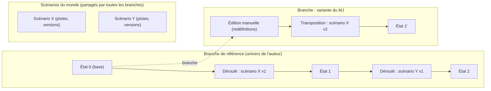

# Structuration procédurale de données narratives — Analyse exploratoire

**Cadre (révisé) :** outil de worldbuilding pour MJ-auteur en JDR fantasy — une couche Univers (wiki MJ complet adossé à un graphe versionné) et une couche Scénario (temporalité, potentiel/réalisé, impact sur l'univers), avec le méta (règles, stats) représenté à part et un schéma d'entités configurable par monde. Priorité : petits univers construits progressivement. Ouverture ultérieure à d'autres formes narratives.
*Cadre v1 d'origine : mémoire de campagne, wiki, aide au MJ.*
**Statut :** analyse pré-cahier des charges, **v30** — modèle conceptuel de la fondation complet ; conception technique engagée. La section 00 consolide les décisions prises après échanges et **fait foi** ; les sections 0 à 13 constituent l'analyse exploratoire initiale, conservée et annotée. Les règles à jour vivent dans *cadre-fondation.md* ; les décisions techniques dans *cadre-technique.md*.
**Date :** septembre 2026 (v1 : analyse exploratoire ; v2 : cadrage révisé ; v3 : ingestion, historique, méta ; v4 : pistes, scénarios, redéfinitions, schéma, notoriété ; v5 : forme des éditions, identité, scénarios liés au monde, vues du wiki ; v6 : premières décisions de conception technique ; v7 : confirmation partielle des éditions en attente ; v8 : supports documentaires ; v9 : hors schéma et non-conformité ; v10 : propositions concurrentes entre lots ; v11 : attributs à valeurs multiples ; v12 : stockage ; v13 : langage de schéma ; v14 : noyau sur mesure en Python ; v15 : principe d'architecture ; v16 : décisions d'ingestion validées ; v17 : corpus synthétique ; v18 : plafonnement de la notoriété ; v19 : résolution contre les entités en attente ; v20 : notoriété des qualifications ; v21 : origine curation ; v22 : décisions du jalon J1 ; v23 : décisions du jalon J2 ; v24 : précisions du jalon J2 ; v25 : décisions du jalon J3 ; v26 : accès aux modèles de langage ; v27 : branches et transposition ; v28 : scénarios et déroulés).

Légende utilisée dans tout le document :

- ❓ question ouverte à trancher avant/pendant le cahier des charges
- 🔀 point de décision structurant (une réponse ferme le champ des possibles)
- 🧪 axe de test / d'évaluation
- 🧑 point d'intervention humaine possible ou nécessaire
- 📚 référence bibliographique (liste en fin de document)

Ajouts v2/v3 :

- ✅ tranché ou conservé
- 🔄 modifié ou reformulé par le cadrage révisé
- ⏸ hors périmètre pour l'instant
- ➕ nouveau besoin issu du cadrage révisé

---

## 00. Cadrage révisé — décisions issues des échanges

> Cette section consolide les réponses apportées au document d'analyse initial. **Elle fait foi** : lorsque les sections 0 à 13 (analyse exploratoire d'origine) la contredisent, c'est elle qui prévaut. Les sections d'origine sont conservées pour mémoire et annotées là où le cadrage les rend obsolètes ou les modifie.
>
> **Historique des versions de cette section :**
> - **v2** : vision, périmètre, couches Univers / Scénario, modèle monde / scénario / déroulé / lignée, ordre des scénarios.
> - **v3** : deux voies d'alimentation, priorité au graphe en place, modes d'ingestion, gestion transversale des contradictions, historique qui ne fait que s'allonger (branches et transpositions), organisation du méta (systèmes, fiches).
> - **v5** : forme concrète d'une édition (granularité au fait, opérations élémentaires, étiquettes), identité par relation `même_que`, scénarios rattachés au monde, vues du wiki (branche + point + filtre), pas d'outillage joueur spécifique. **Le modèle conceptuel de la fondation est complet** ; les questions suivantes portent sur la mise en œuvre.
> - **v4** : objectif prioritaire (petits univers progressifs), axe d'énonciation et documents in-world, pistes comme éditions en attente, scénarios comme ensembles de pistes, redéfinitions ponctuelles et rétroactives, schéma de monde configurable, notoriété secret / public, import par lots, temps diégétique écarté de la fondation. La section a été réorganisée ; les renvois du reste du document ont été mis à jour.
> - **v6** : premières décisions de conception technique (00.20) — noyau déterministe et périphérie probabiliste, clé de fait, catalogue d'opérations complété, familles de contradictions, ordre de construction (ingestion d'abord), analyse de l'impact du noyau sur l'ingestion. Corrections du cadre de la fondation (v1.4).
> - **v7** : confirmation partielle ou adaptée des éditions en attente (00.21) ; cadre de la fondation v1.5.
> - **v8** : corroboration par supports documentaires hors journal, faits orphelins (00.22) ; cadre de la fondation v1.6.
> - **v9** : distinction entre hors schéma (non applicable) et non-conformité (tolérée) (00.23) ; cadre de la fondation v1.7.
> - **v10** : propositions concurrentes entre lots (00.24) ; cadre de la fondation v1.8.
> - **v11** : attributs à valeurs multiples (00.25) ; cadre de la fondation v1.9. Tous les points soulevés par l'analyse de l'impact du noyau sur l'ingestion sont tranchés.
> - **v12** : stockage et représentation des états validés (00.26) ; cadre de la fondation v1.10.
> - **v13** : langage de schéma et validateur unique validés (00.27) ; cadre de la fondation v1.11.
> - **v14** : noyau sur mesure, Python, ligne de commande d'abord (00.28) ; cadre de la fondation v1.12.
> - **v15** : principe « noyau déterministe, périphérie probabiliste » validé (00.29).
> - **v16** : validation en bloc des décisions techniques restantes du cadre technique (00.30) ; cadre technique v2.0.
> - **v17** : stratégie de corpus en plusieurs jets ; premier corpus synthétique Valmont et lacunes qu'il révèle (00.31) ; cadre technique v2.1.
> - **v18** : lacune L5 tranchée — notoriété plafonnée par les entités mentionnées, levée explicite (00.32) ; cadre de la fondation v1.13.
> - **v19** : lacune L3 tranchée — la résolution d'entités voit les créations proposées par les lots en attente (00.33) ; cadre technique v2.3.
> - **v20** : lacune L4 tranchée — la qualification d'une affirmation porte sa propre notoriété (00.34) ; cadre de la fondation v1.14.
> - **v21** : lacune L7 tranchée — étiquette d'origine `curation` pour les décisions sur les sources (00.35) ; cadre de la fondation v1.15. Plus aucune lacune bloquante avant J3.
> - **v22** : décisions du jalon J1 (validateur de schéma) — valeur invalide non applicable (00.36), lien double face en relation noyau provisoire (00.37), fiches exigées déclarées par le monde (00.38), précisions du validateur (00.39) ; cadre de la fondation v1.16, cadre technique v2.6.
> - **v23** : décisions du jalon J2 (journal, projection, vues) — ajout sur une clé occupée (00.40), notoriété d'une clôture (00.41) ; cadre de la fondation v1.17.
> - **v24** : précisions techniques du jalon J2 (00.42) ; cadre technique v2.8.
> - **v25** : décisions du jalon J3 (ingestion) — anomalie acceptée (00.43), origine des propositions confirmées (00.44), document obsolète (00.45) ; cadre de la fondation v1.18, cadre technique v2.9.
> - **v26** : accès aux modèles de langage et routage par tâche (00.46) ; cadre technique v2.10.
> - **v27** : branches, transposition, redéfinition ponctuelle (00.47) ; cadre technique v2.11.
> - **v28** : scénarios, pistes, déroulés (00.48) ; cadre technique v2.12.

### 00.1 Vision reformulée

Le projet n'est pas un outil de **mémoire de campagne** (transformer des parties jouées en wiki). C'est un **outil de worldbuilding pour un MJ-auteur**, organisé en deux couches :

- **La couche Univers** : un wiki complet, destiné au MJ ou à l'auteur, qui regroupe toutes les informations générales de l'univers et contient **ce qui est vrai**, secrets compris. Un graphe le sous-tend.
- **La couche Scénario** : elle reprend le cadre de l'Univers pour construire sa propre structure, avec des exigences supplémentaires : une temporalité, des actions *potentielles*, des actions *réellement produites*, et un **impact en retour sur l'Univers**.

La chronologie recherchée n'est pas celle des parties (« ce qui s'est passé à la session 12 ») mais celle du **développement de l'univers à travers les scénarios**.

### 00.2 Utilisateurs, objectif prioritaire et périmètre

**Utilisateurs visés :**
- un MJ au profil auteur/worldbuilder, avec beaucoup de notes ;
- un auteur qui veut partager son univers, lequel sera ensuite exploité et enrichi par un MJ.

Le nombre de curateurs (un ou plusieurs) est indifférent au modèle. L'outil est **privé et local** : une aide personnelle en premier lieu.

**Consommation :** le wiki est destiné à être **lu par des humains**. Un LLM consommera le contenu autrement, a priori via le graphe.

**Objectif prioritaire :** réussir d'abord des **univers petits ou persistants, construits progressivement** (ingestions petites et fréquentes, validation humaine au fil de l'eau). Les imports massifs de corpus existants restent une question ouverte, à penser en amont pour être faciles à ajouter, mais ne sont pas l'objectif premier (00.5).

**Modèle « fondation » :** le socle minimal visé en premier. Plusieurs mécanismes sont volontairement préparés sans être construits (champs optionnels, objets posés mais non exploités) pour rester ouverts sans alourdir la fondation.

**Dans le périmètre de la fondation :**
- la couche Univers (wiki MJ complet, secrets compris) et son **schéma de monde** configurable (00.10) ;
- la couche Scénario : scénarios, pistes, déroulés (00.8) ;
- l'ingestion de sources écrites et l'édition structurée, avec les trois axes mode / nature / énonciation (00.4) ;
- l'historique des éditions, les branches, les redéfinitions ponctuelles et rétroactives (00.6, 00.7) ;
- la distinction méta / diégétique et le modèle systèmes / fiches (00.11) ;
- le marquage de **notoriété** secret / public (00.12).

**Hors périmètre pour l'instant :**
- le partage communautaire et le multi-tenant ;
- les vues joueurs filtrées — mais la production d'éléments pour les joueurs est **préparée** par le marquage de notoriété (00.12) ;
- les croyances de personnages, rumeurs et vérités multiples (les affirmations attribuées, 00.9, en sont une première brique) ;
- l'ingestion du « contexte de jeu réel » (audio, transcriptions, chat logs de parties) : **vivre l'histoire reste une responsabilité humaine** ;
- le suivi de ce qui a été révélé à la table ;
- l'aide MJ en préparation et en session (sujet lointain, probablement une question de retrieval) ;
- tout LLM narrateur ou joueur ;
- un outillage spécifique de création d'éléments pour les joueurs (le MJ pioche dans le wiki public, 00.12) ;
- la fusion réelle et la scission d'entités (00.10) ;
- l'export de scénarios vers d'autres mondes (00.8) ;
- la réécriture destructive de l'historique (00.6) ;
- le temps diégétique comme axe structurel (00.13) ;
- les types d'entités libres et l'extension automatique du schéma (00.10) ;
- l'inférence automatique de systèmes de règles (00.11) ;
- le traitement avancé des gros imports (niveaux d'autorité, ordonnancement) (00.5).

### 00.3 Sources et alimentation du graphe

**Types de sources :** idéalement toute source écrite — notes à la volée, écrits divers, textes canon « in-game », textes de lore complets, descriptions de personnages, de lieux, de créatures, livres de règles, etc. Toutes les sources sont probablement **locales et privées**.

**Deux voies d'alimentation, et deux seulement :**

1. **L'ingestion de documents.** Le système interprète un texte et propose des nœuds et des relations. **La prose rédigée directement dans l'outil n'a pas de statut particulier** : c'est un document à ingérer, au même titre qu'un fichier importé.
2. **L'édition structurée.** L'utilisateur écrit directement dans les champs de relation et les attributs (diégétiques ou méta), sans interprétation.

**Le graphe fait foi, les textes restent attachés.** Le wiki est une vue calculée du graphe, mais les textes d'origine restent liés aux faits qu'ils ont produits (provenance). Une page wiki peut donc montrer à la fois la fiche générée depuis le graphe et les textes qui l'alimentent. Quand un texte est réécrit, il est ré-ingéré et le système montre ce qui change dans le graphe.

**L'univers doit pouvoir être enrichi, mais aussi redéfini** (voir les modes d'ingestion, 00.4).

### 00.4 Ingestion : trois axes indépendants

Toute ingestion est qualifiée selon trois axes qui se combinent sans se confondre.

| Axe | Question | Valeurs |
|---|---|---|
| **Mode** | Le texte confirme-t-il ou change-t-il l'univers ? | source / édition |
| **Nature** | Où va l'information ? | univers / système / fiche |
| **Énonciation** | Qui affirme ? | la voix de l'auteur (fait) / une voix du monde (affirmation attribuée) |

**Axe 1 — le mode, qui dit comment interpréter une contradiction :**

| Mode | Hypothèse | Une contradiction avec le graphe est… | Traitement |
|---|---|---|---|
| **Source** | Le document est censé être cohérent avec l'univers existant | une **anomalie** (erreur d'extraction, texte obsolète, conflit) | Le graphe en place l'emporte ; la nouveauté devient une **proposition** à valider (00.5) |
| **Édition** | Le document est censé **changer** l'univers | une **intention** (c'est ce qu'on veut modifier) | Crée un nouvel état (00.6) ; le système montre le diff par rapport à l'état de départ pour confirmation |

Dans les deux modes, un document doit rester cohérent **avec lui-même** : une contradiction interne est toujours une anomalie. Les éditions résultant d'un scénario sont **par défaut des ingestions en mode édition** ; une ingestion en mode édition peut aussi être faite à la main.

**Axe 2 — la nature, qui dit où va l'information :**

| Nature | Destination | Exemple |
|---|---|---|
| Diégétique | Univers | « Le Loup de cendre hante les plaines brûlées » |
| Méta de système | Systèmes | « Toute créature a entre 1 et 10 PV » |
| Méta de fiche | Fiches | « Loup de cendre : 5 PV, For 12 » |

**Axe 3 — l'énonciation, qui dit qui affirme** (ne concerne que le contenu diégétique) : soit la voix de l'auteur, qui produit des **faits** ; soit une voix du monde (un document in-world, et plus tard un personnage ou une institution), qui produit des **affirmations attribuées** (00.9).

Exemple de combinaison : la « Chronique de la Chute » s'ingère en mode source, de nature diégétique, avec une énonciation in-world. Une version réécrite après un scénario s'ingérerait en mode édition, même nature, même énonciation.

**Mécanisme commun de déclaration.** Les trois axes sont distincts, mais ils partagent le **même mécanisme** pour être renseignés, avec trois niveaux de priorité décroissante :

1. **Déclaration au niveau du document** (par exemple dans l'en-tête ou *frontmatter* d'un fichier markdown) :
   ```yaml
   mode: source
   nature: mixte
   enonciation: in-world
   enonciateur: chronique-de-la-chute
   ```
2. **Marqueurs explicites au niveau du passage**, selon une convention commune à toutes les dimensions, par exemple `[in-world: Chronique de la Chute] … [/in-world]` ou `[méta] … [/méta]`.
3. **Détection par indices**, en dernier recours, qui produit toujours une **proposition**, jamais une décision : blocs de stats et listes chiffrées (nature méta) ; guillemets, citations en bloc, italique, formules d'attribution (« selon les sages d'Elmar… »), première personne, texte daté et signé (énonciation in-world). En cas d'incertitude, le passage part en validation.

Attention : des guillemets signalent une **attribution**, pas une **fausseté**. La détection produit « affirmation attribuée à X, vérité non établie ».

### 00.5 Priorité, lots et validité des documents

**Règle par défaut : priorité à l'état du graphe en place.** Rien ne change silencieusement. Toute information nouvelle qui contredit le graphe (en mode source) devient une proposition à valider.

**Conservation des décisions.** Une proposition refusée n'est pas supprimée : elle reste tracée avec la décision prise. Une fois les arbitrages faits, le graphe ne dépend plus de l'ordre d'ingestion mais des décisions humaines. Une décision prise n'est pas redemandée à chaque ré-ingestion du même document.

**Import : premier arrivé, premier servi, par lots.** C'est l'option retenue pour la fondation, la plus simple :
- les ingestions successives suivent la règle de priorité au graphe en place ;
- un ensemble de documents ingérés en même temps forme **un seul lot** ; les contradictions internes au lot sont présentées de façon **symétrique** (aucun document ne l'emporte) et corrigées à la main.

**Préparé pour plus tard, sans être construit.** Pour que le traitement des gros corpus soit facile à ajouter :
- **le lot est un objet à part entière** : toute ingestion appartient à un lot, même d'un seul document ; les contradictions internes à un lot sont identifiables comme telles ;
- **un champ « autorité » optionnel** existe sur les documents, non exploité dans la fondation ; il permettra plus tard des niveaux d'autorité (référence, secondaire, brouillon) sans changer le modèle ;
- **la file de contradictions est regroupable** : chaque contradiction est stockée avec ses éléments en cause (entités, documents, lot), pour permettre plus tard un traitement en masse (« tout ce que contredit ce vieux document »).

**Validité des documents dans le temps.** Trois notions à ne pas confondre :
- le **moment d'ingestion** (temps de transaction) ;
- la **version de l'univers** à laquelle le document correspond (un texte écrit avant un changement d'avis décrit un univers qui n'existe plus) ;
- la **validité de chacune de ses affirmations**, gérée fait par fait.

Un document n'est presque jamais valide ou invalide en bloc. Son statut global se déduit de ses affirmations : *entièrement intégré*, *partiellement contredit*, ou *obsolète* (décision humaine : ne plus rien proposer à partir de ce texte).

### 00.6 Historique : une primitive, des branches

**Une seule primitive : une édition crée un nouvel état**, en conservant l'état précédent. Qu'elle provienne d'un scénario ou d'une action manuelle, c'est la même opération. Le lien éventuel à un scénario (et à un déroulé) est une **information attachée à l'édition**, pas un mécanisme distinct. Analogie : un gestionnaire de versions (Git), où chaque édition est un commit, certains étiquetés « conséquence du scénario X ».

**Vocabulaire :**
- une **édition** crée un **état** ;
- une **branche** apparaît quand deux éditions partent du même état et divergent (deux lignées, un monde repris par un autre MJ, un retour en arrière) ;
- une **transposition** applique explicitement un scénario ou une édition d'une branche sur une autre.

**L'historique ne fait que s'allonger.** Aucune édition passée n'est modifiée ni retirée. Pour revenir sur une décision, on repart d'un état antérieur et on crée une **nouvelle branche** ; l'ancienne reste intacte et consultable. La réécriture d'historique (retirer ou réordonner des éditions passées en gardant les suivantes) est **hors périmètre**. Le besoin qu'elle couvrirait (un retcon « qui a toujours été vrai ») est traité sans destruction par la redéfinition rétroactive (00.7).

**Pourquoi ce choix — analyse par cas.** Lignée : base → X (édition de scénario) → M (édition manuelle). Exemple : X établit que « Brume est gouvernée par le conseil des marchands ».

| Cas | Situation | Résultat |
|---|---|---|
| 1 | Consulter l'état avant X | **Trivial** : l'historique est conservé |
| 2 | Retirer X, M indépendante (modifie une montagne ailleurs) | **Sans problème** : X et M commutent |
| 3 | Retirer X, M modifie un élément créé par X (renomme le conseil) | **Conflit** : M vise un nœud absent |
| 4 | Retirer X, M contredit X (« Brume est gouvernée par un roi ») | **Ambigu** : M s'applique, mais son sens change (elle modifie la base au lieu de corriger X) |

Leçon : **revenir à un état antérieur est toujours facile** ; seule la **réécriture d'historique** produit des conflits. En l'écartant, les conflits n'apparaissent plus jamais d'eux-mêmes.

**Détection des dépendances entre éditions.** Si chaque édition enregistre les nœuds qu'elle **lit** et ceux qu'elle **modifie**, le système peut calculer automatiquement si deux éditions sont indépendantes (cas 2), dépendantes (cas 3) ou contradictoires (cas 4). Référence : la théorie des patchs des gestionnaires de versions Darcs et Pijul 📚.

**Conséquences sur les scénarios :**
- **Réordonner des scénarios** = créer une branche depuis l'état antérieur et y rejouer les scénarios dans le nouvel ordre. La lignée d'origine reste intacte.
- **Rejouer un scénario ailleurs** = transposition explicite. C'est seulement à ce moment que la détection des conflits (dépendances, nœuds absents, contradictions) intervient, et l'humain tranche.

**Les conflits n'apparaissent donc que lors de deux gestes délibérés :** une ingestion en mode source qui contredit le graphe, ou une transposition vers une autre branche (y compris le rejeu d'une redéfinition rétroactive, 00.7).

> **Précision v6 :** cette affirmation vaut pour les **conflits d'historique** seulement. Les non-conformités, le hors schéma et les divergences `même_que` sont des signalements d'autres familles, recalculables à tout moment (00.20).

**Forme concrète d'une édition (v5).**

*Granularité : le fait, pas l'entité.* Une édition décrit ses changements fait par fait (tel attribut de telle entité, telle relation entre deux entités), pas en remplaçant des fiches entières. Sinon, deux éditions indépendantes touchant la même entité (X change le titre du baron, M change son allégeance) seraient vues à tort en conflit. La granularité au fait rend la détection de dépendances utile, et donc le rejeu rétroactif et les transpositions praticables.

*Unité : un tout cohérent.* Une édition regroupe plusieurs changements élémentaires qui forment une intention (« le Loup dévore la relique » : la relique est détruite, le Loup gagne des PV, un attribut « porteur de la flamme » apparaît). Elle s'applique, se transpose ou s'écarte **en bloc**.

*Opérations élémentaires :*

| Opération | Exemple |
|---|---|
| Créer une entité | Apparition du conseil des marchands |
| Modifier un attribut | Le titre du baron devient « régent » |
| Ajouter une relation | Le conseil gouverne Brume |
| Retirer une relation | Le roi ne gouverne plus Brume |
| Clore une entité | Le baron meurt, la ville est détruite |
| Changer la notoriété | L'empoisonnement devient public |
| Qualifier une affirmation | La Chronique est déclarée fausse sur ce point |

Ces opérations valent pour le lore, les fiches, les systèmes et le schéma.

> **Complément v6 :** le catalogue est déclaré fermé et complété par : vider un attribut, supprimer une entité (réservé aux corrections), créer une affirmation, déclarer un document obsolète, et une famille d'opérations sur les schémas (00.20).

- **Clore n'est pas supprimer** : une entité close (baron mort, ville détruite) reste dans l'univers avec son histoire et ses relations passées. La vraie suppression est réservée à la correction d'erreurs (entité créée par erreur d'extraction).
- **Pas d'opération d'annulation** : l'historique conserve les états précédents.
- **Fusion et scission** ne sont pas des opérations de la fondation ; l'identité passe par une relation (00.10).

*Étiquettes.* La plupart sont **déduites automatiquement** de l'origine de l'édition :

| Étiquette | Origine |
|---|---|
| Enrichissement | Ajout qui ne contredit rien (cas le plus fréquent) |
| Conséquence de scénario | Piste confirmée ou édition libre dans un déroulé |
| Piste retenue | Piste d'auteur appliquée hors scénario |
| Redéfinition (ponctuelle / rétroactive) | Choix explicite lors d'un retcon (00.7) |
| Correction | Erreur technique (extraction, doublon) |

S'y ajoutent des **étiquettes libres** (tags) pour l'usage de l'auteur (« arc du Loup », « à relire »).

### 00.7 Redéfinitions : ponctuelle ou rétroactive

Une redéfinition (retcon) est une édition. Deux modes coexistent, pour couvrir toutes les situations, notamment les gros retcons qu'il serait pénible de propager à la main.

| | Redéfinition ponctuelle | Redéfinition rétroactive |
|---|---|---|
| Sens | « À partir de maintenant, c'est ainsi » | « Ça a toujours été ainsi » |
| Mécanisme | Une édition ajoutée à la suite de l'historique, étiquetée « redéfinition » | Une nouvelle branche depuis un état antérieur choisi, puis rejeu automatique des éditions suivantes |
| Coût | Nul | Proportionnel au nombre d'éditions touchées |
| Usage type | Petit ajustement, ou changement qu'on accepte de voir apparaître tard | Gros retcon qui doit irriguer tout l'univers |

**Redéfinition ponctuelle.** Une édition normale. Dans les vues antérieures, le système signale « cette information a été redéfinie plus tard ».

**Redéfinition rétroactive.**
1. L'utilisateur choisit à partir de quel état la redéfinition doit être vraie (pas forcément la base : « vrai depuis l'état après X » est possible).
2. Le système crée une branche depuis cet état et y applique la redéfinition.
3. Il **rejoue automatiquement**, dans l'ordre, les éditions qui suivaient sur la branche d'origine. Les éditions indépendantes passent sans intervention ; celles qui dépendent de la redéfinition ou la contredisent sont signalées, et l'humain choisit pour chacune : l'adapter, l'écarter ou la garder.
4. Une fois le rejeu terminé, la nouvelle branche devient la **branche de référence** du monde ; l'ancienne est archivée et reste consultable.

Rien n'est détruit : ce n'est pas une réécriture d'historique, mais la création d'une branche.

**Implications :**
- **Choix explicite du mode, avec aperçu d'impact** : avant validation, le système indique combien d'éditions ultérieures touchent les éléments concernés. La décision reste humaine.
- **Branche de référence** : chaque monde désigne la branche que le wiki affiche par défaut ; les autres sont des variantes ou des archives.
- **Rejeu suspendable et abandonnable** : les conflits peuvent être traités en plusieurs fois, regroupés (par entité, par scénario) ; renoncer au retcon abandonne simplement la nouvelle branche.
- **Éditions écartées tracées** pendant le rejeu.
- **Pistes à revérifier** : les pistes en attente écrites contre l'ancienne branche sont marquées « à revérifier ».
- **Variantes dérivées non mises à jour d'office** : une variante créée à partir de l'ancienne branche est notifiée que son origine a changé, et peut transposer le retcon.
- **Documents sources** : un document dont une affirmation est contredite par le retcon passe au statut « partiellement contredit » sur la nouvelle branche.

La même logique ponctuelle / rétroactive s'applique aux modifications du schéma de monde (00.10) et des systèmes de règles (00.11).

### 00.8 Pistes, scénarios et déroulés

**Une piste est une édition en attente.** Une idée d'auteur (« et si le baron était le frère caché de la reine ? ») a exactement la forme d'une édition — un ensemble de modifications du graphe écrit par rapport à un état donné — simplement non appliquée.

| Geste | Traduction dans le modèle |
|---|---|
| Créer une piste | Écrire une édition en attente |
| Retenir une piste | L'appliquer comme édition (mode édition) : crée un nouvel état |
| Abandonner une piste | La marquer abandonnée, sans la supprimer (trace de ce qui a été envisagé) |
| Vérifier qu'une piste est encore applicable | Même détection de conflits que les transpositions |
| Deux pistes alternatives | Deux éditions en attente qui se contredisent — normal tant qu'aucune n'est appliquée |

**Forme dans le graphe :** une piste est un **nœud à part**, relié à chaque entité concernée. Raisons : une piste touche souvent plusieurs entités ; elle a sa propre vie (statut ouverte / retenue / abandonnée, date, source, alternatives) ; elle a un contenu structuré (relations et attributs proposés). L'entité reste reliée à ses pistes en un saut (« 2 pistes ouvertes » sur la fiche du baron). Une piste relève de l'historique (un futur possible), pas de l'énonciation.

**Scénario = ensemble organisé de pistes.** Pour la fondation, **une action potentielle de scénario et une piste sont la même chose**. Un scénario regroupe des pistes, avec des **embranchements** (« si les joueurs sauvent le baron » / « s'ils le laissent mourir ») et des **dépendances** envers d'autres scénarios. Des critères de plus haut niveau pour distinguer piste d'auteur et action de scénario pourront venir plus tard.

**Un scénario reste ouvert** : on peut ajouter, modifier ou retirer des pistes à tout moment. Les scénarios ont donc **leur propre historique de versions**.

**Un scénario appartient à un monde** (décision v5) :
- il est rattaché au **monde**, pas à une branche : toutes les branches du monde le voient (branche de référence, variantes, branches issues d'une redéfinition rétroactive), ce qui permet de le rejouer sur une autre branche sans le copier ;
- ses **déroulés appartiennent à une branche** : le scénario X est unique pour le monde, mais peut avoir un déroulé sur la branche de référence et un autre sur une variante ;
- son historique de versions est **indépendant des branches** ; une variante qui veut une version vraiment différente le **duplique** au sein du monde ;
- le **schéma du monde** sert de garde-fou : un scénario référence des entités et des types de ce monde, ce qui simplifie la vérification d'applicabilité ;
- l'**export** d'un scénario vers un autre monde est une piste pour plus tard.

**Déroulé = pistes confirmées + éditions libres.** Jouer un scénario revient à **confirmer** les pistes qui se sont réalisées, c'est-à-dire à les appliquer comme éditions.
- **Confirmer avec adaptation** : la confirmation peut modifier la piste au moment de l'appliquer (le baron est sauvé, mais perd un bras). La piste d'origine reste intacte dans le scénario ; l'adaptation est portée par le déroulé.
- **Éditions libres** : l'imprévu (les joueurs brûlent la taverne) est enregistré par des éditions qui ne correspondent à aucune piste.
- **Version jouée** : un déroulé mémorise la version du scénario qui a été jouée ; modifier le scénario ensuite ne l'affecte pas. Rejouer un scénario ailleurs utilise par défaut sa version la plus récente.

**Ordre, dépendances et liberté humaine :**
- **La notion d'ordre des scénarios est posée dès le départ** : un scénario peut dépendre d'un autre.
- **Dépendance ≠ ordre effectif.** La dépendance est une propriété du scénario (déclarée à l'écriture, ordre partiel). L'ordre effectif est une propriété de la lignée.
- Le MJ peut s'écarter de l'ordre prévu et adapter ; le système **vérifie et signale** les dépendances non satisfaites, il ne les impose pas.
- **Changer d'ordre = nouvelle branche** (00.6).
- **Conflit d'applicabilité** : un scénario écrit contre un état (le baron est vivant) et transposé sur un état où ce n'est plus vrai est signalé.
- **Extension possible, non prioritaire :** la combinaison libre de scénarios « à la carte ».

**Conséquence : une seule primitive.** Le modèle fondation repose sur **l'édition**, en attente (piste) ou appliquée (état de l'historique).

### 00.9 Documents in-world et affirmations attribuées

Certains textes existent **dans** le monde (une chronique de cour, une prophétie, un texte religieux, un journal intime) sans que leur contenu soit forcément vrai.

**Traitement :**
- **le document devient une entité de l'univers** (nœud « Chronique de la Chute », avec auteur, date, commanditaire, notoriété) ;
- **son contenu devient des affirmations attribuées** à ce document, pas des faits ;
- faits et affirmations **coexistent sans conflit** : « la Chronique affirme qu'Aldren est mort au combat » et « Aldren a été empoisonné par son frère » ;
- une affirmation peut être reliée à la vérité : *fausse*, *vraie*, *vérité non établie* ; une affirmation vraie peut être **promue** en fait.

**Détection :** par déclaration (axe énonciation, 00.4) ou par indices, avec le mécanisme commun de déclaration. Cas mixte : un texte de lore véridique qui cite un document in-world → classification par passage.

Ce mécanisme réintroduit une forme légère des *claims* de l'analyse initiale : pas des croyances de personnages (hors périmètre), mais des affirmations attachées à un objet du monde. C'est une brique réutilisable plus tard pour les rumeurs et les croyances.

### 00.10 Schéma de monde et types d'entités

**Principe : un système libre, contraint par monde.** Le moteur ne présuppose aucun type d'entité. Chaque monde déclare les siens **avant d'être construit**, dans un fichier de configuration : le **schéma de monde**.

Le schéma déclare :
- **les types d'entités**, avec leurs attributs typés, leurs contraintes, et éventuellement une hiérarchie (« Ordre monastique » est une sorte de « Faction ») ;
- **les types de relations**, entre quels types, avec quelle cardinalité, symétriques ou non ;
- **les contraintes** éventuelles.

```yaml
monde: terres-de-cendre
types:
  Personnage:
    attributs:
      nom: { type: texte, requis: true }
      titre: { type: texte }
  Faction:
    attributs:
      nom: { type: texte, requis: true }
  OrdreMonastique:
    herite_de: Faction
    attributs:
      vœux: { type: liste[texte] }
  Lieu:
    attributs:
      nom: { type: texte, requis: true }
relations:
  gouverne: { de: [Personnage, Faction], vers: Lieu }
  membre_de: { de: Personnage, vers: Faction }
  frere_de: { de: Personnage, vers: Personnage, symetrique: true }
```

**Implications :**
- **Schémas unifiés** : le schéma de monde et les systèmes de règles (00.11) utilisent **le même langage** (catégories, attributs, contraintes). Un monde a un schéma diégétique et zéro, un ou plusieurs systèmes méta. Un seul format, un seul validateur.
- **Types noyau vs types de monde** : les types dont la mécanique dépend sont fournis par la plateforme et non configurables — Document, Affirmation, Piste, Édition, Lot, Scénario, Déroulé, Fiche. Le schéma ne définit que les **types de monde** (contenu diégétique). Les types noyau peuvent se relier aux types de monde. De même, certaines **relations noyau** sont fournies par la plateforme : `concerne` (piste → entité), `a_pour_fiche`, `affirme` (document → affirmation), `même_que` (identité).
- **Identité par relation (v5)** : deux entités qui désignent la même chose sont reliées par `même_que`, sans fusion. Chacune garde ses faits. La relation est qualifiée :
  - **révélation** (diégétique : le mendiant *est* le roi disparu) — la relation **porte une notoriété** : secrète, elle laisse les deux personnages distincts dans une vue publique et les réunit dans la vue d'auteur ; un scénario peut la rendre publique ;
  - **doublon** (technique : « le Roi Gris » et « Aldren II » extraits séparément par erreur) — affiché comme une seule entité dans toutes les vues.
  Le wiki propose une **vue consolidée** (faits des deux entités, avec provenance) ; les contradictions entre elles sont signalées, et peuvent être légitimes pour une révélation (un déguisement).
- **Fusion réelle et scission** : hors fondation. Une scission peut s'exprimer par une relation (`était_en_réalité`), mais la répartition des faits entre les nouvelles entités n'est pas outillée.
- **Extraction guidée** : l'extracteur cherche à remplir le schéma du monde au lieu d'inventer des catégories (plus fiable). Ce qui ne rentre pas est signalé **hors schéma** (entité non typable, relation non déclarée) et mis en attente.
- **Ouverture aux types libres** : les éléments hors schéma serviront plus tard à proposer des extensions du schéma (« 12 entités ressemblent à des Ordres monastiques, créer ce type ? ») — même mécanisme que l'inférence de systèmes, reporté.
- **Le schéma suit l'historique** : le modifier est une édition (ponctuelle ou rétroactive, 00.7) ; les entités non conformes sont signalées, pas modifiées d'office.
- **Schéma par défaut** : la plateforme fournit un schéma de départ pour la fantasy (Personnage, Lieu, Faction, Créature, Objet, Événement, Concept) à copier et adapter.
- **Héritage** : une branche ou une variante hérite du schéma de son origine et peut le modifier.
- **Préparation temporelle** : tout fait ou relation peut porter une **fenêtre de validité diégétique optionnelle** (00.13), non exploitée dans la fondation.

> **Complément v6 :** la cardinalité déclarée d'une relation détermine désormais la **clé de fait**, c'est-à-dire l'emplacement qu'un fait occupe et donc ce qui peut le contredire (00.20).

### 00.11 Le méta : systèmes et fiches

Le méta **vit à part** du lore, mais avec des **connexions directes**. Trois espaces utilisent les mêmes briques (nœuds, relations, attributs, provenance, éditions) avec des rôles distincts :

| Espace | Contenu | Exemple |
|---|---|---|
| **Univers** | Purement diégétique ; chaque entité pointe vers ses fiches | « Loup de cendre » : habitat, légendes, lien avec un culte |
| **Systèmes** | Un schéma par jeu de règles (même langage que le schéma de monde, 00.10) : **catégories** déclarant des **attributs** typés avec contraintes ; éléments réutilisables (capacités) ; règles générales en texte | « Créature : PV entier de 1 à 10 ; Force, Dextérité, Intelligence entiers de 10 à 20 » ; capacité « Morsure » |
| **Fiches** | Les valeurs d'une entité **dans un système donné** ; reliée à l'entité d'univers et à la catégorie à laquelle elle se conforme | « Loup de cendre selon le système A : 5 PV, For 12, Dex 14, Int 10, Morsure » |

```yaml
fiche: loup-de-cendre@systeme-a
entite: univers/loup-de-cendre      # lien vers le lore
conforme_a: systeme-a/creature      # lien vers le schéma
valeurs:
  pv: 5
  force: 12
  dexterite: 14
  intelligence: 10
capacites: [systeme-a/morsure]
```

**Ce que permet la fiche intermédiaire :**
- **retrouver le méta depuis le lore** en un saut ;
- **redéfinir un système sans toucher au lore** ; le système **signale** les fiches devenues non conformes (sans les modifier d'office) et les fiches manquantes ;
- **plusieurs systèmes en parallèle** pour un même univers.

**Critère méta / diégétique :** *si l'information reste vraie quand on change de système de règles, elle est diégétique ; si elle dépend du système, elle est méta.* Tout ce qui est chiffré n'est pas méta (la hauteur d'une montagne est diégétique).

**Éléments à double face :** un sort « Flamme d'azur » est à la fois un concept du monde et une capacité de règles → deux nœuds reliés.

**Historique :** fiches et systèmes **suivent le même historique que l'univers**. Une édition peut toucher lore, fiche et système à la fois (le Loup dévore une relique : lore **et** fiche modifiés dans une seule édition).

**Attributs inconnus à l'ingestion** (« Constitution 13 » sans Constitution dans le système) : à terme, l'ingestion pourra **proposer d'étendre le système**, avec validation humaine. **Méthode d'inférence reportée** : les systèmes ne sont pas indispensables à la fondation. Risque : gonfler un système avec des attributs créés par erreur.

### 00.12 Notoriété : secret / public

Le wiki contient la vérité, secrets compris. **Dès la fondation**, chaque élément porte une **notoriété**.

**Sens retenu : la notoriété dans le monde**, information diégétique (« tout Valmont sait que le roi est mort en 1492 »). Le suivi de ce que les joueurs ont appris à la table reste hors périmètre. C'est la notoriété qui compte pour produire des éléments pour les joueurs : ce qu'un habitant du monde pourrait savoir.

**Règles :**
- **Trois valeurs** : *secret*, *public*, *non qualifié* (valeur par défaut). Tout filtre destiné aux joueurs traite le non qualifié comme secret : rien ne fuite par oubli. Le système peut indiquer combien d'éléments restent non qualifiés.
- **Granularité au niveau du fait** : entités, relations et attributs. Une entité publique peut avoir des faits secrets (le baron est connu, pas sa filiation).
- **Propagation depuis une entité secrète** : tout fait qui mentionne une entité secrète est secret par défaut ; propagation levable au cas par cas.
- **La notoriété suit l'historique** : un scénario peut rendre public un secret, par une édition.
- **Détection à l'ingestion** par indices (« en secret », « nul ne sait que ») → propositions.
- **Documents in-world** : un document a sa notoriété (chronique officielle publique, journal caché secret) ; ses affirmations en héritent. On obtient la version officielle publique et la vérité secrète côte à côte.

**Éléments pour les joueurs (v5).** Pas d'outillage spécifique dans la fondation : le plus important est le **wiki**, et le MJ pioche lui-même ce qu'il donne aux joueurs. Toutes les variantes de wiki s'obtiennent par la même formule :

> **Vue du wiki = branche + point de l'historique + filtre de notoriété** (et plus tard, éventuellement, une époque).

| Vue | Branche | Point | Filtre |
|---|---|---|---|
| Wiki d'auteur | Référence | État courant | Tout |
| Wiki joueur | Référence | État courant | Public uniquement (non qualifié traité comme secret ; identités secrètes non réunies) |
| Wiki « après X » | Référence | Après le déroulé de X | Au choix |
| Wiki d'une variante | Variante | Au choix | Au choix |

### 00.13 Temporalité révisée

| Axe | Statut |
|---|---|
| **Historique des éditions** (quels états, sur quelle branche, dans quel ordre) | **Axe principal de la fondation**, remplace le « temps de session » |
| **Temps diégétique** (calendrier du monde) | **Écarté de la fondation comme axe structurel.** Les dates sont de simples attributs ; une préquelle jouée après les autres s'insère dans l'historique à sa place de jeu, et c'est son contenu qui dit qu'elle se déroule plus tôt |
| **Temps de transaction** | Conservé ; sert aussi à la validité des documents (00.5) |
| Temps de révélation | Hors périmètre |

**Piste pour plus tard : les époques comme vues, pas comme branches.** L'idée de « mondes en 1200, en 1420 » a été examinée. Les branches ne conviennent pas : le monde en 1200 et en 1420 ne sont pas des alternatives mais deux moments d'une même vérité ; des branches dupliqueraient le contenu commun et ne propageraient pas les corrections. La bonne approche est de **calculer** « le monde en 1420 » en filtrant l'état courant sur des **fenêtres de validité diégétique** (modèle bi-temporel). On obtiendrait deux axes croisés :

| Axe | Question | Mécanisme |
|---|---|---|
| Historique | Quelle version de la vérité ? (« après X et Y ») | États et branches |
| Diégétique | Quel moment dans cette vérité ? (« en 1420 ») | Filtre sur les fenêtres de validité |

Des **époques nommées** (« l'Âge de la Chute : 1180–1230 ») seraient des vues enregistrées. Les branches gardent leur rôle pour l'uchronie (« et si Aldren avait survécu ? »).

**Préparation dans la fondation :** fenêtre de validité diégétique **optionnelle** sur les faits et relations (00.10).

### 00.14 Gestion des contradictions : un sous-système transversal

Les contradictions peuvent apparaître à de nombreux endroits :
- entre deux sources ingérées (y compris au sein d'un même lot) ;
- entre une source ingérée et une édition structurée ;
- entre deux éditions structurées ;
- entre une édition de déroulé et l'état sur lequel on l'applique ;
- entre les prérequis d'un scénario et l'état de la lignée (conflit d'applicabilité) ;
- entre une piste en attente et l'état courant ;
- entre deux branches, lors d'une transposition ou du rejeu d'une redéfinition rétroactive ;
- entre une fiche et son système, ou une entité et le schéma de monde (non-conformité) ;
- entre un contenu extrait et le schéma (hors schéma).

Les affirmations in-world ne sont **pas** des contradictions : elles coexistent avec les faits (00.9). Deux pistes alternatives non plus (00.8).

**Mécanisme commun en cinq étapes :**
1. **Détecter** (aidé par l'enregistrement des nœuds lus et modifiés, 00.6).
2. **Qualifier** : évolution, redéfinition, erreur d'extraction, incompatibilité d'ordre, non-conformité, hors schéma. Les axes d'ingestion font une bonne partie du travail : le mode dit si la tension est suspecte ou voulue, l'énonciation écarte les affirmations attribuées.
3. **Proposer** une résolution.
4. **Laisser l'humain trancher.**
5. **Tracer** la décision pour qu'elle ne soit pas redemandée.

Les contradictions sont stockées avec leurs éléments en cause pour pouvoir être **regroupées** (00.5). Les méthodologies précises (interface de revue, traitement en masse) restent à construire.

> **Complément v6 :** les contradictions sont réparties en trois familles — historique, conformité, identité — et la détection des contradictions d'historique repose sur la clé de fait, calculée par le noyau sans LLM (00.20).

### 00.15 Modèle conceptuel

| Concept | Définition |
|---|---|
| **Monde** | Un univers doté d'un schéma, d'une base, de branches (dont une de référence), et éventuellement de systèmes de règles. |
| **Schéma de monde** | Configuration déclarant les types d'entités et de relations du monde (00.10). |
| **Types noyau** | Types fournis par la plateforme, non configurables : Document, Affirmation, Piste, Édition, Lot, Scénario, Déroulé, Fiche ; et relations noyau (`concerne`, `a_pour_fiche`, `affirme`, `même_que`). |
| **`même_que`** | Relation d'identité entre deux entités, qualifiée révélation ou doublon, porteuse de notoriété ; remplace la fusion dans la fondation. |
| **Base** | L'état de vérité initial d'un monde (secrets compris). |
| **Document** | Source ingérée (fichier ou prose écrite dans l'outil) ; porte mode, nature, énonciation, autorité optionnelle, statut ; appartient à un lot. Un document in-world est aussi une entité de l'univers. |
| **Lot** | Ensemble de documents ingérés ensemble ; contradictions internes traitées symétriquement. |
| **Affirmation** | Contenu attribué à une voix du monde (document in-world) ; coexiste avec les faits ; peut être qualifiée vraie / fausse / non établie et promue en fait. |
| **Édition** | Ensemble cohérent de changements élémentaires au niveau du fait (00.6), sur le lore, les fiches, les systèmes ou le schéma, écrit par rapport à un état ; **en attente** (piste) ou **appliquée** (crée un état). Enregistre les nœuds lus et modifiés. Peut être étiquetée (redéfinition, conséquence de scénario…). |
| **Piste** | Édition en attente, nœud relié aux entités concernées ; statut ouverte / retenue / abandonnée. |
| **État** | L'univers (lore, fiches, systèmes, schéma) à un point de l'historique. |
| **Branche** | Divergence de l'historique à partir d'un même état (variante, uchronie, redéfinition rétroactive, ordre de jeu différent). |
| **Branche de référence** | La branche affichée par défaut pour un monde. |
| **Transposition** | Application explicite d'un scénario, d'une piste ou d'une édition sur une autre branche. |
| **Scénario** | Ensemble organisé de pistes, avec embranchements et dépendances ; versionné ; rattaché à un monde et visible de toutes ses branches. |
| **Dépendance** | Relation déclarée « X suppose Y » ; ordre partiel. |
| **Déroulé** | Instance jouée d'une version d'un scénario sur une branche : pistes confirmées (éventuellement adaptées) + éditions libres. |
| **Lignée** | Séquence ordonnée d'éditions sur une branche : l'ordre effectif. |
| **Vue wiki** | Branche + point de l'historique + filtre de notoriété (plus tard : époque). |
| **Système** | Schéma d'un jeu de règles (00.11). |
| **Fiche** | Valeurs méta d'une entité d'univers dans un système donné. |
| **Notoriété** | Secret / public / non qualifié, au niveau de chaque fait (00.12). |
| **Provenance** | Chaque fait sait d'où il vient (document, édition structurée, déroulé, lot). Elle est **structurelle**. |

Exemple de structure :



**Rejouabilité.** Comme chaque état, chaque édition et chaque version de scénario sont conservés, on peut toujours revenir à la source d'origine, consulter n'importe quel état, et rejouer un scénario sur une autre branche.

### 00.16 Principes fondamentaux

1. L'outil sert un MJ ou un auteur qui construit un univers ; il est privé, local, lu par des humains ; un LLM consomme le graphe. **Priorité aux petits univers construits progressivement.**
2. Chaque monde déclare en amont son **schéma** : un système libre, contraint par monde.
3. Le graphe est alimenté par **deux voies** : l'ingestion de documents (y compris la prose écrite dans l'outil) et l'édition structurée. **Le graphe fait foi** ; le wiki en est une vue ; les textes restent attachés comme sources.
4. Toute ingestion est qualifiée par trois axes indépendants — **mode**, **nature**, **énonciation** — renseignés par un mécanisme de déclaration commun.
5. **Priorité au graphe en place**, premier arrivé premier servi, par lots ; rien ne change silencieusement.
6. **Une seule primitive : l'édition**, en attente (piste) ou appliquée (état). **L'historique ne fait que s'allonger** ; on revient en arrière en créant une branche.
7. Une redéfinition peut être **ponctuelle** ou **rétroactive** (nouvelle branche + rejeu).
8. Un **scénario** est un ensemble organisé de pistes, modifiable, versionné et **rattaché à un monde** ; un **déroulé** appartient à une branche, confirme des pistes et ajoute des éditions libres.
9. Les voix du monde produisent des **affirmations**, pas des faits.
10. Le **méta** vit à part (systèmes et fiches), relié au lore, et suit le même historique.
11. Chaque fait porte une **notoriété** ; le non qualifié est traité comme secret.
12. La **provenance** de chaque fait est structurelle.
13. Le système **vérifie et signale**, l'humain **décide** — et la décision est tracée.
14. Une édition travaille **au niveau du fait** et s'applique **en bloc** ; clore n'est pas supprimer.
15. Toute variante de wiki est une **vue** : branche + point + filtre de notoriété.
16. Ce qui n'est pas dans la fondation est **préparé sans être construit** (champs optionnels, objets posés).

### 00.17 Impact sur l'analyse initiale

Légende : ✅ conservé · 🔄 modifié ou reformulé · ⏸ hors périmètre pour l'instant · ➕ nouveau besoin

| Section d'origine | Statut | Commentaire |
|---|---|---|
| 0. Régime de vérité du JDR | 🔄 | Le canon est écrit par l'auteur/MJ ; les changements passent par des éditions, des branches et des redéfinitions ponctuelles ou rétroactives. |
| 1.1 Produits | 🔄 | MVP = wiki MJ de l'univers + couche scénario. Autres produits ⏸ ; éléments pour joueurs préparés par la notoriété. |
| 1.2 Utilisateurs | 🔄 | MJ-auteur et auteur ; communauté ⏸ ; privé. |
| 1.3 Canon / croyance / secret | 🔄 | Une seule vérité ; secret / public marqué (00.12) ; affirmations in-world (00.9) ; croyances de personnages ⏸. |
| 2.1 A. Sources « monde » | ✅ | Textes de lore, textes canon, suppléments, livres de règles. |
| 2.1 B. Sources « préparation MJ » | ✅ | Source centrale ; les idées non décidées deviennent des pistes (00.8). |
| 2.1 C. Sources « session » | ⏸ | |
| 2.1 D. Sources « joueur » | ⏸ | |
| 2.1 E. Sources « méta » | 🔄 | Axe nature (00.4), systèmes et fiches (00.11). |
| 2.2 Dimensions des sources | 🔄 | Deviennent : mode, nature, énonciation, autorité (optionnelle), lot, statut, langue. Point de vue ⏸. |
| 3. Ontologie | 🔄 | Types de monde configurés par schéma (00.10) ; types noyau fournis par la plateforme. |
| 3.4 Identité révélée | ✅ | Relation `même_que` qualifiée (révélation / doublon), porteuse de notoriété ; pas de fusion (00.10). |
| 3.5 Vérités multiples | 🔄 | Première brique via les affirmations attribuées (00.9) ; le reste ⏸. |
| 4. Temporalité | 🔄 | Voir 00.13. |
| 5. Épistémique | 🔄 | Remplacé par la notoriété dans le monde (00.12) ; suivi de la révélation à la table ⏸. |
| 6.1 Acquisition | 🔄 | Sans ASR ni diarisation ; extraction de texte/PDF et registre de noms conservés. |
| 6.2 Segmentation | 🔄 | Segmentation de textes écrits ; ➕ classification par passage (nature, énonciation, notoriété) (00.4). |
| 6.3 Extraction | 🔄 | ➕ extraction guidée par le schéma de monde, hors schéma signalé ; ➕ extraction du méta ; ➕ affirmations in-world. |
| 6.4 Résolution d'entités | ✅ | ➕ v6 : étape de regroupement au niveau du lot (00.20). |
| 6.5 Intégration | 🔄 | ➕ priorité au graphe, lots, propositions, éditions, pistes (00.5–00.8). ➕ v6 : contradiction détectée par collision de clé de fait, sans LLM (00.20). |
| 6.6 Enrichissement | ✅ | Résumés calculables par état. |
| 6.8 Requête | 🔄 | `asOf` devient « vue d'un état sur une branche » ; filtre de notoriété ; `viewAs` ⏸. |
| 6.9 Graphe ou pages = vérité | ✅ | Le graphe fait foi, les textes restent attachés. |
| 6.10 Boucle / circularité | ✅ | Un texte réécrit est ré-ingéré ; les décisions passées sont conservées. |
| 7. Humain dans la boucle | ✅ | « Vérifier et signaler, l'humain décide, la décision est tracée. » |
| 8. Tests | 🔄 | ➕ tests de consultation d'état, de branche, de transposition, de rejeu rétroactif, de conformité (schéma, fiches), de filtrage par notoriété. ➕ v6 : trois niveaux de test, monde Valmont écrit en double, extracteur oracle (00.20). |
| 9. Architecture | 🔄 | ASR ⏸ ; ➕ stockage versionné (états, branches, éditions en attente, versions de scénarios), validateur de schéma unique. ➕ v6 : noyau déterministe sur mesure, journal d'éditions dans SQLite (proposé, 00.20). |
| 10. Ouverture | ✅ | Le schéma configurable par monde facilite l'ouverture à d'autres genres. |
| 11. Risques | 🔄 | Risques 1 et 5 ⏸ ; nouveaux risques en 00.18. |

### 00.18 Risques du cadrage révisé

- **Complexité du versionnement** : branches, rejeux, éditions en attente et versions de scénarios peuvent devenir difficiles à raisonner et à présenter.
- **Conflits en cascade** lors d'une redéfinition rétroactive ou d'une transposition.
- **Prolifération des propositions** et de la file de contradictions, notamment sur un gros lot.
- **Barrière d'entrée du schéma** : exiger une configuration forte en amont peut freiner le démarrage (atténué par un schéma par défaut).
- **Granularité des éditions** : trop fines, ingérables ; trop grosses, traçabilité et détection de dépendances dégradées.
- **Erreurs de classification** (nature, énonciation, notoriété) à l'ingestion.
- **Masse de non qualifié** en notoriété si le marquage n'est pas entretenu.
- **Gonflement du schéma ou des systèmes** quand les extensions automatiques seront activées.
- **(v6) Détection limitée au schéma** : seules les contradictions exprimables par les clés de fait sont détectées ; un schéma aux cardinalités mal déclarées laisse passer des contradictions (00.20).
- **(v6) Non-déterminisme du LLM** à la ré-ingestion, atténué par le cache d'extraction par passage (00.20).

### 00.19 Chantiers ouverts

**Tranchés en v4** (pour mémoire) : documents in-world (00.9) ; décidé vs envisagé (pistes, 00.8) ; forme d'un scénario (00.8) ; redéfinition vs évolution (00.7) ; typage (00.10) ; notoriété (00.12) ; import initial pour la fondation (00.5) ; temps diégétique écarté de la fondation (00.13).

**Tranchés en v5** : forme concrète d'une édition, opérations et étiquettes (00.6) ; identité par relation (00.10) ; éléments pour les joueurs = vues du wiki (00.12) ; scénarios rattachés au monde (00.8).

**Tranchés en v6** : clé de fait ; catalogue d'opérations fermé et complété ; familles de contradictions ; ordre de construction (ingestion avant le noyau dynamique complet) (00.20).

**Le modèle conceptuel de la fondation est complet.** Restent ouverts, sans bloquer le modèle :
1. **Critères de haut niveau** distinguant piste d'auteur et action de scénario.

**Conception technique en cours** (00.20, *cadre-technique.md*) : stockage, langage de schéma, framework et langage de programmation proposés ; stratégie d'extraction, résolution d'entités et choix du LLM à trancher sur mesures (jalon J4) ; les cinq points touchant le cadre soulevés par l'analyse de l'impact du noyau sur l'ingestion sont tranchés (confirmation partielle en v7, 00.21 ; corroboration en v8, 00.22 ; hors schéma en v9, 00.23 ; propositions concurrentes en v10, 00.24 ; attributs à valeurs multiples en v11, 00.25).

**Préparés mais reportés :**
- gros imports : niveaux d'autorité, ordonnancement, traitement en masse des contradictions (00.5) ;
- temps diégétique structurel et époques comme vues (00.13) ;
- types libres et extension du schéma (00.10) ;
- inférence de systèmes de règles (00.11) ;
- combinaison libre de scénarios (00.8) ;
- croyances et rumeurs à partir des affirmations (00.9) ;
- fusion réelle et scission d'entités (00.10) ;
- export de scénarios vers d'autres mondes (00.8) ;
- outillage de création d'éléments pour les joueurs (00.12).

### 00.20 Conception technique — premières décisions (v6)

> Décisions du 26 septembre 2026. Les règles à jour sont dans *cadre-fondation.md* v1.4 ; le détail technique dans *cadre-technique.md* v1.0. Cette section garde la trace du raisonnement.

**Principe directeur : noyau déterministe, périphérie probabiliste (proposé).** Le noyau (modèle, journal, branches, projection, notoriété, contradictions, vues) ne contient aucun LLM et produit toujours la même sortie pour la même entrée. La périphérie (extraction, résolution d'entités, détection d'indices) n'a qu'un droit : produire des propositions. Pourquoi : ce découpage découle directement de R-DEC-02, R-ALI-01 et des invariants 4 et 5 ; il permet deux régimes de test distincts, exact pour le noyau, statistique pour la périphérie.

**Corrections du cadre de la fondation (validées).** Relevées en confrontant le cadre v1.3 à la conception technique :
- **R-HIS-05 contredisait §7.** La règle affirmait que la transposition et l'ingestion en mode source étaient les seuls moments où des conflits sont détectés, alors que §7 listait aussi la non-conformité, le hors schéma, les divergences `same_as` et les pistes à revérifier. Deux voies : restreindre le mot « conflit » (s'adapter au cadre), ou reformuler la règle (faire évoluer le cadre). Retenu : reformulation, et introduction de trois **familles de contradictions** (`history`, `conformity`, `identity`, R-CON-04) ; seules les contradictions d'historique sont limitées aux situations de R-HIS-05.
- **Catalogue d'opérations incomplet.** R-FAI-04 parlait de faits « retirés » sans opération pour vider un attribut ; la suppression réservée aux corrections, la création d'une affirmation, le statut obsolète d'un document et les changements de schéma n'avaient pas d'opération. Ajouts : `unset_attribute`, `delete_entity` (origine `correction` uniquement, R-EDI-07), `add_claim`, `set_document_obsolete`, famille `schema_*`. Le catalogue est déclaré fermé (R-EDI-06).
- **Clé de fait non définie.** Nouvelle règle R-FAI-05 : la clé dérive de la cardinalité déclarée dans le schéma. Une clé fixe `(sujet, prédicat)` a été écartée : elle ne voit pas que « le roi gouverne Brume » et « le conseil gouverne Brume » se contredisent quand un lieu n'a qu'un gouvernant.
- **Tableau du périmètre (§1.4) mal formé**, corrigé.

**Éléments structurants (proposés).** Journal d'éditions en ajout seul et états calculés par projection (écarté : instantanés complets, modèle bi-temporel à la Graphiti sans branches) ; SQLite, un fichier par monde (écartés : Neo4j, fichiers markdown seuls ; Kuzu gardé comme index possible) ; `branch_id` présent dès le premier jalon ; YAML validé par un méta-schéma unique ; adaptateur LLM unique, choix du modèle reporté aux mesures ; noyau sur mesure plutôt qu'extension de Graphiti, GraphRAG ou LightRAG, dont aucun ne gère branches, éditions en attente et rejeu ; Python et ligne de commande d'abord.

**Ordre de construction (validé).** Deux options ont été comparées après le jalon J2 (noyau sur une branche) :
- A — l'ingestion d'abord : sert directement l'objectif prioritaire (petits univers progressifs) ; risque de découvrir tard un défaut du modèle de branches, atténué par le `branch_id` précoce et les tests de propriétés ;
- B — le noyau complet d'abord : modèle éprouvé avant tout LLM, mais Valmont saisi entièrement à la main jusqu'aux scénarios.

Retenu : **A**, avec l'exigence de prendre en compte en détail l'impact du noyau sur les mécanismes d'ingestion.

**Impact du noyau sur l'ingestion (proposé).** L'analyse (*cadre-technique.md* §5) conduit à :
- **détecter les contradictions par collision de clé de fait**, dans le noyau, sans LLM — ce qui écarte la comparaison d'arêtes par LLM de Graphiti (analyse 6.5) ;
- traiter une proposition comme une **édition en attente écrite contre un état de base**, figé au niveau du lot, avec ses clés lues et écrites ;
- **construire la péremption dès J3** : une proposition dont l'état de base a changé sur ses clés passe à revérifier ; c'est une transposition sur la même branche ;
- résoudre les entités **au niveau du lot** pour respecter la symétrie ;
- garantir la mémoire des décisions par une **empreinte de changement** et un **cache d'extraction par passage**, qui neutralise le non-déterminisme du LLM à la ré-ingestion ;
- enregistrer les **corroborations** comme supports hors journal, et calculer le statut des documents par vue ;
- tester toute la chaîne d'ingestion sans LLM grâce à un **extracteur oracle** lisant les annotations du monde Valmont.

Conséquence sur l'ordre : le cœur du module de contradictions (collisions, lectures et écritures, péremption) passe au jalon J2, avant l'ingestion.

**Points soulevés, à valider** (*cadre-technique.md* §5.4) : confirmation partielle d'une proposition (R-EDI-02) ; corroboration hors journal (R-FAI-01) ; hors schéma non applicable vs non-conformité tolérée (R-SCH-04, R-SCH-06) ; propositions concurrentes entre lots (R-PRI-02) ; attributs à valeurs multiples.

### 00.21 Confirmation partielle des éditions en attente (v7)

> Décision du 26 septembre 2026, premier des points soulevés par l'analyse de l'impact du noyau sur l'ingestion (00.20).

**Problème.** R-EDI-02 imposait qu'une édition s'applique en bloc. Or une proposition d'ingestion regroupe les changements d'une unité d'intention (une entité sujet dans un passage), et l'auteur veut souvent n'en garder qu'une partie. Exemple : les notes sur le baron produisent « le baron devient régent + le baron est membre du conseil des marchands » ; l'auteur garde le titre et refuse l'appartenance.

**Voies comparées.**
- *S'adapter au cadre* : l'extracteur produit une proposition par changement. Écartée : revue beaucoup plus longue, et perte du lien entre des changements qui forment une même intention.
- *Faire évoluer le cadre* : autoriser la confirmation partielle ou adaptée. **Retenue.**

**Décision.** Nouvelle règle R-EDI-08 : une édition en attente peut être confirmée partiellement ou adaptée. L'édition appliquée est une nouvelle édition liée à l'originale par `derived_from` ; l'originale n'est pas modifiée ; chaque changement écarté reçoit une décision tracée, qui ne sera pas redemandée à la ré-ingestion. R-EDI-02 est reformulée : l'application en bloc vaut pour les éditions appliquées (transposition, rejeu) et, par défaut, pour la confirmation. Le mécanisme généralise la « confirmation avec adaptation » déjà prévue pour les pistes de scénario (00.8) : une proposition confirmée est close, une piste de scénario reste disponible pour d'autres déroulés.

### 00.22 Corroboration et supports documentaires (v8)

> Décision du 26 septembre 2026, deuxième point soulevé par l'analyse de l'impact du noyau sur l'ingestion (00.20).

**Problème.** Le fait « le conseil des marchands gouverne Brume » est dans l'état ; la Chronique de la Chute, ingérée ensuite, dit la même chose. Rien ne change dans le monde, mais la provenance devrait citer la Chronique (R-FAI-01), alors que l'invariant 1 fait passer toute écriture par une édition.

**Voies comparées.**
- *S'adapter au cadre* : chaque confirmation devient une édition d'ajout de provenance. Écartée : journal gonflé d'éditions sans effet, validations sans enjeu, et provenance propre à chaque branche (la Chronique confirmerait le fait sur la branche de référence et pas sur une variante qui porte le même fait).
- *Faire évoluer le cadre* : la provenance comprend l'édition d'origine et des supports documentaires qui ne sont pas des éditions. **Retenue.**

**Décision.** R-FAI-01 est précisée : un support (`Support`) indique qu'un passage affirme une valeur pour une clé de fait ; il ne change pas l'état, n'est pas validé, ne dépend pas de la branche, et sa relation au fait (confirmation ou contradiction) se calcule sur la vue consultée. L'invariant 1 est précisé : l'édition reste le seul moyen de **modifier** l'état. Nouvelle règle R-FAI-06 : un fait d'origine documentaire qui perd son dernier support est signalé orphelin, jamais retiré d'office. R-DOC-04 et R-DOC-05 renvoient aux supports ; le statut d'un document se calcule par vue.

### 00.23 Hors schéma et non-conformité (v9)

> Décision du 26 septembre 2026, troisième point soulevé par l'analyse de l'impact du noyau sur l'ingestion (00.20).

**Problème.** Les notes sur le baron disent « le baron est vassal du roi Aldren », alors que le schéma de Valmont ne déclare pas de relation `vassal_of`. Le cadre imposait de signaler et mettre en attente ce contenu hors schéma (R-SCH-06), sans dire comment il en sort ; il tolérait par ailleurs les non-conformités (R-SCH-04).

**Voies comparées.**
- *S'adapter au cadre* : appliquer le fait et le signaler comme non conforme. Écartée : le graphe accepterait toute relation inventée par l'extraction, le schéma ne contraindrait plus (invariant 7), et l'on confondrait « le schéma a changé après coup » avec « ce fait n'a jamais été prévu ».
- *Faire évoluer le cadre* : un changement hors schéma n'est pas applicable ; seule la non-conformité est tolérée. **Retenue.**

**Décision.** R-SCH-06 est reformulée : un changement hors schéma ne peut être appliqué qu'après adaptation vers un élément déclaré, ou avec une extension du schéma dans la même édition (R-SCH-03, R-MET-05) ; la règle vaut pour toutes les voies d'alimentation et pour les systèmes de règles. Nouvelle règle R-SCH-10 : la non-conformité (élément devenu invalide après une modification du schéma) est tolérée et signalée ; le hors schéma est refusé à l'application.

### 00.24 Propositions concurrentes entre lots (v10)

> Décision du 26 septembre 2026, quatrième point soulevé par l'analyse de l'impact du noyau sur l'ingestion (00.20).

**Problème.** Lundi, les notes sur le baron proposent « le conseil des marchands gouverne Brume » ; mardi, avant validation, la Chronique de la Chute propose « le roi gouverne Brume ». Les deux visent la même clé de fait, mais aucune n'est dans l'état : le cadre ne voyait pas de contradiction, et « premier arrivé, premier servi » (R-PRI-02) ne couvrait pas les propositions en attente.

**Voies comparées.**
- *S'adapter au cadre* : la première proposition validée l'emporte, l'autre devient une anomalie. Écartée : l'ordre de validation remplace l'ordre d'arrivée, et l'auteur peut valider sans savoir qu'une proposition concurrente existe.
- *Faire évoluer le cadre* : signaler la concurrence et suggérer la priorité au lot le plus ancien. **Retenue.**

**Décision.** Nouvelle règle R-PRI-07 : les propositions en attente de lots différents qui écrivent la même clé avec des valeurs différentes sont signalées comme concurrentes et présentées ensemble ; la priorité est suggérée au lot le plus ancien ; l'humain tranche ; après confirmation de l'une, les autres passent à revérifier. La concurrence rejoint les contradictions de la famille `history` détectées lors d'une ingestion (R-HIS-05, §7).

### 00.25 Attributs à valeurs multiples (v11)

> Décision du 26 septembre 2026, cinquième et dernier point soulevé par l'analyse de l'impact du noyau sur l'ingestion (00.20).

**Problème.** Le schéma d'exemple déclare `MonasticOrder.vows: list[text]`. L'état contient l'ordre des Veilleurs avec le vœu « silence » ; une note ajoute « pauvreté ». Avec une clé de fait par attribut (R-FAI-05), la seule façon d'ajouter un vœu était de remplacer toute la liste.

**Voies comparées.**
- *S'adapter au cadre* : une clé pour toute la liste. Écartée : chaque document qui cite un seul vœu entre en collision avec la liste (faux conflits en mode `source`), et deux ajouts indépendants seraient vus comme contradictoires, ce qui bloquerait transposition et rejeu.
- *Faire évoluer le cadre* : une clé par valeur. **Retenue.**

**Décision.** R-FAI-05 est complétée : un attribut `list[...]` a une clé par valeur, `(entity, attribute, value)`, comme une relation `many_to_many`. Deux opérations rejoignent le catalogue fermé : `add_value` et `remove_value` ; `set_attribute` et `unset_attribute` ne s'appliquent pas à ces attributs. Limite assumée : les valeurs forment un ensemble non ordonné ; un ordre significatif se modélise par une relation ou un attribut numérique.

**Bilan.** Avec ce point, les cinq précisions du cadre issues de l'analyse de l'impact du noyau sur l'ingestion sont actées (00.21 à 00.25). Le jalon J3 n'a plus de point bloquant côté cadre.

### 00.26 Stockage et représentation des états (v12)

> Décision du 26 septembre 2026 : validation des propositions T-STO-01 et T-STO-02 du cadre technique (00.20).

**Décision.** Le **journal d'éditions en ajout seul** fait foi ; un état n'est jamais stocké en entier mais calculé par **projection** du journal (R-HIS-01, R-HIS-02, R-CYC-01). La **tête** de chaque branche est matérialisée ; un état antérieur est recalculé depuis le **point de sauvegarde** le plus proche (R-HIS-04). Le tout vit dans **SQLite, un fichier par monde** (`valmont.db`), les documents sources restant des fichiers à côté, identifiés par empreinte de contenu.

**Alternatives écartées.** Instantanés complets après chaque édition (duplication) ; modèle bi-temporel de Graphiti (pas de branches) ; Neo4j (serveur, pas de versionnement, trop lourd en local) ; fichiers markdown seuls (dépendances et requêtes pénibles). Kuzu reste envisageable plus tard comme index de requêtes, jamais comme source de vérité.

### 00.27 Langage de schéma et validateur (v13)

> Décision du 26 septembre 2026 : validation de la proposition T-SCH-01 du cadre technique (00.20).

**Décision.** Schéma de monde et systèmes de règles s'écrivent en **YAML**. Un **méta-schéma unique**, écrit dans le code (pydantic), fixe ce qu'un schéma peut déclarer : types d'attributs (`text`, `integer`, `boolean`, `list[...]`, référence à un type), contraintes, héritage, cardinalité, symétrie, libellés. Le même validateur sert à valider un schéma, à calculer les clés de fait et à vérifier un changement ou une fiche (hors schéma, non-conformité) — conformément à R-SCH-02 et R-MET-06.

**Alternatives écartées.** JSON Schema brut (peu lisible pour un auteur) ; OWL/RDF (trop lourd, export éventuel plus tard) ; format sur mesure avec son propre analyseur (travail en plus sans gain).

### 00.28 Noyau sur mesure en Python (v14)

> Décision du 26 septembre 2026 : validation des propositions T-FWK-01 et T-LNG-01 du cadre technique (00.20).

**Décision.** Le noyau (journal, projection, clés de fait, collisions, branches, rejeu) est **écrit pour le projet**. Des briques existantes sont réutilisées ponctuellement là où elles n'imposent rien (similarité de noms, embeddings pour la résolution d'entités). Langage : **Python**, pour pydantic (validateur), l'écosystème LLM et les tests de propriétés (*hypothesis*). Interface : **ligne de commande d'abord**, sous le nom provisoire `worldkit` ; interface graphique après le jalon J4.

**Alternatives écartées.** Étendre Graphiti (défaire son modèle temporel pour y greffer les branches, et sa détection de contradictions par LLM va contre le principe du noyau déterministe) ; GraphRAG et LightRAG (ni éditions en attente ni rejeu) ; TypeScript (défendable pour une interface web prioritaire, mais sans pydantic ni *hypothesis*).

### 00.29 Principe d'architecture (v15)

> Décision du 26 septembre 2026 : validation des propositions T-ARC-01 à T-ARC-03 du cadre technique (00.20), sur lesquelles reposaient déjà les décisions 00.21 à 00.28.

**Décision.** Le noyau ne contient aucun appel à un LLM et produit toujours la même sortie pour la même entrée. La périphérie (extraction, résolution d'entités, détection d'indices) ne peut que produire des propositions. La détection des contradictions est une fonction du noyau, calculée sur les clés de fait. Exemple : le LLM extrait `add_relation(conseil, rules, Brume)` ; le noyau constate que `(rules, Brume)` est occupée par le roi et qualifie la contradiction.

**Alternative écartée.** Confier une part du jugement au LLM (« ces deux faits se contredisent-ils ? ») : il verrait des contradictions sémantiques que le schéma n'exprime pas, mais au prix de résultats non reproductibles, non testables exactement, et d'un appel de plus par ingestion. La limite assumée (seules les contradictions exprimables par le schéma sont détectées) est compensée par des cardinalités soigneusement déclarées.

### 00.30 Validation des décisions techniques restantes (v16)

> Décision du 26 septembre 2026. Les décisions encore au statut « proposé » dans le cadre technique, conséquences du principe d'architecture (00.29), ont été présentées et validées en bloc.

**Conséquences mécaniques** : proposition rattachée à un état de base (T-ING-01) ; dépendances entre propositions (T-ING-05) ; péremption et rebase (T-ING-06) ; base unique et résolution d'entités au niveau du lot (T-ING-07) ; passages déterministes (T-ING-10) ; revalidation après changement de schéma (T-ING-14) ; propagation de notoriété calculée, jamais écrite (T-ING-15) ; branche cible du lot (T-ING-16) ; sortie du LLM typée et validée (T-ING-17) ; identifiant de branche dès J2 (T-BRA-01) ; adaptateur LLM unique, modèle choisi à J4 (T-LLM-01).

**Décisions comportant un choix** :
- le contexte fourni au LLM n'est pas une lecture au sens des dépendances (T-ING-02) — sinon chaque validation rendrait toutes les propositions à revérifier ;
- pas d'attribut de prose libre dans le schéma fantasy par défaut (T-ING-03) — la prose reste dans les documents ;
- empreintes de changement ; une décision prise sur une branche vaut pour les branches qui en descendent ensuite (T-ING-08) ;
- cache d'extraction par passage, invalidé par un changement de modèle ou de prompt (T-ING-09) ;
- affirmations structurées, qualification suggérée par le noyau, jamais décidée (T-ING-12) ;
- extracteur oracle pour tester l'ingestion sans LLM dès J3 (T-ING-19) ;
- sous-clés de métadonnées : notoriété et valeur d'un fait se modifient indépendamment (T-FAI-01).

**Bilan.** Toutes les décisions techniques nécessaires aux jalons J0 à J3 sont validées. Restent ouverts, à trancher sur mesures au jalon J4 : choix du LLM, stratégie d'extraction, résolution d'entités.

### 00.31 Corpus de test : plusieurs jets (v17)

> Décision du 26 septembre 2026, au démarrage du jalon J0.

**Décision de l'auteur.** Le corpus est construit en plusieurs jets : d'abord un corpus **synthétique**, écrit par Claude pour tester et analyser le plus grand nombre possible de concepts ; ensuite un corpus **écrit à la main** par l'auteur, plus humain. Cela remplace la proposition initiale (l'auteur écrit les documents et les réponses dès J0), qui aurait retardé les premiers tests.

**Premier jet (corpus-valmont-v1).** Schéma par défaut et schéma de Valmont, deux systèmes de règles, cinq schémas invalides, six éditions de base, neuf documents en huit lots, annotations par passage, deux scénarios versionnés, pistes d'auteur et déroulés, dix-huit parcours de test, vingt questions de compétence, un contrôle de cohérence. Il couvre la plupart des règles du cadre ; restent hors de ce jet la redéfinition rétroactive d'un schéma (R-RED-05) et ce qui touche l'interface.

**Ce que l'écriture du corpus a révélé.** Sept cas que le cadre ne règle pas encore :
- L1 — nom de la relation entre les deux nœuds d'un élément à double face (R-MET-04) ;
- L2 — forme d'une fiche dans les changements ;
- L3 — résolution d'une entité seulement proposée par un autre lot encore en attente (T-ING-07, T-ING-08) ;
- L4 — notoriété d'une qualification d'affirmation (R-DOC-07) ;
- L5 — fait déclaré public mentionnant une entité secrète ou non qualifiée : propagation ou levée (R-NOT-03, R-NOT-04) ;
- L6 — clés des éléments de schéma (supports de règles de système, dépendances envers une définition de type) ;
- L7 — étiquette d'origine d'une décision documentaire (R-EDI-05).

**Limite assumée.** Documents courts et explicites, une seule bonne réponse par passage : les métriques d'extraction sur ce jet seront optimistes ; le second jet servira à choisir le LLM.

### 00.32 Notoriété plafonnée et levée explicite (v18)

> Décision du 26 septembre 2026, lacune L5 révélée par le corpus synthétique (00.31).

**Problème.** Après le siège, « le conseil des marchands gouverne Brume » est déclaré public, mais le conseil n'a jamais été qualifié. R-NOT-03 traite le non qualifié comme secret ; R-NOT-04 rendait secret par défaut un fait mentionnant une entité secrète, « levable au cas par cas », sans dire si déclarer le fait public valait levée. La question « Qui gouverne Brume ? » n'avait pas de réponse en vue joueur.

**Voies comparées.**
- *La notoriété explicite du fait vaut levée* : écartée — le nom du conseil apparaîtrait dans le wiki joueur alors que l'auteur ne l'a jamais qualifié, fuite par oubli contraire à R-NOT-03.
- *L'entité plafonne la notoriété du fait ; la levée est un geste explicite* : **retenue.**

**Décision.** R-NOT-04 est reformulée : la notoriété effective d'un fait est plafonnée par celle des entités qu'il mentionne ; la levée de propagation devient un indicateur explicite (`propagation_lifted`, porté par `set_visibility`) qui affiche le fait sans révéler l'entité, présentée comme non publique. Nouvelle règle R-NOT-07 : les faits déclarés publics mais masqués sont signalés, pour que l'auteur qualifie l'entité ou lève la propagation.

### 00.33 Résolution contre les entités proposées en attente (v19)

> Décision du 26 septembre 2026, lacune L3 révélée par le corpus synthétique (00.31).

**Problème.** Le lot b1 propose de créer le conseil des marchands ; avant sa validation, le lot b5 le cite aussi. La résolution d'un lot ne voyait que l'état de base (T-ING-07) : b5 aurait proposé une seconde création.

**Voies comparées.**
- *S'en tenir à l'état de base* : écartée — deux créations à valider, puis un `same_as` de doublon à poser ; bruit en revue et source d'erreurs, justement dans l'usage prioritaire (petits lots successifs validés au fil de l'eau).
- *Voir aussi les créations en attente* : **retenue.**

**Décision.** T-ING-07 est précisée : la résolution d'un lot voit aussi les entités proposées par les autres lots en attente sur la même branche ; une mention qui correspond à une création en attente (même empreinte, T-ING-08) en reprend l'identifiant et dépend de cette création (T-ING-05). Une entité n'a jamais qu'une proposition de création. Décision technique : le cadre de la fondation n'est pas modifié ; elle prolonge au niveau des entités la logique des propositions concurrentes (R-PRI-07).

### 00.34 Notoriété des qualifications d'affirmations (v20)

> Décision du 26 septembre 2026, lacune L4 révélée par le corpus synthétique (00.31).

**Problème.** La Chronique de la Chute est publique, ses affirmations aussi (R-NOT-05). L'auteur qualifie fausse « Aldren est mort au combat ». Le cadre ne disait pas qui voit cette qualification ; si elle suivait l'affirmation, un joueur lirait « la Chronique ment sur la mort d'Aldren », ce qui laisse deviner le secret du poison.

**Voies comparées.**
- *La qualification suit la notoriété de l'affirmation* : écartée — fuite du secret par déduction, sans que l'auteur s'en aperçoive (contraire à R-NOT-03).
- *La qualification porte sa propre notoriété, non qualifiée par défaut* : **retenue.**

**Décision.** R-NOT-02 ajoute les qualifications d'affirmations à la granularité de la notoriété ; R-DOC-07 précise que la qualification porte sa propre notoriété, masquée par défaut. Techniquement, elle occupe la sous-clé `(claim, qualification)` (T-FAI-01). L'auteur peut la rendre publique (« tout Valmont sait que la Chronique ment sur Corvin »).

### 00.35 Étiquette d'origine des décisions sur les sources (v21)

> Décision du 26 septembre 2026, lacune L7 révélée par le corpus synthétique (00.31).

**Problème.** Déclarer un document obsolète, ou lever ce statut, est une édition (R-DOC-05), qui doit porter une étiquette d'origine (R-EDI-05). Aucune ne convenait : ni enrichissement (rien n'est ajouté au monde), ni correction (ce n'est pas une erreur technique), ni les étiquettes de scénario ou de redéfinition.

**Voies comparées.**
- *Utiliser `correction`* : écartée — mélange les erreurs d'extraction et les décisions sur les sources, et place ces éditions dans la seule catégorie autorisée à supprimer des entités (R-EDI-07).
- *Nouvelle étiquette `curation`* : **retenue.**

**Décision.** Nouvelle étiquette d'origine `curation` (décision sur les sources) et nouvelle règle R-EDI-09 : une édition `curation` ne contient que des changements de statut de document, ces changements n'apparaissent que dans une édition `curation`, et elle ne peut pas contenir `delete_entity`. Extensible plus tard à l'autorité des documents (préparée).

**Bilan.** Les lacunes L3, L4, L5 et L7 sont tranchées : plus rien ne bloque le jalon J3 côté cadre. Restent L1, L2 et L6, à trancher avant J8 (méta et schémas).

### 00.36 Valeur invalide à l'écriture (v22)

> Décision du 26 septembre 2026, soulevée par l'implémentation du validateur (jalon J1).

**Problème.** Le cadre distinguait deux cas : le hors schéma (élément non déclaré, refusé, R-SCH-06) et la non-conformité (élément valide à son écriture devenu invalide, tolérée, R-SCH-10). Il ne disait rien d'un changement qui cite des éléments **déclarés** avec une valeur invalide dès l'écriture : une fiche du Loup à 12 PV quand le système A borne à 10, « Odon gouverne Aldren » alors que `rules` vise un lieu, `set_attribute` sur les vœux des Veilleurs.

**Voies comparées.**
- *Appliquer et signaler comme non-conformité* : plus fidèle au texte ingéré, mais des états seraient invalides dès leur création, et la distinction de R-SCH-10 (« le schéma a changé après coup ») se brouillerait. Écartée.
- *Refuser comme le hors schéma* : un état reste conforme au schéma sous lequel il est écrit ; l'auteur adapte le changement ou modifie le schéma dans la même édition. **Retenue.**

**Décision.** R-SCH-06 porte désormais sur le changement **non représentable** : hors schéma (`out_of_schema`) ou de valeur invalide (`invalid_value` : type ou bornes d'une valeur, type d'une extrémité de relation, attribut requis vidé ou absent d'une entité créée, opération inadaptée à un attribut `list[...]`). R-SCH-10 est reformulée en conséquence.

### 00.37 Lien double face : relation noyau provisoire (v22)

> Décision du 26 septembre 2026, lacune L1 (00.31), rencontrée par le jalon J1.

**Problème.** L'état de base relie le concept « la Flamme d'azur » à la capacité `system-a:azure-flame` par `counterpart_of` (R-MET-04). Aucun schéma ne déclare cette relation et le cadre ne la nomme pas : strictement, le changement est hors schéma, et l'état de base ne pourrait pas être construit en J2.

**Voies comparées.**
- *Hors schéma, bloquant* : lecture stricte ; oblige à trancher L1 avant J2. Écartée.
- *Exception « lacune connue » dans le validateur* : porte dérobée à R-SCH-06. Écartée.
- *Relation noyau provisoire* : le lien entre un élément du monde et un élément de système relève de la plateforme, comme `same_as`, pas du schéma diégétique. **Retenue.**

**Décision.** `counterpart_of` rejoint les relations noyau (§4.4 du cadre de la fondation), marquée provisoire ; M1 l'accepte avec un signalement non bloquant qui cite L1. Trancher L1 ne demandera plus qu'un renommage ou un ajustement de cardinalité (`many_to_many` provisoire).

### 00.38 Fiches exigées déclarées par le monde (v22)

> Décision du 26 septembre 2026, soulevée par l'implémentation de R-MET-06 (jalon J1).

**Problème.** Le parcours W01 attend que le Loup de cendre soit signalé sans fiche dans le système B. Rien ne disait quelles entités doivent avoir une fiche dans quel système : le système B déclare une catégorie `Monster` qu'aucun lien ne rattache au type `Creature` du monde.

**Voies comparées.**
- *Correspondance par le nom* (une catégorie homonyme d'un type du monde l'exige) : le Loup n'est pas signalé dans B. Écartée.
- *Comparaison entre systèmes* (une fiche dans un système, pas dans un autre) : faux positifs dès qu'un système couvre des catégories qu'un autre ignore. Écartée.
- *Correspondance déclarée par le monde* : explicite, déterministe ; déclarée côté monde pour qu'un système reste réutilisable d'un monde à l'autre. **Retenue.**

**Décision.** La déclaration du monde associe à chaque système ses fiches exigées (`sheets` : type du monde → catégorie), sous-types compris (R-MET-06). Une correspondance devenue caduque après une modification de schéma est signalée, non bloquante. La lacune L2 (forme d'une fiche dans les changements) reste ouverte.

### 00.39 Précisions du validateur (v22)

> Décisions du 26 septembre 2026, plan du jalon J1.

- **Relation symétrique entre types différents** : refusée (R-SCH-01) ; une relation symétrique implique `from → to` si et seulement si `to → from`, ce qui suppose les mêmes types aux deux bouts.
- **Identifiants anglais (R-SCH-07)** : vérifiés par une heuristique de forme (ASCII ; `PascalCase` pour les types, `snake_case` pour attributs et relations), sans dictionnaire. Un contrôle lexical a été écarté : fragile, et coûteux pour un gain faible.
- **Clés des éléments de schéma** : clé provisoire `(portée, type|relation, nom[, attribut])` en attendant la lacune L6.
- **Relation symétrique `one_to_one`** : appliquée à la lettre, la règle (ranger les extrémités, puis prendre les deux clés `(from, r)` et `(r, to)`) laissait passer une contradiction — `spouse_of(mervin, isabeau)` et `spouse_of(mervin, zoe)` ne partageaient aucune clé, Mervin tombant d'un côté puis de l'autre après tri. *Revenir au texte* est écarté (contraire à l'invariant 4) ; **retenu** : une clé `(extrémité, relation)` par extrémité (R-FAI-05), et une relation symétrique n'admet que `one_to_one` ou `many_to_many` (R-SCH-01).

### 00.40 Ajout sur une clé occupée (v23)

> Décision du 26 septembre 2026, soulevée par l'implémentation du journal (jalon J2).

**Problème.** L'état de base contient « Odon gouverne Brume ». Une édition structurée appliquée directement ajoute « le conseil des marchands gouverne Brume » : avec `rules` en `one_to_many`, les deux faits occupent la clé `(rules, brume)`, qui ne peut porter qu'un fait (R-FAI-05). Le cadre ne disait pas ce que devient l'application.

**Voies comparées.**
- *Remplacer implicitement* : plus court à écrire, mais Odon perd Brume sans que l'édition le dise — précisément la contradiction que T-ING-03 veut rendre visible. Écartée.
- *Refuser, sauf retrait explicite dans la même édition* : le diff de l'édition montre qui perd Brume ; invariant 4 respecté. **Retenue.**

**Décision.** R-FAI-05 précise qu'un ajout sur une clé occupée n'est applicable que si la même édition retire le fait occupant ; `set_attribute` remplace une valeur, puisque l'opération signifie « modifier », et lit l'ancienne valeur (T-ING-02).

### 00.41 Notoriété d'une clôture (v23)

> Décision du 26 septembre 2026, soulevée par le parcours W01 (jalon J2).

**Problème.** Les clôtures du corpus (Aldren, le Cœur de braise, Odon) ne portent pas de notoriété ; R-NOT-01 les rendrait non qualifiées, donc masquées aux joueurs, alors que W01 attend « Aldren, clos » dans le wiki joueur.

**Voies comparées.**
- *Notoriété propre, non qualifiée par défaut* : permettrait une mort secrète, mais un oubli fait disparaître les morts du wiki joueur, et le corpus serait à corriger. Écartée.
- *La clôture suit la notoriété de l'entité* : conforme à l'intention du corpus, le plus simple. **Retenue.** Une mort secrète passe par un fait secret (`condition`) sur une entité restée ouverte ; une notoriété propre pourra être ajoutée plus tard.

**Décision.** R-NOT-02 : la clôture et la suppression n'ont pas de notoriété propre et suivent celle de l'entité ; `close_entity` et `delete_entity` refusent le champ `visibility`.

### 00.42 Précisions du journal et des vues (v24)

> Décisions du 26 septembre 2026, jalon J2, validées par l'auteur après implémentation.

- **Notoriété d'un remplacement** : `set_attribute` sans notoriété explicite garde celle du fait remplacé. Sinon, changer une valeur et changer sa notoriété écriraient la même sous-clé, ce que T-FAI-01 veut éviter.
- **Traces** : une édition refusée à l'application directe n'est pas enregistrée (rien n'a été soumis) ; une édition soumise l'est toujours, même non applicable, conformément à R-SCH-06 (« signalé et mis en attente »).
- **Opérations sans objet** : retirer un fait absent est refusé ; ajouter un fait déjà présent est sans effet. `delete_entity` retire aussi les faits qui mentionnent l'entité.
- **Schéma initial** : le chargeur génère l'édition `e000`, qui construit schéma et systèmes par des changements `schema_*` (R-SCH-03). La liste des systèmes reste une donnée du monde, à revoir avec les branches (J5, R-MON-04).
- **Vocabulaire** : un nom donné à un rang du journal (`@base`) est un *point nommé*, distinct du *point de sauvegarde* de T-STO-01, dont la fréquence est reportée faute de besoin mesuré.
- **Vues** : identifiants affichés tels quels (libellés préparés, R-SCH-08) ; un groupe de doublons est représenté par l'entité créée en premier.

### 00.43 Accepter une anomalie (v25)

> Décision du 27 septembre 2026, jalon J3.

**Problème.** Les notes sur le baron proposent « le conseil gouverne Brume » alors que l'état dit « Odon gouverne Brume ». Depuis 00.40, un ajout sur une clé occupée exige le retrait explicite du fait occupant. Que produit l'acceptation de cette anomalie ?

**Voies comparées.**
- *Refuser l'acceptation tant que l'auteur n'a pas adapté la proposition* : explicite, mais chaque anomalie acceptée demande une réécriture. Écartée.
- *Ajouter le retrait automatiquement dans l'édition dérivée, montré avant confirmation* : le retrait est écrit et visible (« Odon perd Brume ») ; l'auteur n'a rien à réécrire. **Retenue.**

**Décision.** Accepter une anomalie ou une intention portant sur une relation produit une édition dérivée qui commence par le retrait du fait occupant (T-ING-04). `set_attribute` n'en a pas besoin : l'opération remplace.

### 00.44 Origine d'une proposition confirmée (v25)

> Décision du 27 septembre 2026, jalon J3.

**Problème.** Toute édition appliquée porte une origine (R-EDI-05), mais aucune ne convenait à une proposition qui remplace un fait : `enrichment` signifie « sans contradiction », `correction` vise les erreurs techniques, `scenario_consequence` suppose un déroulé.

**Voies comparées.**
- *Une étiquette unique `revision`* : simple, mais confond redéfinition et évolution, et les vues antérieures ne signaleraient rien. Écartée.
- *Déduire selon le cas* : anomalie acceptée → `redefinition` ponctuelle (la vérité est autre à partir de maintenant ; les vues antérieures signalent « redéfini plus tard », R-VUE-03) ; intention acceptée → nouvelle étiquette `evolution` (le monde change dans son histoire, distinction « redéfinition ou évolution » de 00.7). **Retenue.**

**Décision.** R-EDI-05 précise la déduction ; nouvelle étiquette d'origine `evolution`. Une proposition en attente n'a pas encore d'origine : elle est fixée à la confirmation.

### 00.45 Document obsolète et levée du statut (v25)

> Décision du 27 septembre 2026, jalon J3 ; point ouvert §10.1 du cadre, désormais tranché.

**Problème.** Le cadre disait qu'un document obsolète bloque toute nouvelle proposition, sans dire ce que deviennent les propositions déjà en attente, ni l'effet de la levée du statut sur les décisions passées.

**Voies comparées.**
- *Clore puis tout reproposer* : double emploi avec la mémoire des décisions, et réextraction de passages inchangés. Écartée.
- *Clore et oublier les décisions à la levée* : repose des questions tranchées (contraire à R-PRI-04). Écartée.
- *Bloquer sans clore, puis réactiver* : l'obsolescence devient un interrupteur réversible ; rien ne se perd. **Retenue.**

**Décision.** R-DOC-05 : pendant l'obsolescence, les propositions du document sont bloquées (refusables, non acceptables) et une ingestion du document ne produit ni n'enregistre rien ; la levée les réactive telles quelles ; les décisions tracées restent valables. Le point ouvert §10.1 « Documents obsolètes » est retiré.

### 00.46 Modèles de langage : plusieurs, routés par tâche (v26)

> Décision du 27 septembre 2026, jalon J4.

**Problème.** L'extraction par LLM demande au moins un modèle accessible pour mesurer. La machine de l'auteur ne peut pas faire tourner de modèle local ; l'auteur dispose d'un abonnement Claude et préfère l'utiliser plutôt que l'API facturée à l'usage.

**Voies comparées.**
- *Utiliser le jeton de l'abonnement directement avec l'API* : écartée — le jeton est documenté pour Claude Code, et Anthropic n'autorise pas, sauf accord, à brancher la connexion claude.ai dans un autre produit.
- *Clé d'API seulement* : propre techniquement (cache du prompt, sorties structurées), mais facturée à l'usage.
- *Plusieurs adaptateurs routés par tâche, en commençant par Claude Code en mode non interactif avec l'abonnement* : conforme à l'usage documenté de Claude Code dans des scripts, pour un usage personnel ; prépare l'API et le local. **Retenue.**

**Décision.** Trois adaptateurs derrière l'interface unique (T-LLM-01) : `claude-code` (abonnement, usage personnel), `anthropic-api`, `ollama` (préparé). Un fichier de profils associe chaque tâche à un modèle ; premiers modèles : légers (Haiku 4.5, Sonnet 5). Premières mesures sur Valmont v1 (Sonnet 5 : précision 0,73, rappel 0,86 ; Haiku 4.5 : 0,61, 0,79), à confirmer sur le second jet du corpus avant tout choix.

### 00.47 Branches et transposition (v27)

> Décision du 27 septembre 2026, jalon J5.

**Problème.** Le cadre posait les branches (R-HIS-03), la transposition (R-HIS-05) et la table des dépendances (§6.3) sans en fixer la mise en œuvre. Deux points du corpus butaient : l'édition e201 (Mervin gouverne Brume sur la variante) ajoutait un fait sur une clé occupée sans retirer Odon, ce que la décision 00.40 refuse ; et le parcours W13 transpose un scénario, notion qui n'arrive qu'au jalon J6.

**Voies comparées.** *Tout faire en J5, scénarios compris* : écartée, les scénarios n'existent pas encore. *Transposer les éditions en J5, les scénarios en J6 sur le même mécanisme* : **retenue**. Pour e201, *adapter le corpus* (retrait explicite d'Odon) plutôt qu'assouplir 00.40 : **retenue**.

**Décision.** Une branche lit le journal de ses ancêtres jusqu'au point de divergence ; la transposition compare l'édition à l'état qu'elle supposait et la qualifie d'indépendante, dépendante ou contradictoire ; garder, adapter ou écarter sont des décisions humaines tracées ; une vue antérieure signale ce qu'une redéfinition réécrit plus tard. La piste x-d3 du siège, qui ajoute « le conseil gouverne Brume » sans retirer Odon, sera adaptée en J6.

### 00.48 Scénarios et déroulés (v28)

> Décision du 27 septembre 2026, jalon J6.

**Problème.** Le cadre posait les scénarios versionnés, les déroulés et les pistes (R-SCN-01 à 09) sans dire comment une piste écrite contre un état se confronte à la branche où on la joue, ni comment traiter une dépendance « X suppose Y » non satisfaite ou deux alternatives confirmées ensemble.

**Voies comparées.** *Appliquer les pistes telles quelles* : écartée, une piste écrite quand Odon gouvernait Brume n'a pas de sens sur une variante où Mervin gouverne. *Réutiliser l'analyse de la transposition (00.47)* : **retenue** — une piste jouée est une édition confrontée à un état autre que celui contre lequel elle a été écrite (R-HIS-05). Pour les dépendances et les alternatives, *bloquer* est écarté au profit de *signaler* (R-SCN-08).

**Décision.** Scénario et versions attachés au monde, versions figées ; déroulé = une édition `scenario_consequence` par piste confirmée et par édition libre ; pistes en conflit signalées, décidées par l'auteur ; pistes ouvertes visibles de l'auteur seulement. Corpus : la piste x-d3 retire explicitement Odon (00.40) ; l'attendu de W12 citait à tort ad-2 sur la page d'Odon.

### 00.49 Redéfinition rétroactive et rejeu (v29)

> Décision du 27 septembre 2026, jalon J7.

**Problème.** Le cadre posait la redéfinition rétroactive (§6.4 : nouvelle branche, rejeu, bascule de la référence, ancienne branche archivée) et ses règles (R-RED-01 à 05) sans en fixer la mise en œuvre. Cinq points restaient ouverts. Comment rendre le rejeu suspendable et reprenable ? Une qualification d'affirmation ne lisait aucune clé : le rejeu de « Aldren est mort de fièvre » n'aurait donc pas présenté « mort au combat : fausse », que W15 attend. Comment basculer la référence sans réécrire l'histoire ? Que deviennent les points nommés, les pistes, les propositions et les déroulés de l'ancienne branche ? Comment notifier une variante ?

**Voies comparées.**
- *Rejeu* : *sans état, relancé avec les décisions en arguments* est écarté, parce que la suspension resterait implicite et que l'abandon n'aurait pas d'état propre. *Session stockée* : **retenue**.
- *Qualification* : *elle lit la clé revendiquée* est **retenue**. *L'affirmation lit aussi* est écarté : le document dit ce qu'il dit, et le rejeu s'arrêterait sans objet. *Cas particulier dans le rejeu* est écarté : ce serait une règle hors du mécanisme des clés.
- *Référence* : *historique en ajout seul* est **retenu**. *Édition de journal* est écartée, parce que la référence est au-dessus des branches. *Écraser la déclaration* est écarté, parce qu'on perdrait la trace.
- *Éléments de l'ancienne branche* : *tout reporter par la correspondance du rejeu* est **retenu**. *Report manuel* est écarté : une branche archivée refuse les écritures, et R-RED-03 ne serait plus automatique. *Résolution à travers l'ancienne branche* est écartée, parce qu'elle mettrait une indirection partout.
- *Variantes* : *signalement recalculé* est **retenu**. *Notification stockée à acquitter* est écartée : ce serait un état à maintenir pour un fait permanent.

**Décision.** Le rejeu est une session (T-RED-01) qui transpose, dans l'ordre, les éditions postérieures à l'ancrage. Une édition indépendante passe seule ; sur un conflit, le rejeu attend une décision humaine, qui est tracée. À la fin, la nouvelle branche remplace la source : celle-ci est archivée, consultable mais plus modifiable, et la nouvelle branche devient la référence si la source l'était. Points, pistes, propositions, mémoire des décisions et déroulés sont reportés ; une piste qui touche une clé redéfinie passe à revérifier. Les variantes sont signalées, jamais modifiées. La qualification d'une affirmation lit les clés du changement revendiqué (T-ING-12). En chemin, un défaut de la transposition a été corrigé : garder une édition ne retire l'occupant que d'une clé qu'elle écrit, jamais d'une clé seulement lue.

### 00.50 Contrepartie, fiches et clés de schéma (v30)

> Décision du 27 septembre 2026, avant J8 (lacunes L1, L2, L6 du corpus).

**Problème.** Trois cas du corpus restaient provisoires :
- **L1** : le lien entre les deux faces d'un élément, `counterpart_of`, était accepté sans cardinalité. Deux capacités pour la même Flamme d'azur dans le même système n'étaient jamais signalées.
- **L2** : une fiche se créait par un raccourci, alors que le cadre annonçait les relations `has_sheet` et `conforms_to`, que rien n'écrivait. Rien n'empêchait non plus une seconde fiche du Loup de cendre dans le système A.
- **L6** : la clé d'un élément de schéma était provisoire. Restait aussi à savoir si une édition dépend des définitions qu'elle utilise.

**Voies comparées.**
- *L1* : *une contrepartie par système, sous le nom actuel* est **retenue**. *Renommer* (`implemented_as`) est écarté : le gain est modeste. *Un-pour-un strict* est écarté, parce qu'il interdit la capacité générique. *Aucune contrainte* est écarté, parce que l'erreur de saisie passerait inaperçue.
- *L2* : *le raccourci devient la forme officielle, les deux relations sont calculées* est **retenu**. *Trois changements explicites* est écarté : une fiche pourrait être à moitié rattachée. *Attributs portés par l'entité* est écarté, parce qu'il mêle le méta à l'univers (R-MET-01).
- *L6* : *la clé devient définitive, écrite par les seules éditions de schéma* est **retenue**. *Les éditions lisent les définitions* est écarté : un rejeu sur une borne s'arrêterait sur chaque édition, même valide. *Une clé au grain du type* est écartée, parce qu'elle crée des collisions sans objet.

**Décision.**
- `counterpart_of` va du monde vers un système, avec au plus une contrepartie par système : clé `(counterpart, élément, système)`.
- Une fiche naît d'un seul changement, qui porte son rattachement immuable. Il y a une fiche par système (clé `(sheet, entité, système)`, libérée à la clôture) : reclasser, c'est clore puis recréer. `has_sheet` et `conforms_to` sont calculées, refusées à l'écriture, et exposées par les pages et l'export.
- La clé de schéma est définitive, au grain de l'attribut. La dépendance d'une édition à une définition reste vérifiée par la revalidation, seul endroit où une valeur devenue invalide doit arrêter quelque chose.

---

## 0. Comment lire ce document

Le traitement complet peut se découper en une chaîne dont chaque maillon est un sous-problème de recherche à part entière. Plutôt que de suivre la chaîne linéairement, ce document commence par ce qui conditionne tout le reste : **ce qu'on veut produire**, **ce qu'on ingère**, et **le modèle de monde**. Le pipeline lui-même (section 6) vient ensuite, puis l'humain, les tests, l'architecture, les extensions.

Un principe transversal ressort de toutes les lectures faites : un JDR n'est pas un roman. La différence n'est pas de genre mais de **régime de vérité**. Dans un roman, le texte est complet, cohérent par construction, et l'auteur détient l'autorité. Dans un JDR :

- le monde se construit **au fil de l'eau** (le MJ improvise, les joueurs inventent) ;
- plusieurs "vérités" coexistent (ce que sait le MJ, ce que croient les joueurs, ce que croit chaque personnage, ce qui est rumeur, ce qui est mensonge) ;
- des faits sont **révisés** (retcon), pas seulement ajoutés ;
- le canon est **négocié socialement** à la table.

Toute architecture qui ignore ça produira un wiki juste mais inutile, ou faux et dangereux (spoiler, fuite de secret, fait retconné réapparu).

---

## 1. Cadrage : objectifs, utilisateurs, produits

### 1.1 Quels produits finaux ?

> **Cadrage révisé —** 🔄 MVP = wiki MJ de l'univers + couche scénario, en priorité pour des petits univers construits progressivement. Les autres produits sont ⏸ ; les éléments pour joueurs sont préparés par la notoriété (00.12). Voir 00.1 et 00.2.

"Transformer une campagne en wiki" cache plusieurs produits qui n'ont ni le même coût ni les mêmes exigences de qualité. Il faut les nommer pour pouvoir prioriser.

| Produit | Description | Exigence dominante |
|---|---|---|
| Wiki de campagne | Fiches personnages, lieux, factions, objets, événements ; consultable par les joueurs | Exactitude épistémique (pas de spoiler) |
| Timeline | Chronologie diégétique + chronologie des sessions | Cohérence temporelle |
| "Previously on" | Récap avant session | Pertinence, concision, filtrage par PJ |
| Aide MJ en préparation | "Que sait le baron sur le vol ?", "Quels fils narratifs sont ouverts ?" | Complétude, accès aux secrets |
| Aide MJ en session (temps réel) | Rappel de PNJ, cohérence de voix, règles maison | Latence, précision |
| Assistant joueur | Journal du personnage, ce que *mon* perso sait | Filtrage strict par personnage |
| Analyse / relecture | Graphes de relations, arcs, thèmes, personnages sous-exploités | Métriques structurelles |
| Base pour génération | Alimenter un LLM narrateur (MJ IA, PNJ IA) | Cohérence, provenance, anti-hallucination |

🔀 **Décision structurante n°1 :** quel produit est le MVP ? Le wiki joueur et l'aide MJ n'ont pas la même politique de visibilité ; un même graphe peut servir les deux, mais la couche de filtrage doit exister dès le départ.

❓ Le produit est-il **consulté par un humain** (wiki) ou **consommé par une machine** (contexte pour LLM) ? Les deux ont des exigences de format différentes (prose lisible vs. triplets denses).

### 1.2 Qui sont les utilisateurs ?

- **Le MJ** : détient l'autorité de canon, voit tout, produit la majorité des sources. Probablement le curateur principal (🧑).
- **Les joueurs** : consultent, éventuellement contribuent (journaux, fiches, corrections). Vue filtrée.
- **Un auteur / worldbuilder** solo : cas hybride, souvent sans sessions, avec beaucoup de notes.
- **Une communauté** (actual play, fanbase) : modèle wiki collaboratif type Fandom, avec conflits éditoriaux.

❓ Un seul curateur ou plusieurs ? Cela change tout le modèle de validation (section 7).

❓ Le système est-il pour **ma** table (données privées, petit volume, tolérance à la lenteur) ou pour **des** tables (multi-tenant, volume, coût) ? Cette question est prématurée pour un cahier des charges, mais elle influence le choix de stockage et de modèle LLM (local vs cloud, section 9).

### 1.3 Le triangle canon / croyance / secret

> **Cadrage révisé —** 🔄 Une seule vérité, secrets compris, avec une notoriété secret / public par fait (00.12). Les documents in-world produisent des affirmations attribuées (00.9). Croyances de personnages, rumeurs et vues par joueur ⏸.

C'est la spécificité du JDR qu'aucun système "roman" ne gère. Trois plans à distinguer dès le cadrage :

1. **Ce qui est vrai dans le monde** (canon MJ, y compris ce qui n'a jamais été révélé).
2. **Ce que les joueurs savent** (révélé à la table, ou déduit).
3. **Ce que chaque personnage sait/croit** (peut différer de ce que sait le joueur — un joueur peut avoir lu un module ; un PJ peut avoir été absent d'une scène).

S'ajoutent : les **rumeurs** (vrai ou faux inconnu), les **mensonges de PNJ** (faux mais présentés comme vrai), les **secrets de joueurs** entre eux (PJ traître).

Une recherche récente sur des agents narratifs de long terme 📚[Epistemic Memory Failures] identifie précisément ce mode d'échec : des personnages qui redemandent ou redécouvrent des faits qu'ils avaient déjà appris — un décalage entre l'état du monde et l'état épistémique du personnage, distinct de l'hallucination. Leur correctif ("Key Facts Injection" avec marqueurs *already knows*) a réduit ce phénomène de 73 %. La leçon : **tracer ce que chaque personnage sait compte autant que tracer ce qui s'est passé.**

---

## 2. Sources : typologie et implications

Le message initial ne stipulait pas les sources. C'est la question la plus lourde de conséquences : chaque type de source impose un pré-traitement différent, un niveau d'autorité différent, et un niveau de bruit différent.

### 2.1 Typologie

> **Cadrage révisé —** 🔄 Sources A et B ✅ ; C (session) et D (joueur) ⏸ ; E recentré sur règles et stats. Toute source écrite est visée ; deux voies d'alimentation (ingestion de documents, édition structurée). Voir 00.3 et 00.4 ; méta en 00.11.

**A. Sources "monde" (écrites avant le jeu, souvent tierces)**
- Livres de règles, suppléments de setting, bestiaires, modules d'aventure publiés.
- Format : PDF à mise en page complexe (colonnes, encadrés, tableaux, stat blocks, cartes), parfois scans.
- Autorité : élevée pour le lore "officiel", mais **le MJ peut dévier** (homebrew, "dans ma campagne le roi est mort").
- Implications : OCR/extraction de PDF structuré, séparation règles vs. lore, gestion de licence (🔀 peut-on ingérer un module payant ? à quel usage ?).
- Piège : un module d'aventure contient des **futurs possibles** (rencontres prévues, fins alternatives) qui ne sont pas du canon tant qu'ils n'ont pas été joués.

**B. Sources "préparation MJ" (écrites avant/entre les sessions, privées)**
- Notes libres, fiches PNJ, arbres de secrets, cartes annotées, wiki personnel (Obsidian, Kanka, World Anvil, LegendKeeper, Notion).
- Format : markdown, texte brut, bases structurées avec leur propre schéma.
- Autorité : très élevée pour le canon, mais **volatile** (le MJ change d'avis, note des idées non retenues).
- Implication : distinguer "décidé" de "envisagé" — le MJ ne le marque jamais explicitement. 🧑 point d'intervention naturel.

**C. Sources "session" (produites pendant le jeu)**
- Audio enregistré → transcription. Une étude sur des enregistrements de JDR 📚[Playing with Voices] montre que la diarisation (qui parle) y est nettement plus confuse que sur des corpus de réunions, parce que les joueurs changent de voix pour incarner des personnages. Cela veut dire : la question "qui a dit ça ?" est déjà difficile, et "quel *personnage* a dit ça ?" l'est encore plus.
- Chat logs (Discord, Foundry VTT, Roll20) : déjà textuels, avec locuteur identifié, mais mélangeant jets de dés, table-talk, narration et dialogue in-character.
- Play-by-post / jeu par écrit : le cas le plus propre (texte rédigé, souvent balisé).
- Notes prises en session (par le MJ ou un joueur scribe) : compressées, subjectives, incomplètes.
- Résumés a posteriori : déjà interprétés, donc **perte d'information mais gain de structure**.

Autorité : c'est le canon *joué*, donc en principe la vérité la plus forte — mais bruitée, ambiguë, et contenant du hors-jeu.

**D. Sources "joueur"**
- Fiches de personnage (structurées, évolutives), backstories (prose, souvent non validées par le MJ), journaux in-character (point de vue subjectif, potentiellement faux).
- Autorité : élevée pour le personnage, faible pour le monde (une backstory peut être contredite par le MJ).

**E. Sources "méta"**
- Règles maison, outils de sécurité, calendrier réel des sessions, présences/absences (**crucial pour l'épistémique** : un PJ absent n'a pas assisté à la scène).

### 2.2 Dimensions à qualifier pour chaque source

Pour chaque document ingéré, le système devrait pouvoir répondre à :

| Dimension | Valeurs possibles | Pourquoi ça compte |
|---|---|---|
| Niveau de fiction | diégétique / méta / mixte | Ne pas mettre "on fait une pause pizza" dans le wiki |
| Autorité | officiel / MJ / joueur / IA / inconnu | Résolution de conflits |
| Statut | canon / envisagé / joué / rumeur / retconné | Ce qui entre dans la "vérité" |
| Temporalité d'écriture | avant / pendant / après le jeu | Un module décrit un futur possible ; un résumé décrit un passé |
| Point de vue | omniscient / MJ / PJ X / PNJ Y | Filtrage épistémique |
| Langue | FR / EN / mixte (très fréquent en JDR : règles EN, jeu FR) | Embeddings et extraction multilingues |
| Fiabilité technique | transcription brute / relue / rédigée | Seuils de confiance |

❓ Ces dimensions sont-elles renseignées **par l'humain à l'import** (🧑 coût faible, fiabilité haute), **inférées par le système** (risque d'erreur en amont de toute la chaîne), ou les deux avec validation ?

### 2.3 Questions transversales sur les sources

- ❓ **Volume** : une campagne de 30 sessions de 4h ≈ 120 h d'audio ≈ 1 à 1,5 million de mots transcrits. C'est un ordre de grandeur qui rend la relecture humaine intégrale impossible → la priorisation de la revue (section 7) devient un vrai problème de conception.
- ❓ **Vie privée** : enregistrer des joueurs implique consentement, stockage, et un choix local vs cloud pour l'ASR et le LLM.
- ❓ **Droits** : les textes de règles/settings sont sous licence. Ingestion pour usage privé vs. wiki public partagé.
- ❓ **Hétérogénéité de départ** : le premier cas d'usage doit-il couvrir *toutes* les sources ou une seule (ex : uniquement des résumés de session écrits par le MJ) ? Commencer par la source la plus propre est une stratégie de dérisquage évidente.

🔀 **Décision structurante n°2 :** quelle(s) source(s) pour le MVP ? Le choix "résumés rédigés" vs "transcriptions brutes" divise le coût du projet par un facteur important.

---

## 3. Modèle de monde (ontologie)

> **Cadrage révisé —** 🔄 Les types d'entités et de relations sont déclarés par un schéma configurable par monde ; les types noyau (Document, Affirmation, Piste, Édition, Lot, Scénario, Déroulé, Fiche) sont fournis par la plateforme (00.10).

### 3.1 Ce qui existe déjà

Il n'est pas nécessaire de partir de zéro. Plusieurs ontologies formelles pour la fiction existent, principalement issues des humanités numériques :

- **GOLEM** 📚 : ontologie pour la narration et la fiction, qui étend CIDOC-CRM et LRMoo et s'appuie sur DOLCE ; elle vise à capturer structure narrative, dynamique des personnages et mondes fictionnels tout en supportant le suivi de provenance et des interprétations plurielles. Son module Personnage exige notamment que chaque affirmation sur un personnage soit **explicitement énoncée ou inférée**, et que sa **provenance soit claire** — deux exigences qui correspondent exactement aux besoins JDR.
- **Narrative Ontology (NOnt)** 📚 : basée sur CIDOC-CRM, fondée sur la narratologie et l'*Event Calculus* de l'IA — donc une modélisation événementielle avec un vrai traitement du temps.
- **OntoMedia** 📚 : plus ancienne, sépare classes d'entités et classes temporelles, avec des spécialisations pour la fiction.

Leçon : ces ontologies sont **lourdes** (héritage cultural-heritage, RDF/OWL). Elles servent de **référence conceptuelle** et de garantie d'interopérabilité, pas nécessairement de schéma d'implémentation. ❓ S'aligner formellement (export RDF) ou seulement s'en inspirer ?

### 3.2 Les catégories de base

Un schéma minimal viable pour du JDR fantasy, à raffiner :

- **Entités persistantes** : Personnage (PJ, PNJ), Lieu (hiérarchique : monde > région > ville > bâtiment > pièce), Objet (unique vs. générique), Faction/Organisation, Créature/Espèce, Concept (religion, magie, loi, coutume), Document in-world (lettre, prophétie).
- **Événements** : quelque chose qui se passe, avec participants, lieu, temps diégétique, et *scène/session* d'origine.
- **Relations** : entre entités (allié de, vassal de, situé dans, possède), typées ou libres.
- **États** : propriétés qui changent dans le temps (vivant/mort, position, allégeance, blessé). Un état est un fait avec une **fenêtre de validité**.
- **Assertions / claims** : "X a dit que Y", avec un locuteur, une confiance, et une vérité inconnue. C'est la brique qui permet les rumeurs et mensonges.
- **Fils narratifs** (quêtes, arcs, intrigues) : ouverts / résolus / abandonnés. Très spécifique JDR/JV, absent des ontologies littéraires.
- **Unités de discours** : Session, Scène, Rencontre, Tour. Le niveau "discours" (comment ça a été raconté) vs. "fabula" (ce qui s'est passé) — distinction narratologique reprise dans le survey 📚[Narrative Theory-Driven].

### 3.3 Typage ouvert vs. fermé

🔀 **Décision structurante n°3.** Deux écoles :

- **Fermé** (ontologie fixée, ex. 7 types d'entités et ~20 types de relations comme dans l'expérience sur Dune / Crime et Châtiment 📚) : extraction plus fiable, requêtes plus simples, mais tout ce qui ne rentre pas est perdu ou déformé.
- **Ouvert** (le LLM propose des types librement, puis on regroupe — approche *Relation Clustering* 📚 par similarité sémantique des phrases relationnelles) : plus fidèle, mais explosion combinatoire et incohérence entre sessions.
- **Hybride évolutif** : noyau fermé + types libres marqués "candidats", promus manuellement (🧑). C'est la voie qui préserve une part humaine sans bloquer l'extraction.

❓ Le schéma est-il **par campagne** (chaque monde a ses concepts : une magie, un panthéon) ou **global** (un socle commun + extensions) ? Pour l'ouverture au-delà du JDR fantasy, le socle commun est ce qui se transfère.

### 3.4 Identité et entités "révélées"

> **Cadrage révisé —** ✅ Tranché : relation `même_que` qualifiée révélation / doublon, porteuse de notoriété, sans fusion (00.10).

Problème propre à la fiction, absent des KG d'entreprise : une entité peut exister sous deux identités avant qu'on apprenne qu'elles n'en font qu'une (l'homme encapuchonné = le conseiller du roi). Le pattern *spoiler-safe* de SurrealDB 📚 le modélise élégamment : deux nœuds séparés, et une relation `same_as` **datée** (stampée au moment de la révélation), plutôt qu'une fusion destructive. Avant la révélation, le graphe montre deux entités ; après, une.

Implication : la résolution d'entités (section 6.4) ne peut pas être une simple fusion, elle doit produire des **relations d'identité temporelles**.

### 3.5 Le problème des "vérités multiples"

> **Cadrage révisé —** 🔄 Hors périmètre, sauf une première brique : les affirmations attribuées aux documents in-world (00.9).

Il faut choisir un modèle pour représenter le fait que "le baron est loyal" est vrai pour les joueurs et faux pour le MJ.

Options :
1. **Un seul graphe + attributs de visibilité** sur chaque fait (`known_by: [MJ, PJ1, PJ3]`, `revealed_at: session 12`). Simple, mais l'explosion des vues par personnage est vite ingérable.
2. **Un graphe de faits + un graphe de croyances** : chaque assertion est portée par un agent (le MJ pour le canon, un PJ, un PNJ). Une croyance est un fait *au sujet* d'un fait. Plus riche, plus complexe.
3. **Logique épistémique dynamique** complète (Ostari 📚 en génération narrative) : théoriquement correct, mais jugé trop coûteux même en recherche.

Une approximation pragmatique : faits avec provenance + niveaux de visibilité discrets (MJ-only / table / par-PJ) + "claims" pour ce qui est dit sans être établi. Le niveau 2 peut être introduit plus tard si le besoin est démontré.

---

## 4. Temporalité

> **Cadrage révisé —** 🔄 Axes révisés : historique des éditions (axe principal), temps diégétique, temps de transaction ; temps de révélation ⏸. Voir 00.13. La distinction retcon / évolution de 4.1 repose désormais sur une primitive unique (l'édition qui crée un état) ; voir 00.6 et 00.15.

C'est l'axe où le JDR est le plus exigeant. Il n'y a pas un temps mais **quatre** :

| Axe | Ce qu'il mesure | Exemple |
|---|---|---|
| Temps diégétique | Calendrier du monde fictif | "12 Fleurcœur, an 1492" |
| Temps de session | Ordre de jeu réel | "Session 14" |
| Temps de révélation | Quand les joueurs l'ont appris | "Révélé session 18 (pour un fait diégétique de l'an 1400)" |
| Temps de transaction | Quand le système l'a ingéré | Horodatage d'import |

Le modèle **bi-temporel** de Graphiti/Zep 📚 gère deux de ces axes : il tracke quatre timestamps par fait — création et expiration dans le système d'un côté, et validité dans le monde de l'autre ; quand une nouvelle arête contredit une ancienne sur une plage temporelle qui se chevauche, l'ancienne est **invalidée** (t_invalid posé), pas supprimée. C'est la bonne primitive : un fait périmé reste consultable "tel qu'on le croyait à l'époque".

Pour le JDR, il faut ajouter le **temps de révélation** (c'est le `asOf` du pattern spoiler-safe) et probablement le **temps de session** comme axe de navigation.

### 4.1 Difficultés spécifiques

- **Calendriers fictifs** : conversion, mois inventés, années à plusieurs ères. ❓ Modéliser en entier ordinal + affichage, ou en système calendaire configurable ?
- **Imprécision** : "quelques jours plus tard", "à l'époque de la guerre". Nécessite des intervalles flous ou des relations d'ordre (avant/après) plutôt que des dates.
- **Analepses / prolepses** : flashbacks joués, prophéties, visions. L'ordre de discours (session) ≠ ordre de fabula.
- **Voyage temporel, boucles** : rare mais catastrophique pour un modèle linéaire.
- **Retcon vs. évolution** : "le roi meurt" (le monde change, fait antérieur reste valide dans sa fenêtre) vs. "en fait le roi n'a jamais existé, j'ai changé d'avis" (le fait antérieur était *faux*, doit être marqué retconné, pas invalidé temporellement). Ce sont deux opérations différentes qu'il faut distinguer dans le modèle et dans l'interface (🧑 — seul le MJ peut déclarer un retcon).

🧪 **Axe de test temporel** : un corpus de scénarios pièges (flashback, révélation tardive, retcon, mort puis résurrection, PNJ absent d'une scène) avec les réponses attendues à des questions "que sait X à la session N ?".

---

## 5. Épistémique : qui sait quoi

> **Cadrage révisé —** 🔄 Remplacé dans la fondation par la notoriété dans le monde (secret / public / non qualifié, 00.12). Le suivi de ce que chaque joueur sait reste ⏸.

Découle des sections 1.3 et 3.5 mais mérite son propre traitement car c'est le principal risque produit.

### 5.1 Vues à servir

- **Vue MJ** : tout, y compris le non-révélé, les futurs envisagés.
- **Vue table** : ce qui a été joué et révélé à tous.
- **Vue par PJ** : ce à quoi ce personnage a assisté ou ce qu'on lui a dit — dépend des **présences** (source E) et des **scènes** (un PJ parti en éclaireur n'a pas vu la scène de la taverne).
- **Vue par PNJ** : utile pour l'aide MJ ("que sait le baron ?") et pour des PNJ IA.

### 5.2 Mécanismes de filtrage

Le filtrage doit être une **contrainte de requête**, pas un post-traitement : si on demande au LLM de générer une fiche à partir de tout le graphe puis de retirer les spoilers, il en fuira. Il faut restreindre le sous-graphe *avant* la génération. Le papier *Living the Novel* 📚 illustre la fuite : un RAG par similarité sémantique peut ramener un passage final quand on interroge sur les motivations initiales, parce que les mots-clés se recoupent.

❓ Que faire des **inférences** ? Si les joueurs savent A et B, et que A+B ⇒ C (secret), le wiki joueur doit-il montrer C ? Probablement non (le système ne doit pas jouer à la place des joueurs), mais un mode "aide-mémoire des indices" pourrait être précieux. 🧑 Le MJ décide.

🧪 **Axe de test épistémique** : taux de fuite (facts MJ-only apparaissant dans une vue joueur) mesuré sur un corpus annoté. C'est probablement la métrique **la plus importante** du produit s'il est exposé aux joueurs.

---

## 6. Le pipeline, étape par étape

Chaque étape est présentée avec : son objectif, ses options, les questions ouvertes, les points d'intervention humaine, et ses axes de test.

### 6.1 Acquisition et normalisation

> **Cadrage révisé —** 🔄 Pas d'audio ni de transcription de partie : l'ASR et la diarisation sont ⏸. Extraction de texte/PDF et registre de noms canoniques ✅.

**Objectif :** produire un texte propre, segmenté en tours de parole, annoté de métadonnées (source, date, locuteur).

- Audio → ASR (Whisper ou équivalent) + diarisation (pyannote…). La difficulté JDR est documentée 📚[Playing with Voices] : changement de voix pour les personnages, chevauchements, jargon (noms inventés que l'ASR massacre). Pistes : lexique de noms propres injecté dans l'ASR, diarisation aidée par le calendrier des présences, correction humaine ciblée sur les noms.
- PDF → extraction structurée (mise en page, tableaux, encadrés). Choix d'outil déterminant.
- Chats/VTT → parsing des formats, séparation dés/commandes/texte.
- Normalisation : orthographe des noms propres (un **registre de noms canoniques** 🧑 maintenu par le MJ est probablement le meilleur investissement à faible coût de tout le projet), anonymisation éventuelle des joueurs.

❓ Corriger la transcription avant tout, ou accepter le bruit et le compenser en aval ? Un retour d'expérience de MJ 📚[AI Chronicles] note que des transcriptions médiocres restaient exploitables pour du résumé — mais l'extraction d'entités est plus sensible au bruit que le résumé.

🧪 WER (taux d'erreur mot) sur un échantillon, **WER sur noms propres** spécifiquement, DER (diarisation), et — plus utile — taux d'erreur d'attribution *au personnage* (pas au joueur).

### 6.2 Segmentation

> **Cadrage révisé —** 🔄 Segmentation de textes écrits ; niveaux in/hors-jeu de session ⏸ ; ➕ classification par passage (nature, énonciation, notoriété) pour les documents mixtes (00.4).

**Objectif :** découper en unités qui ont un sens narratif, et **classer chaque unité par niveau de fiction**.

Deux découpages orthogonaux :

1. **Par niveau** : narration MJ / dialogue in-character / action déclarée / mécanique (jets, règles) / table-talk hors-jeu / méta-discussion sur l'histoire ("on devrait retourner voir le prêtre"). Le méta-discours est intéressant : il contient les **intentions** et **hypothèses des joueurs**, utile pour le MJ, à ne pas confondre avec des faits.
2. **Par unité narrative** : scène (unité de lieu/temps/personnages), rencontre, transition. LitSeg 📚 propose une segmentation guidée par la narratologie (extraction d'événements, démêlage des fils, repérage des points de bascule) qui a montré des gains nets en récupération par rapport à des découpages aveugles. Sur du JDR, la scène est l'unité naturelle : c'est ce qui définit **qui était présent**, donc l'épistémique.

❓ Frontières de scène : détectées par le LLM, par des marqueurs explicites (le MJ dit "on coupe"), ou annotées 🧑 ? Une approche mixte (proposition automatique, validation rapide) est plausible.

❓ Granularité : une scène de 40 minutes de dialogue est trop longue pour un chunk d'extraction ; il faut probablement des sous-unités (échanges) tout en gardant la scène comme conteneur pour l'épistémique.

🧪 Accord inter-annotateurs humains sur les frontières de scène (pour savoir si la tâche est même bien définie), puis F1 du système contre ces annotations. Test spécifique de la **classification de niveau** (in/hors-jeu), dont l'erreur est très visible dans un wiki.

### 6.3 Extraction

**Objectif :** transformer chaque unité en entités, événements, relations, états, claims — avec **confiance** et **provenance** (lien vers le passage source).

Options :
- Extraction en une passe (tout d'un coup, prompt unique) vs. multi-passes (entités d'abord, puis relations, puis événements). Les pipelines modulaires sont plus contrôlables mais sujets aux erreurs en cascade ; les extractions bout-en-bout sont plus souples 📚[StructSense].
- Guidée par schéma (structured output, JSON validé) vs. libre puis normalisée. Le structured output est quasi obligatoire pour la fiabilité ; Graphiti 📚 note d'ailleurs des échecs d'ingestion avec les modèles qui ne le supportent pas bien.
- Avec ou sans le **contexte du graphe existant** dans le prompt (fournir les entités déjà connues aide l'extraction et la résolution, mais coûte des tokens et peut biaiser).

Sous-problèmes spécifiques au JDR :
- **Attribution de parole** : "le tavernier dit" (PNJ joué par le MJ) vs. "Marc dit" (joueur, hors jeu) vs. "Kael dit" (PJ). Trois niveaux pour un seul locuteur physique.
- **Actions déclarées vs. réussies** : "j'essaie de crocheter la serrure" + jet raté ≠ la porte est ouverte. L'extraction doit lire la **résolution**, pas l'intention.
- **Hypothèses des joueurs** ("je pense que le baron ment") → claim avec agent = joueur, pas fait.
- **Contenu généré par le MJ à la volée** (description d'un lieu improvisé) : c'est du canon dès qu'il est dit — mais le MJ peut vouloir le marquer "provisoire".

🧑 L'humain ne peut pas relire toutes les extractions. Pistes de priorisation : faible confiance, nouvelle entité (vs. mention d'une entité connue), contradiction avec l'existant, forte centralité de l'entité concernée.

🧪 Précision/rappel/F1 contre un **gold standard** annoté à la main (coût élevé, mais indispensable sur au moins 2–3 sessions). Les chiffres de la littérature sur domaines experts (F1 ~ 0.95 en entités, > 0.75 en relations 📚) sont des ordres de grandeur optimistes ; le narratif ambigu fera probablement moins bien. Métriques séparées par type : entités / relations / événements / états / claims, car les difficultés diffèrent.

### 6.4 Résolution d'entités (coréférence et alias)

**Objectif :** relier chaque mention à l'entité correcte, ou créer une entité nouvelle.

Difficultés fiction : surnoms, titres ("le capitaine" qui change de personne), descriptions ("la femme à la cicatrice"), identités révélées (section 3.4), homonymes (deux "Gareth"), entités génériques vs. uniques ("un garde" vs. "le garde Piotr"), langues mixtes.

Options : correspondance exacte/floue sur les noms + registre d'alias 🧑 + jugement LLM avec contexte du graphe + seuils de confiance. En dessous d'un seuil : **ne pas fusionner**, créer une entité "candidate" à réconcilier (file de revue 🧑).

Principe à retenir : **la fusion doit être réversible** (l'article sur la réparation de graphes 📚 propose un contrôle de version des constructions de graphe ; à minima, garder la trace des fusions pour pouvoir les défaire).

🧪 Métrique pairwise (paires de mentions correctement liées), et surtout un jeu de tests "pièges" (alias, révélation, homonymes) construit à la main.

### 6.5 Intégration au graphe (le cœur du "maintenir" plutôt que "construire")

> **Cadrage révisé —** ➕ À étendre : priorité au graphe en place et propositions (00.5), modes d'ingestion (00.4), éditions et enregistrement des nœuds lus/modifiés (00.6), gestion transversale des contradictions (00.14). ➕ v6 : la détection de contradiction par LLM décrite ci-dessous est écartée au profit d'une collision de clés de fait calculée par le noyau (00.20).

**Objectif :** insérer les faits extraits en préservant la cohérence.

Opérations :
- **Déduplication** : même fait extrait deux fois (deux résumés d'une même scène) → renforcer le poids, pas dupliquer (approche GraphRAG 📚 où les mentions répétées pondèrent l'arête).
- **Détection de contradiction** : Graphiti compare chaque nouvelle arête aux arêtes sémantiquement proches via LLM pour identifier des contradictions 📚. C'est coûteux mais c'est *la* fonction qui distingue un système vivant d'un extracteur.
- **Résolution** : invalidation temporelle (le monde a changé), retcon (l'ancien était faux), coexistence (deux claims contradictoires portés par deux agents — c'est légitime, c'est une rumeur ou un mensonge), ou escalade à l'humain 🧑.
- **Provenance** : chaque fait pointe vers son/ses passages sources. Le retour d'expérience du MJ IA 📚[MONITOR] pose une règle stricte : rien n'entre dans le canon sans provenance, et ce qui contredit le canon est rejeté avant sauvegarde. Règle saine, mais **trop stricte pour du JDR humain** où la contradiction est souvent le signal d'un retcon légitime → mieux vaut "mis en quarantaine" que "rejeté".
- **Priorité des sources** : en cas de conflit, la hiérarchie d'autorité (section 2.2) départage — sauf décision humaine.

🔀 **Décision structurante n°4 :** le système est-il autorisé à **modifier** le canon seul (invalider un fait sur la base d'une nouvelle session) ou seulement à **proposer** ? Un cran intermédiaire : automatique pour les évolutions d'état à faible ambiguïté (PV, position), manuel pour tout ce qui touche l'identité, la mort, l'allégeance.

🧪 Taux de contradictions détectées vs. réelles (précision/rappel sur un corpus où l'on injecte des contradictions connues), taux de faux conflits (le système croit voir une contradiction où il n'y en a pas — très irritant pour le curateur).

### 6.6 Enrichissement

**Objectif :** dériver des artefacts secondaires qui rendent le graphe exploitable.

- Résumés d'entité (descriptions consolidées à partir de tous les faits), **régénérés** quand les faits changent — et versionnés par temps de révélation si on veut des fiches sans spoiler.
- Résumés de communauté (GraphRAG 📚 : détection hiérarchique de communautés, puis résumés par niveau, permettant de répondre à des questions globales par map-reduce). Sur un JDR, les communautés correspondent souvent à des factions, des régions, des arcs — ce qui est en soi une **découverte** intéressante pour le MJ. Note : Graphiti utilise une propagation de labels plutôt que Leiden, précisément parce qu'elle s'étend plus facilement à un graphe **dynamique** 📚 — un détail technique qui compte ici.
- Embeddings : de chunks (pour retrouver le passage), d'entités (pour la résolution et la similarité), éventuellement d'événements.
- Timelines dérivées (diégétique, par personnage, par fil narratif).
- Index de "fils ouverts" (quêtes non résolues, promesses de PNJ, indices non exploités) — un produit MJ très précieux et peu coûteux une fois le graphe en place.

❓ Recalcul à chaque ingestion (coût) ou incrémental (complexité) ? MemORAI 📚 souligne l'avantage des mises à jour incrémentales (ajout de nœuds/arêtes sans reconstruction) face aux approches arborescentes qui doivent tout reconstruire.

### 6.7 Curation humaine (voir section 7 pour le détail)

Insérée ici dans l'ordre du pipeline, entre intégration et exposition : rien de ce qui est "candidat" n'est visible aux joueurs avant validation — ou, en mode plus souple, visible avec un marqueur "non vérifié".

### 6.8 Interprétation et requête

**Objectif :** transformer le graphe en réponses, pages, récapitulatifs.

Modes (issus de la littérature, à combiner) :
- **Local** : à partir d'une entité, ses voisins — pour une fiche.
- **Global** : map-reduce sur les résumés de communauté — pour "quels sont les grands conflits ?".
- **Multi-hop** : traversée — pour "comment Kael est-il lié à la guilde ?".
- **Temporel** : `asOf(session N)` ou `asOf(date diégétique)` — filtre systématique.
- **Épistémique** : `viewAs(PJ X)` — filtre systématique pour les vues non-MJ.
- **Structurel** : métriques de réseau (centralité, communautés, ponts) — pour l'analyse ("ce PNJ est un pont entre deux factions, il devrait être plus important").
- **Génératif** : le sous-graphe filtré sert de contexte à un LLM pour rédiger la page wiki, le récap, ou répondre en tant que PNJ.

❓ Le wiki est-il **généré à la demande** (toujours frais, coût par requête) ou **matérialisé** (pages stockées, régénérées sur changement, coût de cohérence) ? La matérialisation permet l'édition humaine directe de la page (🧑) — mais alors la page édité e devient-elle une source ? (voir 6.10)

🧪 Le vrai test est ici : batterie de **questions de compétence** (*competency questions*, approche recommandée en ingénierie ontologique 📚) écrites par le MJ *avant* de construire, avec réponses attendues, rejouées à chaque évolution du système. Exemples : "Qui était présent à la scène du pont ?", "Que sait Kael de la trahison à la fin de la session 9 ?", "Quels fils sont ouverts ?", "Quand la ville a-t-elle brûlé, en date diégétique ?".

### 6.9 Rendu et produits

> **Cadrage révisé —** 🔄 Le wiki est une vue calculée d'un état : le graphe fait foi, les textes restent attachés comme sources (voir 00.3 et 00.15).

Format des sorties : pages markdown (compatibles Obsidian → réutilisables comme *source B*), pages web, exports vers Kanka/World Anvil, contexte JSON pour un LLM narrateur, visualisations de graphe et de timeline.

❓ Le **wiki lisible** est-il la vérité de référence (et le graphe un index dérivé), ou le **graphe** est-il la vérité (et le wiki une projection) ? Le second est plus propre techniquement ; le premier est plus naturel pour un MJ qui veut éditer en prose. Le compromis plausible : graphe = vérité, mais chaque édition humaine de page est réingérée comme source d'autorité maximale.

### 6.10 La boucle

Le système produit des pages → l'humain les corrige → ces corrections deviennent des sources. C'est vertueux (le canon se consolide) mais crée un risque de **circularité** : une hallucination non détectée devient canon, puis contexte pour la génération suivante. Le suivi de provenance doit distinguer "source primaire" (session) de "source dérivée validée" (page corrigée) de "source dérivée non validée" (page générée). 🧪 Test de dérive : réingérer N fois et mesurer l'écart au gold.

---

## 7. L'humain dans la boucle

L'exigence d'une "part importante d'humain" n'est pas seulement une préférence ; c'est ce que la littérature recommande : les frameworks quasi-non-supervisés existent, mais l'évaluation et la curation humaines restent essentielles pour l'exactitude, la complétude et la fidélité sémantique 📚. Une étude sur la validation de KG combinant LLM et humains 📚 montre des gains modestes mais **sans compromis** sur les autres métriques.

### 7.1 Où l'humain intervient (catalogue)

| Moment | Action humaine | Coût | Effet de levier |
|---|---|---|---|
| Configuration | Définir/ajuster l'ontologie, les types, les calendriers | Ponctuel, élevé | Énorme (tout en dépend) |
| Import | Qualifier la source (autorité, niveau, PdV, présences) | Faible par doc | Élevé |
| Registre | Maintenir noms canoniques et alias | Faible, continu | Très élevé (ASR, ER) |
| Segmentation | Valider frontières de scène, niveau in/hors-jeu | Moyen | Moyen |
| Extraction | Revoir extractions à faible confiance ou à fort impact | Élevé si non priorisé | Élevé |
| Résolution d'entités | Trancher fusions ambiguës | Faible par cas | Élevé |
| Conflits | Choisir : invalidation / retcon / coexistence | Faible par cas, décisionnel | Critique |
| Canon | Promouvoir "candidat" en "canon", déclarer un retcon | Décisionnel | Critique |
| Visibilité | Marquer révélé / secret / par-PJ | Moyen | Critique (produit joueur) |
| Rendu | Éditer une page, réécrire un résumé | Variable | Moyen (+ risque de circularité) |
| Évaluation | Rédiger les questions de compétence, annoter le gold | Élevé, ponctuel | Énorme (rend le système testable) |

### 7.2 Principes d'UX à explorer

- **Proposer, pas décider**, sur tout ce qui touche l'identité, la mort, la visibilité, le retcon.
- **File de revue priorisée** : par confiance, par impact (une entité centrale mal fusionnée corrompt beaucoup), par nouveauté. L'idée d'un score d'impact des arêtes pour prioriser les réparations 📚[Graph rectification] est directement transposable.
- **Diff lisible** : "avant / après cette session, voici ce qui change pour le baron" — bien plus digeste qu'une liste de triplets.
- **Correction là où elle est vue** : corriger dans la page wiki, et que ça remonte au graphe.
- **Effort minimal viable** : un MJ qui a 20 minutes après une session doit pouvoir faire les 5 validations les plus importantes et ignorer le reste sans que le système se bloque.
- **Configurabilité manuelle** : prompts d'extraction, seuils, règles de fusion, hiérarchie des sources — exposés, versionnés, testables (voir 8.4).

❓ Un seul curateur (le MJ) ou une curation distribuée (les joueurs corrigent ce qui concerne leur perso) ? La seconde option introduit des conflits éditoriaux et une question d'autorité, mais réduit la charge.

---

## 8. Tests et évaluation

### 8.1 Pourquoi c'est difficile

Il n'existe pas de benchmark JDR pour cette tâche. Les benchmarks KG classiques (DocRED, Text2KG…) 📚 sont hors domaine. Les *actual plays* publics (Critical Role & co.) ont des transcriptions communautaires mais posent des questions de droits et ne sont pas annotés en graphe. **Le projet devra fabriquer ses propres jeux de test.** C'est un chantier à part entière, à budgéter.

### 8.2 Corpus de test possibles

- **Sa propre campagne, annotée** : le plus fidèle, le plus coûteux, non partageable.
- **Sessions synthétiques** : un LLM joue les joueurs et un autre le MJ (c'est ce que fait le projet MONITOR 📚 pour tester la tenue des sessions). Avantage : on **contrôle la vérité** (on sait ce qui s'est passé, on peut injecter des pièges). Inconvénient : moins de bruit que le réel (pas d'ASR, pas de table-talk chaotique) — donc à utiliser pour tester la logique, pas la robustesse.
- **Hybride** : session synthétique lue à voix haute et enregistrée → bruit réel, vérité connue.
- **Un roman ou un module publié** : vérité stable, permet de tester extraction et interprétation sans la complexité dynamique.

### 8.3 Métriques par étape (récapitulatif)

| Étape | Métrique | Gold nécessaire |
|---|---|---|
| ASR | WER global, WER noms propres | Transcription relue |
| Diarisation | DER + attribution au personnage | Annotation locuteur/personnage |
| Segmentation | F1 frontières ; accuracy niveau in/hors-jeu | Annotation scènes |
| Extraction | P/R/F1 par type | Triplets annotés |
| Résolution d'entités | Pairwise F1 ; réussite sur pièges | Clusters de mentions |
| Intégration | P/R détection de conflits ; faux conflits | Conflits injectés |
| Retrieval | Recall@k du passage source | Questions ↔ passages |
| QA bout-en-bout | Exactitude sur questions de compétence | Questions ↔ réponses |
| Épistémique | Taux de fuite ; complétude par vue | Faits étiquetés par visibilité |
| Temporel | Exactitude `asOf` | Timeline gold |
| Curation | Taux de correction humaine par session (proxy qualité), temps de revue | Journal des corrections |
| Dérive | Écart au gold après N cycles | Gold initial |

### 8.4 Testabilité et configuration manuelle

Pour que "tester et configurer à la main pour optimiser" soit possible :

- Chaque étape doit être **rejouable isolément** sur un snapshot (même entrée → sortie comparable), avec ses paramètres exposés (modèle, prompt, seuils, schéma).
- Les **ablations** doivent être faciles : chunking A vs B, ontologie ouverte vs fermée, avec ou sans contexte de graphe dans l'extraction.
- **LLM-as-judge** pour l'évaluation à volume, mais **validé par échantillonnage humain** (protocole utilisé dans plusieurs travaux d'extraction 📚) — sinon on optimise vers les biais du juge.
- Un **tableau de bord de régression** : les questions de compétence rejouées à chaque changement de prompt ou de modèle.
- Tests de **non-régression du canon** : après un retcon, vérifier que l'ancien fait n'apparaît plus dans aucune vue.

🧪 Un axe rarement testé mais vital ici : la **stabilité inter-ingestion** — deux ingestions de la même session (ou de deux résumés de la même session) doivent converger vers le même graphe.

---

## 9. Architecture et choix techniques (options, pas décisions)

> **Cadrage révisé —** 🔄 v6 : premières décisions proposées en 00.20 et dans *cadre-technique.md* (noyau sur mesure, journal d'éditions dans SQLite, adaptateur LLM unique).

Listés pour visibilité ; chacun mérite un mini-comparatif au moment du cahier des charges.

- **Stockage du graphe** : base graphe (Neo4j, Kuzu, SurrealDB — ce dernier propose nativement le pattern `observedAt/asOf` 📚), base relationnelle avec tables de triplets, ou fichiers (markdown + frontmatter, "graphe Obsidian"). Le choix dépend du volume, de la temporalité (bi-temporel natif ou émulé), et du besoin de requêtes structurelles.
- **Vecteurs** : intégrés à la base graphe ou séparés.
- **Frameworks existants** : Graphiti (temporel, incrémental, contradictions) ; Microsoft GraphRAG (communautés, global search, batch) ; LightRAG (mises à jour localisées) ; custom. Aucun ne gère nativement l'épistémique multi-vues ni le retcon — ce sera du sur-mesure quoi qu'il arrive. ❓ Partir d'un framework et l'étendre, ou construire un noyau minimal ?
- **LLM** : cloud (qualité, coût par token, vie privée des enregistrements) vs local (confidentialité, mais structured output et profondeur d'appel moins fiables sur petits modèles — un projet de MJ IA 📚 note une dégradation sous ~70B pour les chaînes d'outils). Possibilité d'un mix : local pour l'extraction de routine, cloud pour la résolution de conflits.
- **ASR/diarisation** : local (Whisper + pyannote) recommandé pour la vie privée.
- **Interface de curation** : le point le plus sous-estimé ; c'est là que le projet se joue en pratique.
- **Coût** : l'extraction + détection de conflits par LLM sur 1M de mots par campagne se chiffre — à estimer avant de choisir le degré d'automatisation.

---

## 10. Ouverture au-delà du JDR fantasy

Ce qui change et ce qui ne change pas selon la forme narrative. Utile pour concevoir un socle transférable.

| Forme | Régime de vérité | Temporalité | Épistémique | Sources | Ce qui se transfère |
|---|---|---|---|---|---|
| JDR fantasy (cible) | Négocié, évolutif, retcon | 4 axes | Multi-vues, secrets | Hétérogènes, bruitées | — |
| JDR autre genre (SF, horreur, enquête) | Idem | Idem (+ voyage temporel fréquent en SF) | Encore plus central en enquête | Idem | Presque tout ; l'ontologie de domaine change (tech, entités) |
| Roman | Fixé, cohérent, autorité unique | Diégétique + discours | Lecteur vs personnage (spoiler) | Un texte propre | Extraction, ER, temporel, spoiler-safe ; pas de retcon, pas de dynamique |
| Jeu vidéo narratif | Fixé mais **branché** (choix, fins multiples) | Diégétique + ordre de jeu variable | Joueur vs PJ, états de quête | Scripts, dialogues, wiki | Fils narratifs, états ; ajout : arbres de possibles |
| Série / saga multi-œuvres | Fixé mais **révisé entre œuvres** (rétrocontinuité officielle) | Ordre de publication ≠ ordre diégétique | Spectateur | Multiples textes | Retcon (!), same_as temporel, multi-sources |
| Fanfiction / univers étendu | Multiples canons concurrents | Idem | Idem | Communautaire | Claims avec agent, coexistence de vérités |
| Campagne collaborative en ligne (play-by-post) | Négocié, écrit, propre | 4 axes | Multi-vues | Textuelles, balisées | Cas idéal de test pour le socle JDR |

Le socle transférable est : **entités + événements + états à fenêtre de validité + claims avec agent + provenance + temps de révélation + vues filtrées**. Ce qui est spécifique au JDR : la dynamique (ingestion continue, contradiction, retcon), les sources bruitées, les niveaux in/hors-jeu.

---

## 11. Risques principaux

> **Cadrage révisé —** 🔄 Risques 1 et 5 ⏸ ; nouveaux risques en 00.18.

1. **Fuite épistémique** (spoiler, secret révélé) — risque produit n°1 si exposé aux joueurs.
2. **Circularité** (hallucination devenue canon).
3. **Charge de curation** intenable → abandon par le MJ.
4. **Dérive du schéma** (types qui prolifèrent, incohérence entre sessions).
5. **Bruit amont** (ASR/diarisation) qui pollue tout.
6. **Fausse précision temporelle** (dates inventées pour combler).
7. **Sur-ingénierie** : construire l'épistémique complète avant d'avoir un wiki basique qui marche.
8. **Vie privée et droits** (enregistrements, contenu sous licence).
9. **Absence de benchmark** → impossibilité de savoir si on progresse.

---

## 12. Questions ouvertes consolidées

À trancher (ou à assumer comme hypothèses) pour passer au cahier des charges :

**Cadrage**
1. Quel produit MVP (wiki joueur / aide MJ / récap / analyse / base pour génération) ? — **Réponse :** ✅ Wiki MJ de l'univers + couche scénario.
2. Humain-lecteur ou machine-consommatrice en priorité ? — **Réponse :** ✅ Wiki lu par des humains ; un LLM consomme le graphe.
3. Un curateur (MJ) ou curation distribuée ? — **Réponse :** ✅ Indifférent au modèle.
4. Ma table ou des tables (mono/multi-tenant) ? — **Réponse :** ⏸ Privé ; question de suite éventuelle.

**Sources**
5. Quelles sources pour le MVP (résumés MJ ? transcriptions ? chat logs ? PDF de setting ?) ? — **Réponse :** 🔄 Toute source écrite (notes, lore, textes canon, fiches, règles) + édition structurée ; pas de sources de session.
6. Métadonnées de source saisies à la main, inférées, ou mixtes ? — **Réponse :** 🔄 Mixte : mode et nature déclarés à l'import ; nature affinée par passage pour les documents mixtes (00.4).
7. Politique de vie privée / local vs cloud ? — **Réponse :** ✅ Local et privé.
8. Gestion des contenus sous licence ? — **Réponse :** 🔄 Moins critique : usage privé.

**Modèle**
9. S'aligner sur GOLEM/CIDOC-CRM ou s'en inspirer seulement ? — **Réponse (v6) :** ❓ Toujours ouvert ; proposé : pas d'alignement formel dans la fondation, export éventuel depuis le graphe plus tard (00.20).
10. Typage fermé, ouvert, ou hybride évolutif ? — **Réponse :** ✅ Système libre contraint par monde : schéma configuré en amont ; types libres ⏸ (00.10).
11. Schéma par campagne ou socle global + extensions ? — **Réponse :** ✅ Schéma par monde, à partir d'un schéma par défaut ; types noyau fournis par la plateforme (00.10).
12. Modèle des vérités multiples : attributs de visibilité, graphe de croyances, ou logique épistémique ? — **Réponse :** 🔄 Une seule vérité ; notoriété secret / public (00.12) ; affirmations attribuées pour les documents in-world (00.9).
13. Comment représenter identité révélée (same_as daté) et retcon (distinct de l'invalidation) ? — **Réponse :** ✅ Redéfinition ponctuelle (édition étiquetée) ou rétroactive (branche + rejeu) (00.7).

**Temps**
14. Calendriers fictifs : ordinal simple ou système configurable ? — **Réponse :** ⏸ Temps diégétique écarté de la fondation ; fenêtre de validité optionnelle (00.13).
15. Dates floues : intervalles, relations d'ordre, ou les deux ? — **Réponse :** ⏸ Reporté avec le temps diégétique.
16. Le temps de révélation est-il un axe de première classe dès le MVP ? — **Réponse :** ⏸ Remplacé par l'historique des éditions.

**Pipeline**
17. Corriger la transcription en amont ou compenser en aval ? — **Réponse :** ⏸ Pas de transcription.
18. Frontières de scène : auto, manuelles, ou proposées/validées ? — **Réponse :** 🔄 Devient une question de segmentation de textes écrits. v6 : passages déterministes (titres, paragraphes, marqueurs), identifiés par empreinte (00.20).
19. Extraction mono-passe ou multi-passes ; avec ou sans contexte du graphe ? — **Réponse (v6) :** ❓ À trancher par ablation au jalon J4 ; acquis : sortie typée validée contre le schéma, cache par passage, le contexte fourni au LLM n'est pas une lecture au sens des dépendances (00.20).
20. Le système peut-il modifier le canon seul, ou seulement proposer ? Selon quel seuil ? — **Réponse :** 🔄 Mode source : le graphe en place l'emporte, la nouveauté devient proposition ; mode édition : changement voulu, confirmé par diff (00.4, 00.5).
21. Wiki généré à la demande ou matérialisé ? — **Réponse :** 🔄 Le wiki est une vue calculée d'un état du lore ; matérialisation = question d'implémentation. v6 : tête de branche matérialisée, états antérieurs recalculés (proposé, 00.20). v12 : ✅ validé (00.26).
22. Graphe = vérité, ou pages = vérité ? — **Réponse :** ✅ Graphe = vérité ; les textes restent attachés comme sources.
23. Une page corrigée par l'humain redevient-elle source ? Avec quelle autorité ? — **Réponse :** 🔄 La prose écrite dans l'outil est un document ingéré comme un autre, en mode source ou édition (00.3, 00.4).

**Tests**
24. Quel corpus de test (propre campagne annotée, synthétique, hybride, roman/module) ? — **Réponse :** 🔄 Sessions synthétiques moins pertinentes ; ajouter des tests de consultation d'état, de branche, de transposition et de conformité des fiches. v6 : monde Valmont écrit en double (éditions structurées et documents annotés) (00.20).
25. Qui écrit les questions de compétence et le gold ; budget ? — **Réponse (v6) :** 🔄 L'auteur écrit les questions de compétence au jalon J0 ; les annotations de Valmont servent de gold et d'entrée à l'extracteur oracle (00.20).
26. Quelles métriques sont bloquantes (ex : taux de fuite < X %) vs. indicatives ? — **Réponse (v6) :** 🔄 Les propriétés du noyau (dont l'absence de fuite dans un filtre public) sont des tests exacts, donc bloquants ; les métriques d'extraction sont indicatives, seuils à fixer après J4.

**Architecture**
27. Framework existant étendu ou noyau custom ? — **Réponse (v14) :** ✅ Noyau sur mesure en Python, briques ponctuelles réutilisées (00.20, 00.28).
28. Base graphe / relationnelle / fichiers ? — **Réponse (v12) :** ✅ Journal d'éditions en ajout seul dans SQLite, un fichier par monde ; états calculés par projection ; documents en fichiers identifiés par empreinte (00.20, 00.26).
29. LLM local, cloud, ou mixte par étape ? — **Réponse (v6) :** ❓ Reporté aux mesures du jalon J4, derrière un adaptateur unique (00.20).

**Nouvelles questions (v2 à v5)** — voir 00.19 pour les chantiers restants

30. Comment le méta (règles, stats) est-il représenté à côté du lore ? — **Réponse :** ✅ Systèmes et fiches, reliés au lore, même historique (00.11).
31. Comment distinguer un document in-world (qui existe et affirme X) d'un fait vrai X ? — **Réponse :** ✅ Le document est une entité ; son contenu est un ensemble d'affirmations attribuées ; axe d'énonciation (00.4, 00.9).
32. Que se passe-t-il quand l'ingestion contredit une édition manuelle ? Édite-t-on en prose ou en nœuds ? — **Réponse :** ✅ Les deux voies ; priorité au graphe en place ; modes source / édition (00.3 à 00.5).
33. Comment séparer le décidé de l'envisagé dans les notes ? — **Réponse :** ✅ L'envisagé devient des pistes, éditions en attente, nœuds reliés aux entités (00.8).
34. Un monde forké peut-il récupérer les mises à jour de son origine ? — **Réponse :** 🔄 Par transposition explicite ; notification quand l'origine change (00.6, 00.7).
35. Quelle forme pour un scénario et pour une édition ? — **Réponse :** ✅ Scénario = ensemble organisé de pistes, versionné (00.8) ; édition = ensemble cohérent de changements au niveau du fait (00.6).
36. Comment articuler temps diégétique et ordre de lignée ? — **Réponse :** ⏸ Temps diégétique écarté de la fondation ; à terme, époques comme vues calculées (00.13).
37. Comment produire des éléments pour les joueurs sans rouvrir le chantier épistémique ? — **Réponse :** ✅ Wiki filtré par notoriété ; le MJ pioche ; pas d'outillage spécifique dans la fondation (00.12).
38. La combinaison libre de scénarios est-elle une extension à prévoir ? — **Réponse :** ⏸ Reportée.
39. Faut-il réécrire l'historique ? — **Réponse :** ⏸ Non ; la redéfinition rétroactive couvre le besoin sans destruction (00.6, 00.7).
40. Comment représenter la différence entre redéfinition et conséquence de scénario ? — **Réponse :** ✅ Étiquette sur l'édition ; redéfinition ponctuelle ou rétroactive (00.7).
41. Import initial : symétrique ou ordonné par autorité ? — **Réponse :** ✅ Premier arrivé premier servi, lots symétriques ; autorité optionnelle préparée (00.5).
42. L'ingestion peut-elle inférer ou étendre un système de règles ? — **Réponse :** 🔄 Envisagé, méthode reportée (00.11).
43. Les pistes vivent-elles attachées aux entités ou comme nœuds à part ? — **Réponse :** ✅ Nœuds à part, reliés aux entités (00.8).
44. Faut-il marquer le secret dès la fondation ? — **Réponse :** ✅ Oui : secret / public / non qualifié, notoriété dans le monde (00.12).
45. Les scénarios vivent-ils dans les branches ou hors d'elles ? — **Réponse :** ✅ Rattachés au monde, partagés par toutes ses branches ; déroulés par branche ; export ⏸ (00.8).
46. Quelles sont les opérations élémentaires d'une édition et leur granularité ? — **Réponse :** ✅ Granularité au fait ; sept opérations ; clore ≠ supprimer (00.6). v6 : catalogue fermé et complété (00.20).
47. La fusion et la scission d'entités font-elles partie de la fondation ? — **Réponse :** ✅ Non ; identité par relation `même_que` (révélation / doublon) (00.10).
48. Quelles étiquettes pour les éditions ? — **Réponse :** ✅ Étiquettes déduites de l'origine + tags libres (00.6).

**Nouvelles questions (v6)**

49. Qu'est-ce qui identifie un fait, et donc ce qui peut le contredire ? — **Réponse :** ✅ La clé de fait, dérivée de la cardinalité déclarée (00.20).
50. Où se détectent les contradictions à l'ingestion : dans le LLM ou dans le noyau ? — **Réponse (v15) :** ✅ Dans le noyau, par collision de clés de fait ; jamais par le LLM (00.20, 00.29).
51. Construit-on l'ingestion ou le noyau dynamique complet en premier ? — **Réponse :** ✅ L'ingestion, en tenant compte en détail de l'impact du noyau (00.20).
52. Peut-on valider une proposition en partie, alors qu'une édition s'applique en bloc ? — **Réponse (v7) :** ✅ Oui : confirmation partielle ou adaptée, édition dérivée tracée (00.21).
53. Un document qui confirme un fait existant doit-il produire une édition ? — **Réponse (v8) :** ✅ Non : il produit un support documentaire, hors journal ; la provenance d'un fait = édition d'origine + supports (00.22).
54. Un changement hors schéma peut-il être appliqué et simplement signalé ? — **Réponse (v9) :** ✅ Non : il doit être adapté ou accompagné d'une extension du schéma dans la même édition ; seule la non-conformité issue d'un changement de schéma est tolérée (00.23).
55. Que faire de deux propositions en attente, issues de lots différents, qui visent la même clé ? — **Réponse (v10) :** ✅ Les signaler comme concurrentes, les présenter ensemble, suggérer la priorité au lot le plus ancien ; l'humain tranche (00.24).
56. Comment versionner un attribut dont la valeur est une liste ? — **Réponse (v11) :** ✅ Comme un ensemble non ordonné : une clé par valeur, opérations `add_value` / `remove_value` (00.25).
57. Quel corpus pour les premiers tests ? — **Réponse (v17) :** ✅ Plusieurs jets : synthétique d'abord (couverture maximale des concepts), puis écrit à la main par l'auteur (00.31).
58. Un fait public qui mentionne une entité non publique est-il visible des joueurs ? — **Réponse (v18) :** ✅ Non par défaut : l'entité plafonne la notoriété du fait ; levée explicite possible, qui masque l'entité ; les faits masqués sont signalés (00.32).
59. Un lot peut-il citer une entité seulement proposée par un autre lot en attente ? — **Réponse (v19) :** ✅ Oui : la résolution reprend l'identifiant proposé, et la proposition dépend de la création (00.33).
60. Qui voit qu'une affirmation publique a été qualifiée fausse ? — **Réponse (v20) :** ✅ Personne en vue publique par défaut : la qualification a sa propre notoriété, non qualifiée par défaut (00.34).
61. Quelle étiquette d'origine pour déclarer un document obsolète ? — **Réponse (v21) :** ✅ `curation`, réservée aux changements de statut de document (00.35).
62. Un changement qui cite des éléments déclarés avec une valeur invalide est-il applicable ? — **Réponse (v22) :** ✅ Non : il est non représentable, comme le hors schéma (00.36).
63. Comment représenter le lien double face tant que L1 n'est pas tranchée ? — **Réponse (v22) :** ✅ Relation noyau provisoire `counterpart_of`, signalée (00.37).
64. Qui déclare quelles entités doivent avoir une fiche dans un système ? — **Réponse (v22) :** ✅ Le monde, par une correspondance type du monde → catégorie, par système (00.38).
65. Comment vérifier que les identifiants de monde sont en anglais ? — **Réponse (v22) :** ✅ Heuristique de forme (ASCII, casse), sans dictionnaire (00.39).
66. Quelles clés pour une relation symétrique `one_to_one` ? — **Réponse (v22) :** ✅ Une clé `(extrémité, relation)` par extrémité ; symétrie limitée à `one_to_one` et `many_to_many` (00.39).
67. Que devient l'ajout d'un fait sur une clé déjà occupée ? — **Réponse (v23) :** ✅ Refusé, sauf si la même édition retire le fait occupant ; `set_attribute` remplace (00.40).
68. Une clôture porte-t-elle sa propre notoriété ? — **Réponse (v23) :** ✅ Non : elle suit celle de l'entité (00.41).
69. Remplacer une valeur sans préciser de notoriété change-t-il sa notoriété ? — **Réponse (v24) :** ✅ Non : la notoriété du fait est gardée (00.42).
70. Accepter une anomalie qui vise une clé occupée : qui retire l'ancien fait ? — **Réponse (v25) :** ✅ L'édition dérivée, automatiquement, et le diff le montre (00.43).
71. Quelle origine pour une proposition confirmée qui remplace un fait ? — **Réponse (v25) :** ✅ `redefinition` ponctuelle pour une anomalie, `evolution` pour une intention (00.44).
72. Que devient un document obsolète, et que produit la levée du statut ? — **Réponse (v25) :** ✅ Propositions bloquées sans être closes, réactivées à la levée ; décisions conservées (00.45).
73. Quel modèle de langage pour l'extraction, et comment y accéder ? — **Réponse (v26) :** ✅ Plusieurs, routés par tâche ; d'abord Claude Code avec l'abonnement (usage personnel), API et local préparés ; choix final sur le second jet du corpus (00.46).
74. Comment transposer une édition sur une branche qui a divergé ? — **Réponse (v27) :** ✅ La comparer, clé par clé, à l'état qu'elle supposait : indépendante (automatique), dépendante (non applicable), contradictoire (garder, adapter ou écarter, tracé) (00.47).
75. Que se passe-t-il quand on joue une piste sur une branche qui a divergé depuis son écriture ? — **Réponse (v28) :** ✅ Elle est analysée comme une transposition ; en conflit, signalée et décidée par l'auteur ; dépendances entre scénarios et alternatives signalées, non imposées (00.48).
76. Comment redéfinir « depuis toujours » sans réécrire l'histoire, et que devient ce qui dépendait de l'ancienne version ? — **Réponse (v29) :** ✅ Nouvelle branche et rejeu en session stockée, suspendable, reprenable et abandonnable. L'ancienne branche est archivée, la référence bascule par un historique en ajout seul. Points, pistes, propositions et déroulés sont reportés, avec « à revérifier » quand ils sont concernés. Les variantes sont signalées. Une qualification d'affirmation lit la clé revendiquée (00.49).
77. Comment relier les deux faces d'un élément, rattacher une fiche, et adresser un élément de schéma ? — **Réponse (v30) :** ✅ `counterpart_of` avec une contrepartie par système ; une fiche naît avec un rattachement immuable, une par système, `has_sheet` et `conforms_to` calculées ; la clé de schéma est définitive, écrite par les seules éditions de schéma, la dépendance aux définitions passant par la revalidation (00.50).

---

## 13. Références

Papiers et ressources cités (🔗 liens fournis dans la conversation) :

- Edge et al., *From Local to Global: A Graph RAG Approach to Query-Focused Summarization* (2024) — communautés, résumés hiérarchiques, map-reduce.
- Rasmussen et al., *Zep: A Temporal Knowledge Graph Architecture for Agent Memory* (2025) + Graphiti (open source) — bi-temporalité, invalidation d'arêtes, ingestion incrémentale.
- *LitSeg: Narrative-Aware Document Segmentation for Literary RAG* (Peking University) — segmentation guidée par la narratologie.
- *Living the Novel: Timeline-Aware Conversational Agents from Novels* — temps diégétique vs RAG, fuite de spoilers.
- SurrealDB, *Spoiler-safe narrative memory* (Spectron) — pattern observedAt/asOf, same_as daté.
- *Relation Clustering in Narrative Knowledge Graphs* (2020) — relations ouvertes regroupées par similarité.
- Shereshevsky, *Knowledge Graphs Reveal the Hidden Architecture of Great Literature* (2026) — expérience appliquée, métriques structurelles.
- *Narrative Theory-Driven LLM Methods for Automatic Story Generation and Understanding: A Survey* — section 8.4 Graphs & RAGs, fabula/discours.
- *AriGraph: Learning Knowledge Graph World Models with Episodic Memory for LLM Agents* — graphe construit pendant le jeu.
- *Learning to Play Like Humans: LLM Adaptation in Interactive Fiction Games* — KG-map dynamique.
- *MemORAI* — mises à jour incrémentales vs reconstruction.
- *Constructing coherent spatial memory in LLM agents through graph rectification* — contrôle de version, score d'impact, parallèle SLAM.
- *Graphs Meet AI Agents: Taxonomy, Progress, and Future Opportunities* — memory maintenance comme catégorie.
- Puentes, *From Tabletop Game Tables to Ontological Graphs: Building an LLM Game Master* (2026) — provenance stricte, tests par sessions synthétiques.
- open-tabletop-gm (GitHub) — séparation mécanique/narratif, limites des petits modèles.
- Remme & Tang, *Playing with Voices: Tabletop Role-Playing Game Recordings as a Diarization Challenge* (NAACL 2025) — difficulté de la diarisation JDR.
- *Epistemic Memory Failures in Long-Form Narrative Agents: A Deployment Study* (ICLR 2026) — known-information forgetting, Key Facts Injection.
- Pianzola et al., *The GOLEM Ontology for Narrative and Fiction* (2025) ; *Narrative Ontology (NOnt)* (CNR-ISTI) ; *OntoMedia* (Southampton) — ontologies formelles.
- *Knowledge graph validation by integrating LLMs and human-in-the-loop* (2025) ; *StructSense* (2025) — validation humaine, LLM-as-judge.
- Ewal, *AI Chronicles: Tabletop RPG Observer* — retour d'expérience MJ sur transcription + LLM.
- Shirvani et al., travaux sur planification narrative avec croyances (Ostari, Headspace) — logique épistémique en génération.
- Darcs et Pijul (gestionnaires de versions) — théorie des patchs : commutation et dépendance entre modifications (ajout v3, section 00.6).
