# Cadre conceptuel de la fondation

**Objet :** base de vérité du modèle conceptuel de la fondation. Sert d'entrée à la conception technique.
**Version :** 1.17 — 26 septembre 2026. Dérivé de *analyse-structuration-narrative-jdr.md* (v23, section 00).
**Statut :** de référence. En cas de divergence avec l'analyse ou avec le cadre technique, ce document prévaut.

**Conventions**
- Chaque règle porte un identifiant stable (`R-XXX-nn`) pour être citée dans la conception technique.
- *Doit* = obligatoire dans la fondation. *Peut* = autorisé. *Préparé* = présent dans le modèle mais non exploité.
- **Nommage technique en anglais** : tout ce qui a vocation à être implémenté (types, relations, clés de configuration, valeurs d'énumération, opérations, champs) porte un nom anglais, écrit entre `backquotes`. La prose reste en français ; le nom technique accompagne le terme français à sa première occurrence et figure dans le glossaire (§3).
- Les identifiants de règles (`R-XXX-nn`) sont des références documentaires, pas des noms techniques.

---

## 1. Finalité et périmètre

### 1.1 Finalité

Outil de **worldbuilding** pour MJ-auteur de JDR, privé et local, organisé en deux couches :

| Couche | Rôle |
|---|---|
| **Univers** | Wiki complet de la vérité du monde, secrets compris, adossé à un graphe versionné |
| **Scénario** | Changements envisagés et réalisés de l'univers ; la chronologie suivie est celle du **développement de l'univers à travers les scénarios**, pas celle des parties |

### 1.2 Utilisateurs et consommation

- Utilisateurs : MJ-auteur ; auteur dont l'univers est ensuite exploité par un MJ. Nombre de curateurs indifférent.
- Le wiki est lu par des **humains**. Un LLM consomme le **graphe**.

### 1.3 Objectif prioritaire

Des **univers petits ou persistants, construits progressivement** : ingestions petites et fréquentes, validation humaine au fil de l'eau.

### 1.4 Périmètre

| Dans la fondation | Préparé, non construit | Hors périmètre |
|---|---|---|
| Univers, schéma de monde | Autorité des documents (champ optionnel) | Partage communautaire, multi-tenant |
| Ingestion de sources écrites, édition structurée | Traitement en masse des contradictions | Audio, transcriptions, logs de parties |
| Historique, branches, redéfinitions | Fenêtre de validité diégétique (champ optionnel) | Suivi de ce qui est révélé à la table |
| Pistes, scénarios, déroulés | Types libres / extension du schéma | Interface et traduction de l'interface |
| Systèmes de règles et fiches | Libellés traduits des types et relations (`labels`) | Croyances de personnages, rumeurs |
| Documents in-world, affirmations | Inférence de systèmes | Aide MJ en session, LLM narrateur ou joueur |
| Identité (`same_as`) | Export de scénarios | Outillage dédié aux éléments pour joueurs |
| Notoriété secret / public | Combinaison libre de scénarios | Fusion réelle, scission d'entités |
| Vues du wiki | — | Réécriture destructive de l'historique |
| — | — | Temps diégétique comme axe de navigation |

---

## 2. Vue d'ensemble

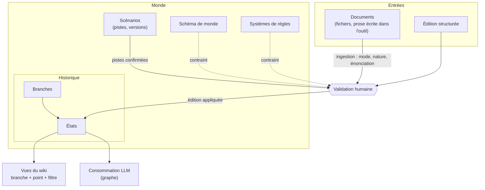

**Chaîne de base :** toute information entre par une **édition** ; une édition appliquée crée un **état** ; un wiki est une **vue** calculée d'un état.

---

## 3. Glossaire

| Terme | Nom technique | Définition |
|---|---|---|
| Monde | `World` | Univers doté d'un schéma, de systèmes, de scénarios et d'un historique en branches. |
| Schéma de monde | `WorldSchema` | Configuration déclarant les types d'entités et de relations diégétiques du monde. |
| Système de règles | `RuleSystem` | Schéma d'un jeu de règles (méta). Même langage que le schéma de monde. |
| Cardinalité | `cardinality` | Contrainte déclarée sur un type de relation : `one_to_one`, `one_to_many`, `many_to_one`, `many_to_many`. |
| Entité | `Entity` | Objet de l'univers typé par le schéma (personnage, lieu, faction…). |
| Fait | `Fact` | Unité atomique de vérité : un attribut d'une entité, ou une relation entre deux entités. |
| Attribut à valeurs multiples | `list[...]` | Attribut dont la valeur est un ensemble non ordonné ; chaque valeur est un fait à part (R-FAI-05). |
| Clé de fait | `fact_key` | Emplacement qu'occupe un fait ; deux faits de même clé ne coexistent pas dans un état (R-FAI-05). |
| Fiche | `Sheet` | Valeurs méta d'une entité dans un système donné. |
| Fiches exigées | `sheets` | Déclaration du monde, par système : types du monde qui exigent une fiche et catégorie attendue (R-MET-06). |
| Contrepartie | `counterpart_of` | Relation noyau, provisoire, entre les deux nœuds d'un élément à double face (R-MET-04, lacune L1). |
| Hors schéma | `out_of_schema` | Changement qui cite un élément non déclaré ; non applicable (R-SCH-06). |
| Valeur invalide | `invalid_value` | Changement qui cite des éléments déclarés en violant leurs contraintes ; non applicable (R-SCH-06). |
| Non-conformité | `non_conforming` | Élément d'un état devenu invalide après une modification du schéma ; toléré et signalé (R-SCH-10). |
| Document | `Document` | Source ingérée. Un document in-world est aussi une entité de l'univers. |
| Lot | `Batch` | Ensemble de documents ingérés ensemble. |
| Affirmation | `Claim` | Contenu attribué à une voix du monde ; n'est pas un fait. |
| Changement | `Change` | Opération élémentaire du catalogue (§6.1). |
| Édition | `Edit` | Ensemble cohérent de changements, en attente ou appliqué. |
| Édition dérivée | `derived_from` | Lien d'une édition appliquée vers l'édition en attente qu'elle confirme partiellement ou adapte (R-EDI-08). |
| Piste | `Draft` | Édition en attente d'origine auteur ou scénario. |
| Proposition | `Proposal` | Édition en attente d'origine ingestion, soumise à validation. |
| État | `State` | Contenu complet du monde (lore, fiches, systèmes, schéma) à un point de l'historique. |
| Branche | `Branch` | Suite ordonnée d'éditions appliquées à partir d'un état. |
| Branche de référence | `reference_branch` | Branche affichée par défaut (attribut du monde). |
| Transposition | `transpose` | Application explicite d'une édition ou d'un scénario sur une autre branche. |
| Scénario | `Scenario` | Ensemble organisé de pistes, versionné, rattaché au monde. |
| Version de scénario | `ScenarioVersion` | État d'un scénario à un moment de sa propre histoire. |
| Déroulé | `Playthrough` | Instance jouée d'une version de scénario sur une branche. |
| Contradiction | `Conflict` | Tension détectée, qualifiée et soumise à décision (§7). |
| Propositions concurrentes | `competing_proposals` | Propositions en attente, issues de lots différents, qui écrivent la même clé de fait (R-PRI-07). |
| Famille de contradiction | `conflict_family` | `history` / `conformity` / `identity` (R-CON-04). |
| Notoriété | `visibility` | `secret` / `public` / `unqualified`, portée par chaque fait. |
| Notoriété effective | `effective_visibility` | Notoriété d'un fait après plafonnement par les entités qu'il mentionne (R-NOT-04). |
| Levée de propagation | `propagation_lifted` | Indicateur explicite qui rend un fait visible en vue publique sans révéler l'entité non publique qu'il mentionne (R-NOT-04). |
| Mode d'ingestion | `mode` | `source` / `edit`. |
| Nature | `nature` | `diegetic` / `meta_system` / `meta_sheet` / `mixed`. |
| Énonciation | `voice` | `author` / `in_world` ; l'énonciateur est `speaker`. |
| Autorité | `authority` | Champ préparé sur les documents. |
| Fenêtre diégétique | `diegetic_window` | Champ préparé sur les faits. |
| Libellés | `labels` | Libellés par langue des types, attributs et relations de monde ; champ préparé. |
| Vue | `View` | Wiki calculé : branche + point de l'historique + filtre de notoriété. |
| Provenance | `provenance` | Origine d'un fait : l'édition qui l'a établi (issue d'un document et d'un lot, d'une édition structurée ou d'un déroulé), et ses supports documentaires. |
| Support documentaire | `Support` | Passage d'un document qui affirme une valeur pour une clé de fait ; n'est pas une édition (R-FAI-01). |
| Fait orphelin | `orphan_fact` | Fait d'origine documentaire qui n'a plus aucun support (R-FAI-06). |

## 4. Modèle structurel

### 4.1 Diagramme conceptuel

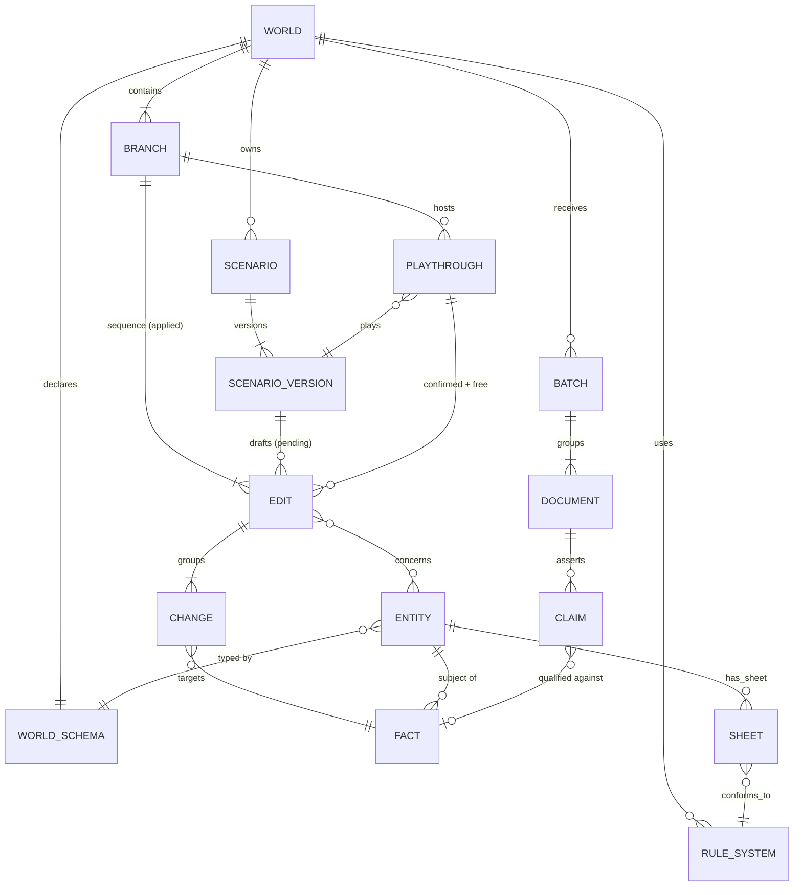

### 4.2 Monde

| ID | Règle |
|---|---|
| R-MON-01 | Un monde **doit** avoir exactement un schéma de monde, une base, et au moins une branche. |
| R-MON-02 | Un monde **doit** désigner une **branche de référence**. |
| R-MON-03 | Un monde **peut** avoir zéro, un ou plusieurs systèmes de règles. |
| R-MON-04 | Une branche ou variante **hérite** du schéma et des systèmes de son origine, et **peut** les modifier par édition. |

### 4.3 Schémas (monde et systèmes)

Principe : **un système libre, contraint par monde.** Le moteur ne présuppose aucun type diégétique ; chaque monde déclare les siens avant d'être construit.

| ID | Règle |
|---|---|
| R-SCH-01 | Le schéma de monde **doit** déclarer les types d'entités (attributs typés, contraintes, héritage éventuel) et les types de relations (domaine, cible, cardinalité, symétrie). La cardinalité (`cardinality`) se lit de `from` vers `to` : `one_to_many` signifie qu'une cible a au plus une source ; `many_to_many` est la valeur par défaut. Un attribut de type `list[...]` est un ensemble non ordonné de valeurs. Une relation symétrique (`symmetric`) a les mêmes types en `from` et en `to`, et une cardinalité `one_to_one` ou `many_to_many`. |
| R-SCH-02 | Schéma de monde et systèmes **doivent** utiliser le **même langage** et le **même validateur**. |
| R-SCH-03 | Les schémas **font partie de l'état** : les modifier est une édition (ponctuelle ou rétroactive). |
| R-SCH-04 | Une modification de schéma **ne doit pas** modifier d'office les éléments existants : les non-conformités sont **signalées**. |
| R-SCH-05 | La plateforme **doit** fournir un schéma de monde par défaut (fantasy) à copier et adapter. |
| R-SCH-06 | Un changement **non représentable** dans le schéma de l'état visé **doit** être signalé et mis en attente, et **ne peut pas être appliqué** en l'état. Il est non représentable s'il est **hors schéma** (`out_of_schema` : il cite un type, un attribut ou une relation non déclaré) ou de **valeur invalide** (`invalid_value` : il cite des éléments déclarés mais viole leurs contraintes — type ou bornes d'une valeur, type d'une extrémité de relation, attribut requis vidé ou absent d'une entité créée, `set_attribute` sur un attribut `list[...]` ou `add_value` sur un attribut simple). Il ne devient applicable que s'il est adapté vers un changement représentable, ou si la même édition modifie le schéma pour le rendre représentable (R-SCH-03, R-MET-05). Cela vaut pour toute voie d'alimentation et pour les systèmes de règles (R-SCH-02). |
| R-SCH-07 | Dans la fondation, les identifiants des types, attributs et relations **de monde** **doivent** être en anglais, comme ceux de la plateforme. Norme de départ volontairement stricte, assouplissable plus tard. |
| R-SCH-08 | Chaque type, attribut et relation **peut** porter des libellés par langue (`labels`) ; champ préparé, exploité par une future interface. Sans libellé, l'identifiant est affiché tel quel. |
| R-SCH-09 | Les termes de la plateforme (types noyau, énumérations) se traduisent dans l'interface ; les termes définis par l'auteur se traduisent via `labels` dans le schéma. |
| R-SCH-10 | **Hors schéma ≠ non-conformité.** Un élément **non conforme** était valide quand il a été écrit et l'est devenu après une modification du schéma : il est **toléré et signalé** (R-SCH-04). Un changement **non représentable** (hors schéma ou de valeur invalide) ne l'a jamais été : il est **refusé à l'application** (R-SCH-06). |

Exemple :

```yaml
world: ashlands
types:
  Character:      { attributes: { name: { type: text, required: true }, title: { type: text } } }
  Faction:        { attributes: { name: { type: text, required: true } } }
  MonasticOrder:
    extends: Faction
    labels: { fr: "Ordre monastique", en: "Monastic order" }
    attributes: { vows: { type: list[text], labels: { fr: "vœux" } } }
  Place:          { attributes: { name: { type: text, required: true } } }
relations:
  rules:      { from: [Character, Faction], to: Place, cardinality: one_to_many }
  member_of:  { from: Character, to: Faction }
  sibling_of: { from: Character, to: Character, symmetric: true, labels: { fr: "frère ou sœur de" } }
```

Ici, `rules` en `one_to_many` signifie qu'un lieu n'a qu'un seul gouvernant : « le roi gouverne Brume » et « le conseil gouverne Brume » occupent la même clé de fait (R-FAI-05) et se contredisent.

Les identifiants des types et relations **de monde** sont choisis par l'auteur, en anglais (R-SCH-07) ; leurs libellés lisibles passent par `labels` (R-SCH-08).

### 4.4 Types et relations noyau

Fournis par la plateforme, **non configurables**, car la mécanique en dépend.

| Types noyau | Relations noyau |
|---|---|
| `Document`, `Batch`, `Claim`, `Edit`, `Draft`, `Proposal`, `Scenario`, `ScenarioVersion`, `Playthrough`, `Sheet` | `concerns` (édition/piste → entité), `asserts` (document → affirmation), `has_sheet` (entité → fiche), `conforms_to` (fiche → catégorie de système), `same_as` (entité ↔ entité), `counterpart_of` (élément du monde → élément d'un système ; **provisoire**, lacune L1) |

| ID | Règle |
|---|---|
| R-NOY-01 | Le schéma de monde **ne doit** définir que des types diégétiques. |
| R-NOY-02 | Les types noyau **peuvent** être reliés aux types de monde. |

### 4.5 Fait

Le **fait** est l'unité atomique de vérité et de versionnement.

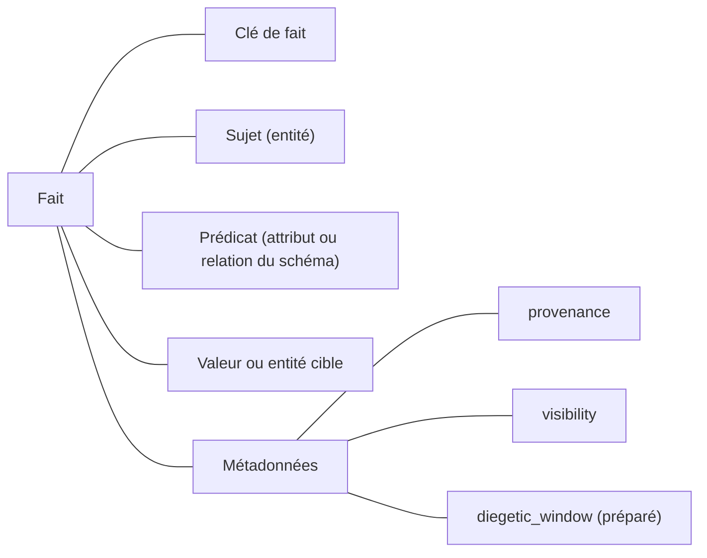

| ID | Règle |
|---|---|
| R-FAI-01 | Tout fait **doit** porter sa **provenance**, en deux parties : l'**édition qui l'a établi** (issue d'un document et d'un lot, d'une édition structurée ou d'un déroulé), et ses **supports documentaires** (`Support`). Un support indique qu'un passage affirme une valeur pour une clé de fait. Il n'est **pas une édition** : il ne change pas l'état, n'est pas soumis à validation et ne dépend pas de la branche ; qu'il confirme ou non le fait se calcule sur la vue consultée. |
| R-FAI-02 | Tout fait **doit** porter une **notoriété** (4.9). |
| R-FAI-03 | Tout fait **peut** porter une **fenêtre de validité diégétique** (`diegetic_window`) ; champ préparé, non exploité par la fondation. |
| R-FAI-04 | Un fait n'existe que dans un **état** : il est créé, modifié ou retiré par des changements (§6.1). |
| R-FAI-05 | Tout fait **doit** avoir une **clé de fait** (`fact_key`), déduite du schéma ; deux faits de même clé ne peuvent coexister dans un état. Attribut : `(entity, attribute)` ; attribut à valeurs multiples (`list[...]`) : `(entity, attribute, value)`, une clé par valeur. Relation, selon sa cardinalité (R-SCH-01) : `many_to_many` → `(from, relation, to)` ; `one_to_many` → `(relation, to)` ; `many_to_one` → `(from, relation)` ; `one_to_one` → les deux clés précédentes. Relation symétrique : extrémités rangées dans un ordre canonique ; en `one_to_one`, les rôles `from` et `to` étant interchangeables, une clé `(extrémité, relation)` par extrémité (`spouse_of(mervin, isabeau)` occupe `(mervin, spouse_of)` et `(isabeau, spouse_of)`). L'existence d'une entité a pour clé `(entity)`. La clé fonde la détection des contradictions et des dépendances (R-EDI-03, §6.3). Un ajout sur une clé occupée par un autre fait n'est applicable que si la même édition retire ce fait (« le conseil gouverne Brume » exige de retirer « Odon gouverne Brume ») ; seule `set_attribute` remplace une valeur, puisque l'opération signifie « modifier ». |
| R-FAI-06 | Un fait d'origine documentaire qui perd son dernier support (passage supprimé à la ré-ingestion) **doit** être signalé comme **orphelin** (`orphan_fact`) ; il n'est **jamais retiré d'office** (R-PRI-01). |

### 4.6 Méta : systèmes et fiches

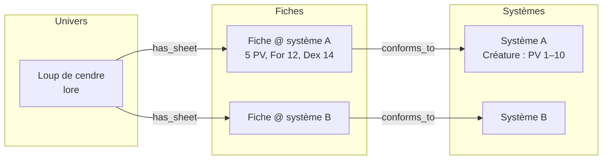

| ID | Règle |
|---|---|
| R-MET-01 | Le méta **doit** vivre hors de l'univers : dans les systèmes (règles, catégories, attributs) et les fiches (valeurs par entité et par système). |
| R-MET-02 | Une entité **peut** avoir une fiche par système. |
| R-MET-03 | Critère de classement : *une information qui reste vraie si l'on change de système de règles est diégétique ; sinon elle est méta.* |
| R-MET-04 | Un élément à double face (sort, capacité nommée) **doit** être représenté par deux nœuds reliés : un dans l'univers, un dans le système. Le lien est la relation noyau `counterpart_of`, provisoire jusqu'à ce que la lacune L1 soit tranchée. |
| R-MET-05 | Fiches et systèmes **suivent le même historique** que l'univers ; une édition peut toucher lore, fiche, système et schéma à la fois. |
| R-MET-06 | Un système **doit** signaler les fiches non conformes et les fiches manquantes, sans les modifier. Les fiches exigées sont **déclarées par le monde** (`sheets`) : pour chaque système, les types du monde (sous-types compris) qui exigent une fiche et la catégorie attendue — le Loup de cendre, `Creature`, exige une fiche `Monster` dans le système B. Un système reste ainsi réutilisable d'un monde à l'autre. |

### 4.7 Documents, lots et affirmations

| ID | Règle |
|---|---|
| R-DOC-01 | Toute ingestion **doit** appartenir à un **lot**, même d'un seul document. |
| R-DOC-02 | Un document **doit** porter : `mode`, `nature`, `voice` (et `speaker` si `in_world`) (5.2), `status` ; et **peut** porter une `authority` (préparée). |
| R-DOC-03 | La prose rédigée dans l'outil **est un document** comme un autre. |
| R-DOC-04 | Un document **doit** rester attaché aux faits qu'il a produits ou confirmés (éditions et supports, R-FAI-01) ; sa réécriture entraîne une ré-ingestion et un diff. |
| R-DOC-05 | Statut d'un document (`status`) : *intégré* (`integrated`), *partiellement contredit* (`partially_contradicted`), *obsolète* (`obsolete`). Le statut se déduit, pour chaque vue, de ses affirmations, de ses supports et de l'état ; *obsolète* est une décision humaine, prise par une édition d'origine `curation` (`set_document_obsolete`, R-EDI-09), et bloque toute nouvelle proposition issue du document. Ce statut est **réversible** : le lever rend le document ré-ingérable ; modalités à étudier (10.1). |
| R-DOC-06 | Un document **in-world** **doit** être une entité de l'univers ; son contenu produit des **affirmations**, pas des faits. |
| R-DOC-07 | Une affirmation **peut** être qualifiée *vraie*, *fausse* ou *non établie* (`true` / `false` / `undetermined`) par rapport aux faits, et **peut** être promue en fait (édition combinant `qualify_claim` et les changements qui établissent le fait). La **qualification porte sa propre notoriété**, indépendante de celle de l'affirmation : non qualifiée par défaut, donc masquée en vue publique (R-NOT-03). Exemple : la Chronique, publique, affirme qu'Aldren est mort au combat ; qualifiée fausse, elle reste lue telle quelle par les joueurs tant que l'auteur ne rend pas la qualification publique. |
| R-DOC-08 | Faits et affirmations contradictoires **coexistent** ; ce n'est pas une contradiction au sens de 7. |


### 4.8 Identité

| ID | Règle |
|---|---|
| R-IDT-01 | Deux entités désignant la même chose **doivent** être reliées par `same_as`, **sans fusion** : chacune garde ses faits. |
| R-IDT-02 | `same_as` **doit** être qualifiée (`kind`) : **révélation** (`revelation`, diégétique) ou **doublon** (`duplicate`, erreur technique). |
| R-IDT-03 | Une révélation **porte une notoriété** : secrète, elle laisse les entités distinctes dans une vue publique. |
| R-IDT-04 | Un doublon est affiché comme une seule entité dans toutes les vues. |
| R-IDT-05 | Les vues **doivent** proposer une page consolidée, avec provenance ; les contradictions entre entités reliées sont signalées. |

### 4.9 Notoriété

Sens : **notoriété dans le monde** (ce qu'un habitant pourrait savoir), pas ce que la table a appris.

| ID | Règle |
|---|---|
| R-NOT-01 | Valeurs de `visibility` : `secret`, `public`, `unqualified` (défaut). |
| R-NOT-02 | Granularité : entités, attributs, relations, affirmations, qualifications d'affirmations, documents. La clôture et la suppression d'une entité n'ont pas de notoriété propre : elles suivent celle de l'entité (Aldren, public, est vu clos en vue publique). |
| R-NOT-03 | Tout filtre public **doit** traiter le *non qualifié* comme *secret*. |
| R-NOT-04 | La **notoriété effective** (`effective_visibility`) d'un fait est **plafonnée** par celle des entités qu'il mentionne : un fait qui mentionne une entité secrète ou non qualifiée n'est pas public, quelle que soit sa notoriété déclarée. La propagation est **levable au cas par cas**, par un indicateur explicite (`propagation_lifted`) porté par `set_visibility` : le fait s'affiche alors en vue publique **sans révéler l'entité**, présentée comme non publique. |
| R-NOT-05 | Les affirmations héritent de la notoriété de leur document. |
| R-NOT-06 | La notoriété **fait partie de l'état** : elle change par édition. |
| R-NOT-07 | Le système **doit** signaler les faits déclarés publics mais masqués par une entité non publique, pour que l'auteur puisse qualifier l'entité ou lever la propagation. |

---

## 5. Alimentation

### 5.1 Deux voies

| Voie | Nature | Passe par |
|---|---|---|
| **Ingestion** | Interprétation d'un document | Extraction guidée par le schéma → édition (appliquée ou en attente) |
| **Édition structurée** | Écriture directe de faits | Édition |

| ID | Règle |
|---|---|
| R-ALI-01 | Il n'existe **que ces deux voies** vers le graphe. |
| R-ALI-02 | **Le graphe fait foi** ; le wiki en est une vue. |

### 5.2 Trois axes d'ingestion

| Axe | Question | Valeurs | Effet |
|---|---|---|---|
| **Mode** (`mode`) | Le document confirme-t-il ou change-t-il l'univers ? | `source` / `edit` | Interprétation d'une contradiction |
| **Nature** (`nature`) | Où va l'information ? | `diegetic` / `meta_system` / `meta_sheet` / `mixed` | Destination : univers, système, fiche |
| **Énonciation** (`voice`) | Qui affirme ? | `author` / `in_world` (énonciateur : `speaker`) | Fait ou affirmation |

| Mode | Une contradiction avec l'état est… | Résultat |
|---|---|---|
| `source` | une **anomalie** | **Proposition** en attente ; l'état en place l'emporte |
| `edit` | une **intention** | Édition présentée en **diff**, appliquée après confirmation |

| ID | Règle |
|---|---|
| R-ING-01 | Les trois axes sont **indépendants** et **doivent** être renseignés pour chaque document ou passage. |
| R-ING-02 | Une contradiction **interne** à un document est toujours une anomalie. |
| R-ING-03 | Les éditions issues d'un scénario sont en mode `edit` par défaut. |

### 5.3 Mécanisme de déclaration

Commun aux trois axes (et à la notoriété), par priorité décroissante :

| Niveau | Forme | Portée |
|---|---|---|
| 1 | En-tête du document (*frontmatter*) | Document entier |
| 2 | Marqueurs explicites (`[in_world: …] … [/in_world]`, `[meta] … [/meta]`) | Passage |
| 3 | Détection par indices | Passage — produit toujours une **proposition** |

```yaml
mode: source
nature: mixed
voice: in_world
speaker: chronicle-of-the-fall
visibility: public
```

| ID | Règle |
|---|---|
| R-DEC-01 | Un niveau supérieur l'emporte sur un niveau inférieur. |
| R-DEC-02 | La détection **ne décide jamais** : elle propose. |
| R-DEC-03 | Des guillemets signalent une **attribution**, pas une fausseté. |

### 5.4 Priorité et lots

| ID | Règle |
|---|---|
| R-PRI-01 | **Priorité à l'état en place** : rien ne change silencieusement. |
| R-PRI-02 | **Premier arrivé, premier servi** entre lots successifs. |
| R-PRI-03 | Les contradictions **internes à un lot** sont présentées **symétriquement**. |
| R-PRI-04 | Toute décision **doit** être tracée et **ne doit pas** être redemandée à la ré-ingestion du même contenu. |
| R-PRI-05 | Politique de validation (`validation_policy`) : dans la fondation, `manual` — **toute édition issue de l'ingestion est validée par l'humain**, enrichissements compris. L'application automatique des enrichissements (`auto_enrichment`, avec seuil de confiance) est à étudier (10.1). |
| R-PRI-06 | Quelle que soit la politique, toute édition appliquée reste dans l'historique et peut être défaite (R-HIS-03, 10.1). |
| R-PRI-07 | Des propositions en attente issues de **lots différents** qui écrivent la même clé de fait avec des valeurs différentes **doivent** être signalées comme **concurrentes** (`competing_proposals`) et présentées ensemble. La priorité est **suggérée** au lot le plus ancien (R-PRI-02) ; l'humain tranche. Une fois l'une confirmée, les autres passent à revérifier. |

### 5.5 Pipeline d'ingestion

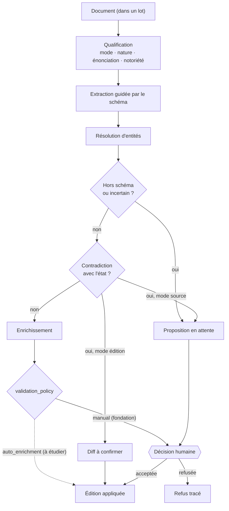

---

## 6. Modèle dynamique

### 6.1 Édition

| ID | Règle |
|---|---|
| R-EDI-01 | Une édition est un **ensemble cohérent de changements au niveau du fait**. |
| R-EDI-02 | Une édition **appliquée** se transpose ou s'écarte **en bloc**. Une édition en attente s'applique en bloc, sauf confirmation partielle ou adaptée (R-EDI-08). |
| R-EDI-03 | Une édition **doit** enregistrer les faits qu'elle **lit** et ceux qu'elle **modifie** (détection de dépendances), identifiés par leur clé (R-FAI-05). |
| R-EDI-04 | Une édition est écrite **par rapport à un état**. |
| R-EDI-05 | Une édition **doit** porter une étiquette d'origine (`origin`) et **peut** porter des étiquettes libres (`tags`). |
| R-EDI-06 | Le catalogue d'opérations est **fermé** : toute écriture dans l'état passe par l'une des opérations ci-dessous. |
| R-EDI-07 | `delete_entity` n'est autorisée que dans une édition d'origine `correction`. Elle ne retire rien de l'historique (R-CYC-01) : l'entité et ses faits disparaissent des états suivants seulement. |
| R-EDI-08 | Une édition en attente **peut** être confirmée **partiellement** ou **adaptée**. L'édition appliquée est alors une nouvelle édition qui référence l'originale (`derived_from`) ; l'originale n'est pas modifiée, et chaque changement écarté fait l'objet d'une décision tracée (R-CYC-02, R-PRI-04). Une proposition confirmée, même partiellement, est close ; une piste de scénario reste disponible pour d'autres déroulés (R-SCN-06). |
| R-EDI-09 | Une édition d'origine `curation` ne contient **que** des changements de statut de document (`set_document_obsolete`), et ces changements n'apparaissent **que** dans une édition `curation`. Elle ne modifie pas le monde et ne peut pas contenir `delete_entity` (R-EDI-07). |

**Opérations élémentaires (changements)**

Les opérations sur les faits valent pour le lore comme pour les fiches (la cible est alors la fiche). Les opérations `schema_*` portent sur le schéma de monde ou sur un système de règles, désigné par leur portée (`scope`) (R-SCH-02, R-SCH-03).

| Famille | Opération | Nom technique | Exemple |
|---|---|---|---|
| Entités | Créer une entité | `create_entity` | Apparition du conseil des marchands |
| | Clore une entité | `close_entity` | Le baron meurt |
| | Supprimer une entité (correction) | `delete_entity` | « Brume-sur-Mer », lieu inventé par une erreur d'extraction |
| Faits | Modifier un attribut | `set_attribute` | Le baron devient « régent » |
| | Vider un attribut | `unset_attribute` | Le baron perd son titre |
| | Ajouter une valeur à un attribut multiple | `add_value` | Les Veilleurs font vœu de pauvreté |
| | Retirer une valeur d'un attribut multiple | `remove_value` | Les Veilleurs renoncent au vœu de silence |
| | Ajouter une relation | `add_relation` | Le conseil gouverne Brume |
| | Retirer une relation | `remove_relation` | Le roi ne gouverne plus Brume |
| | Changer une notoriété | `set_visibility` | L'empoisonnement devient public |
| Affirmations et documents | Créer une affirmation | `add_claim` | La Chronique affirme qu'Aldren est mort au combat |
| | Qualifier une affirmation | `qualify_claim` | La Chronique est fausse sur ce point |
| | Déclarer un document obsolète, ou lever ce statut | `set_document_obsolete` | Les vieilles notes sur le baron sont obsolètes |
| Schémas | Déclarer ou modifier un type | `schema_set_type` | Ajouter le type `MonasticOrder` |
| | Retirer un type | `schema_remove_type` | Retirer le type `Guild` |
| | Déclarer ou modifier une relation | `schema_set_relation` | Passer `rules` en `one_to_many` |
| | Retirer une relation | `schema_remove_relation` | Retirer `vassal_of` |

- **Clore ≠ supprimer** : une entité close reste dans l'univers. La suppression est réservée à la **correction** d'erreurs (R-EDI-07).
- Pas d'opération d'annulation : l'historique conserve les états.
- Retirer un type ou une relation du schéma ne retire aucun fait : les éléments concernés deviennent non conformes et sont signalés (R-SCH-04).
- Un attribut à valeurs multiples (`list[...]`) est un **ensemble non ordonné** : il se modifie uniquement par `add_value` et `remove_value` ; `set_attribute` et `unset_attribute` ne s'y appliquent pas. Un ordre significatif (rangs, succession) se modélise par une relation ou un attribut numérique.

**Étiquettes d'origine (déduites)**

| Étiquette | Nom technique | Origine |
|---|---|---|
| Enrichissement | `enrichment` | Ajout sans contradiction |
| Conséquence de scénario | `scenario_consequence` | Piste confirmée ou édition libre d'un déroulé |
| Piste retenue | `adopted_draft` | Piste d'auteur appliquée hors scénario |
| Redéfinition ponctuelle / rétroactive | `redefinition` (`point` / `retroactive`) | Choix explicite lors d'un retcon |
| Correction | `correction` | Erreur technique (extraction, doublon) |
| Décision sur les sources | `curation` | Changement du statut d'un document, sans effet sur le monde (R-EDI-09) |

### 6.2 Cycle de vie d'une édition

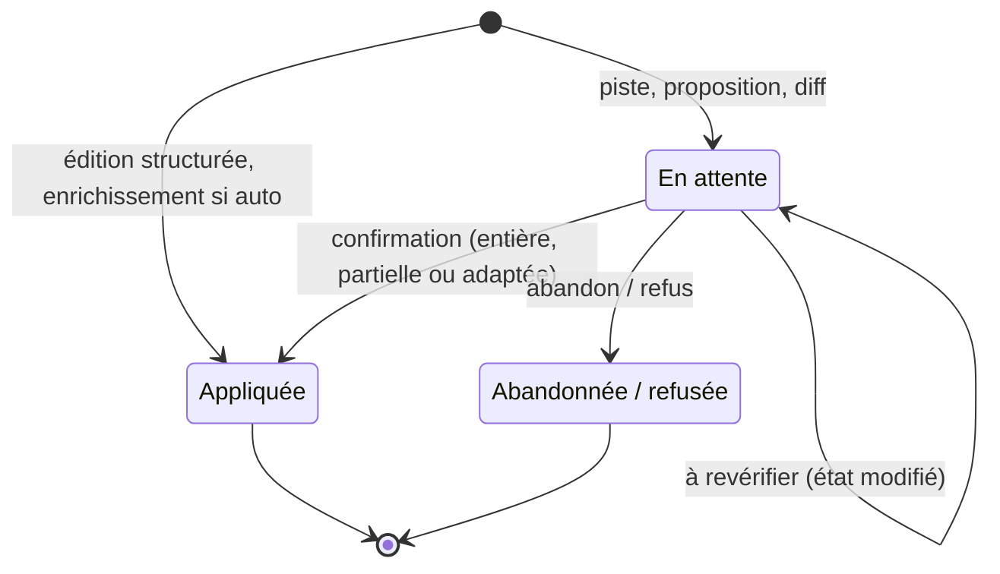

| ID | Règle |
|---|---|
| R-CYC-01 | Une édition appliquée **n'est jamais modifiée ni retirée**. |
| R-CYC-02 | Une édition abandonnée ou refusée **reste tracée**. |
| R-CYC-03 | Deux éditions en attente **peuvent** se contredire (alternatives). |
| R-CYC-04 | Statut d'une édition (`status`) : `pending`, `applied`, `abandoned`. |

### 6.3 Historique et branches

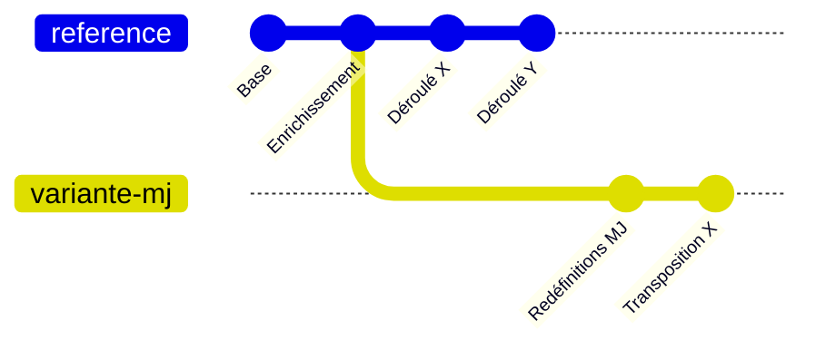

| ID | Règle |
|---|---|
| R-HIS-01 | **L'historique ne fait que s'allonger.** |
| R-HIS-02 | Un **état** = état de départ de la branche + éditions appliquées, dans l'ordre, jusqu'au point considéré. |
| R-HIS-03 | Revenir en arrière = **créer une branche** depuis un état antérieur. |
| R-HIS-04 | Tout état antérieur **doit** rester consultable. |
| R-HIS-05 | Une **transposition** applique explicitement une édition ou un scénario sur une autre branche. Les **conflits d'historique** (famille `history`, R-CON-04) ne sont détectés que dans deux situations : quand une édition est confrontée à un état autre que celui contre lequel elle a été écrite (transposition, rejeu, confirmation d'une édition en attente après évolution de la branche) ; et lors d'une ingestion (contradiction avec l'état en mode `source`, contradiction interne à un document ou à un lot, concurrence entre propositions de lots différents). |
| R-HIS-06 | Changer l'ordre des scénarios = nouvelle branche rejouant les scénarios dans le nouvel ordre. |

**Dépendances entre éditions**, calculées à partir des clés des faits lus et modifiés (R-EDI-03, R-FAI-05) :

| Relation | Condition | Transposition |
|---|---|---|
| Indépendantes | Aucune clé commune | Automatique |
| Dépendante | B lit ou modifie une clé écrite par A | Conflit si A absent |
| Contradictoires | A et B écrivent la même clé avec des valeurs différentes | Décision humaine |

### 6.4 Redéfinitions

| | Ponctuelle | Rétroactive |
|---|---|---|
| Sens | « À partir de maintenant » | « Depuis toujours » (ou depuis un état choisi) |
| Mécanisme | Édition étiquetée ajoutée à la branche | Nouvelle branche + rejeu |
| Vues antérieures | Signalent « redéfini plus tard » | Reflètent la redéfinition |

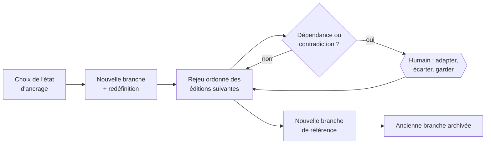

| ID | Règle |
|---|---|
| R-RED-01 | Le mode **doit** être choisi explicitement, après un **aperçu d'impact** (nombre d'éditions ultérieures concernées). |
| R-RED-02 | Le rejeu **doit** être suspendable, reprenable et abandonnable. |
| R-RED-03 | Après rejeu, les pistes en attente concernées passent **à revérifier**. |
| R-RED-04 | Les variantes dérivées de l'ancienne branche sont **notifiées**, pas modifiées. |
| R-RED-05 | Les mêmes modes s'appliquent aux modifications de schéma et de systèmes. |

### 6.5 Scénarios et déroulés

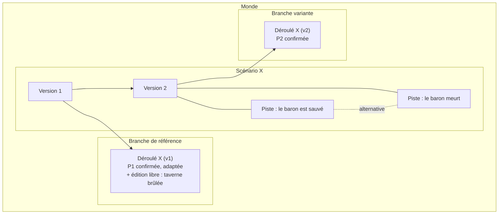

| ID | Règle |
|---|---|
| R-SCN-01 | Un scénario est un **ensemble organisé de pistes**, avec embranchements et dépendances envers d'autres scénarios. |
| R-SCN-02 | Dans la fondation, **action potentielle de scénario = piste**. |
| R-SCN-03 | Un scénario est **rattaché au monde** et visible de toutes ses branches. |
| R-SCN-04 | Un scénario reste **modifiable** et possède son propre historique de **versions**. |
| R-SCN-05 | Un **déroulé** appartient à une branche et référence la **version jouée**. |
| R-SCN-06 | Un déroulé contient des **pistes confirmées** (éventuellement adaptées ; l'adaptation appartient au déroulé, R-EDI-08) et des **éditions libres** (imprévu). |
| R-SCN-07 | Une **dépendance** (« X suppose Y ») est déclarée sur le scénario ; l'**ordre effectif** est celui de la branche. |
| R-SCN-08 | Le système **vérifie et signale** les dépendances non satisfaites et les conflits d'applicabilité ; il ne les impose pas. |
| R-SCN-09 | Une piste d'auteur (hors scénario) est un nœud relié par `concerns` aux entités visées. |

---

## 7. Contradictions

| Lieu | Qualification typique | Famille |
|---|---|---|
| Source vs état (mode `source`) | Anomalie | `history` |
| Contenus d'un même document ou d'un même lot | Anomalie, symétrique | `history` |
| Propositions en attente de lots différents, même clé | Concurrence, priorité suggérée au lot le plus ancien | `history` |
| Édition vs état (transposition, rejeu) | Dépendance / contradiction | `history` |
| Scénario vs état | Conflit d'applicabilité | `history` |
| Édition en attente vs état courant | À revérifier | `history` |
| Fiche vs système, entité vs schéma | Non-conformité | `conformity` |
| Contenu extrait vs schéma | Hors schéma | `conformity` |
| Entités reliées par `same_as` | Divergence (légitime ou non) | `identity` |

**Ne sont pas des contradictions :** fait vs affirmation (R-DOC-08) ; deux pistes alternatives (R-CYC-03).

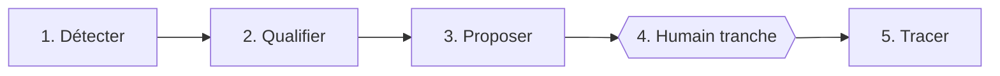

| ID | Règle |
|---|---|
| R-CON-01 | Un **mécanisme unique** traite toutes les contradictions. |
| R-CON-02 | La qualification s'appuie sur les axes d'ingestion (mode, énonciation) et sur les dépendances entre éditions. |
| R-CON-03 | Chaque contradiction **doit** être stockée avec ses éléments en cause (entités, documents, lot, éditions) pour permettre le regroupement. |
| R-CON-04 | Chaque contradiction appartient à une **famille** (`conflict_family`) : `history` (entre éditions, ou entre une édition et un état ; détectée seulement dans les situations de R-HIS-05), `conformity` (non-conformité, hors schéma) ou `identity` (divergence `same_as`). Les familles `conformity` et `identity` sont des **signalements** recalculables à tout moment sur un état. |

---

## 8. Restitution

### 8.1 Vues du wiki

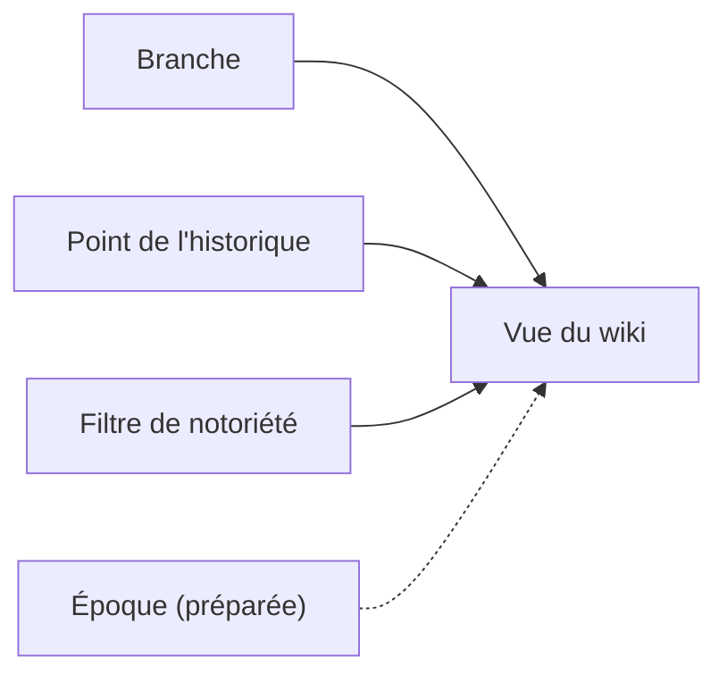

| Vue | Branche | Point | Filtre |
|---|---|---|---|
| Wiki d'auteur | Référence | Courant | Tout |
| Wiki joueur | Référence | Courant | Public |
| Wiki « après X » | Référence | Après le déroulé de X | Au choix |
| Wiki d'une variante | Variante | Au choix | Au choix |

| ID | Règle |
|---|---|
| R-VUE-01 | Toute variante de wiki **est une vue** ; aucune n'est stockée séparément. |
| R-VUE-02 | Une page d'entité **doit** montrer ses faits, ses fiches, ses pistes ouvertes, ses documents sources et, le cas échéant, sa consolidation `same_as`. |
| R-VUE-03 | Une vue antérieure **doit** signaler les informations redéfinies plus tard. |
| R-VUE-04 | Les éléments pour les joueurs sont prélevés par le MJ dans une vue publique ; pas d'outillage dédié. |

### 8.2 Consommation machine

| ID | Règle |
|---|---|
| R-LLM-01 | Un LLM consomme le **graphe** (un état, une branche, un filtre), pas les pages du wiki. |

---

## 9. Invariants

1. **Une seule primitive** : l'édition, en attente ou appliquée, est le seul moyen de modifier l'état.
2. **L'historique ne fait que s'allonger** ; tout état reste consultable.
3. **Le graphe fait foi** ; le wiki est une vue ; les textes restent attachés.
4. **Rien ne change silencieusement** : toute contradiction est détectée, qualifiée, tranchée par un humain, tracée.
5. **Le système vérifie et signale ; l'humain décide.**
6. **Provenance et notoriété** sont portées par chaque fait.
7. **Le schéma contraint, il ne modifie pas** : les non-conformités sont signalées.
8. **Les voix du monde affirment ; seul l'auteur établit des faits.**
9. **Le méta vit à part**, relié au lore, et suit le même historique.
10. **Ce qui n'est pas construit est préparé** : aucun choix de la fondation ne bloque les extensions listées en 1.4.

---

## 10. Points ouverts

### 10.1 Conceptuels (non bloquants)

| Point | Commentaire |
|---|---|
| Critères distinguant piste d'auteur et action de scénario | Identiques dans la fondation (R-SCN-02) |
| Application automatique des enrichissements | `auto_enrichment` : seuil de confiance au-delà duquel un ajout non contradictoire et conforme est appliqué sans validation (R-PRI-05) |
| Défaire une édition passée | Mécanisme de *rollback* ciblé compatible avec un historique qui ne fait que s'allonger : édition inverse (`revert`) ajoutée à la branche, ou nouvelle branche depuis l'état antérieur |
| Documents obsolètes | Effets de la levée du statut : ré-ingestion complète, ou réactivation des seules propositions bloquées ; sort des décisions déjà tracées (R-DOC-05) |

### 10.2 Entrées de la conception technique

Ces sujets sont traités dans *cadre-technique.md*, qui cite ce document sans le dupliquer.

| Sujet | Question | Statut |
|---|---|---|
| Stockage | Graphe, relationnel, fichiers ? Représentation des états | Retenu : journal d'éditions + projection, SQLite |
| Calcul des vues | Matérialisation ou calcul à la demande ; cache par état | Retenu : tête matérialisée, états antérieurs recalculés |
| Langage de schéma | Format, expressivité, validateur | Retenu : YAML + méta-schéma unique |
| Extraction | Mono ou multi-passes ; contexte | Ouvert, mesuré au jalon J4 |
| Résolution d'entités | Registre de noms, alias, seuils | Ouvert, mesuré au jalon J4 |
| LLM | Local, cloud, mixte selon l'étape | Ouvert, choisi sur mesures |
| Framework | Existant étendu ou noyau sur mesure | Retenu : noyau sur mesure, en Python |
| Ontologies de référence | Alignement ou inspiration (GOLEM, CIDOC-CRM) | Ouvert, export éventuel |
| Tests | Corpus, questions de compétence, tests d'états, branches, rejeu, conformité, filtres | Proposé : trois niveaux, monde Valmont en double |
