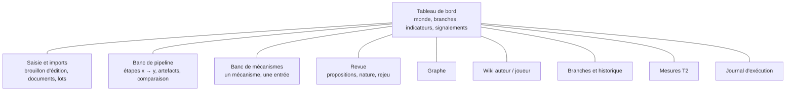
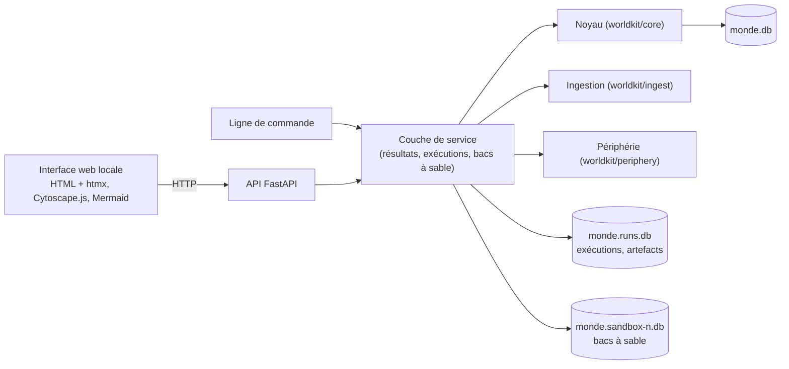

# Cadre de l'interface

**Objet :** vision, principes, découpage et points à trancher de l'interface de `worldkit`, conçue d'abord comme un **banc d'essai** : tester, suivre l'efficacité, contrôler, et obtenir des retours complets et explicites.
**Version :** 0.4 — 27 septembre 2026. S'appuie sur *cadre-fondation.md* v1.21 et *cadre-technique.md* v2.15, qu'il cite sans les dupliquer.
**Statut :** de travail. Chaque décision porte un statut : **validé** (acté avec l'auteur) ou **proposé** (en attente). En cas de divergence, le cadre de la fondation puis le cadre technique prévalent.

**Conventions**
- Les décisions d'interface portent un identifiant stable `I-XXX-nn`. Les règles et décisions des autres cadres sont citées par leur identifiant (`R-XXX-nn`, `T-XXX-nn`).
- Les questions sont numérotées `QI-nn` (§11) et tranchées une à une, avec des options et une recommandation ; chaque réponse devient une décision `I-XXX-nn` (§8).
- Nommage technique en anglais, prose en français (comme les autres cadres).

---

## 1. Objectifs

L'interface n'est pas d'abord un outil d'écriture confortable. C'est un **instrument de mesure et de pilotage** du noyau et de l'ingestion, qui rend les tests humains praticables (retcon d'Aldren, Loup sous deux systèmes…) et rend visible ce que la ligne de commande laisse enfoui.

| ID | Objectif |
|---|---|
| I-OBJ-01 | **Tester un pipeline entier** : d'un document (ou d'un lot) jusqu'aux vues, en voyant chaque étape. |
| I-OBJ-02 | **Tester un mécanisme seul** : une entrée donnée à la main, la sortie de ce seul mécanisme (valider un schéma, calculer des clés, appliquer une édition, qualifier un changement, transposer…). |
| I-OBJ-03 | **Exécuter un pipeline partiel, de l'étape x à l'étape y** : injecter une entrée intermédiaire (des brouillons écrits à la main, une extraction enregistrée) et s'arrêter où l'on veut. |
| I-OBJ-04 | **Suivre l'efficacité** : indicateurs à chaque étape (volumes, étiquettes, erreurs, durées, appels au modèle), qualité mesurée (T2), et leur évolution d'une exécution à l'autre. |
| I-OBJ-05 | **Contrôler** : rien ne s'écrit dans un monde sans action explicite ; on peut essayer dans un bac à sable, comparer, puis appliquer. Les décisions humaines (revue, nature, rejeu) se prennent dans l'interface. |
| I-OBJ-06 | **Retours complets et explicites** : chaque résultat montre ses entrées, ses sorties, les signalements avec la règle citée, et le chemin qui y a mené. |
| I-OBJ-07 | **Voir** : le graphe, le wiki (auteur et joueur), les branches et l'historique. |
| I-OBJ-08 | **Alimenter** : saisie directe d'éditions (brouillon) et imports (documents, lots, fichiers d'éditions, scénarios). |

## 2. Principes

| ID | Principe |
|---|---|
| I-PRI-01 | **Clarté avant beauté.** Tables denses, identifiants visibles, textes bruts accessibles, aucune information cachée derrière une animation. Le maximum de réponse rendue et d'indicateurs. |
| I-PRI-02 | **Aucune logique métier dans l'interface.** Les règles du domaine (clés, collisions, notoriété, qualification, transposition, rejeu) sont calculées par le service, jamais par l'interface, qui recueille une saisie, appelle le service et affiche ce qui revient. Elle garde la **présentation** : mise en page, tri, recherche dans ce qu'elle a reçu, disposition du graphe, surlignage. Un **filtre de vue** (auteur ou joueur, branche, point) est du métier : il décide de ce qui existe à l'écran. Une seule vérité (T-ARC-01, R-SCH-02) ; ce qui s'affiche est ce qui est testé. En cas de doute, le calcul va au service. *(validé)* |
| I-PRI-03 | **Tout résultat est traçable** : entrée, sortie, règle citée (`R-…`, `T-…`), version du code et de l'extracteur, durée. |
| I-PRI-04 | **Essai avant écriture** : une exécution de test ne modifie jamais le monde de travail sans confirmation (bac à sable, I-SBX-01). *(validé)* |
| I-PRI-05 | **Le déterminisme se voit** : rejouer une exécution et comparer ; une différence sur une étape déterministe est une anomalie signalée. |
| I-PRI-06 | **Le coût se voit et se contrôle** : toute étape qui appelle un modèle affiche une estimation (nombre d'appels) et demande confirmation ; le cache d'extraction est visible (T-ING-09, I-LLM-01). *(validé)* |
| I-PRI-07 | **Parité avec la ligne de commande** : ce que fait l'interface reste faisable en ligne de commande, pour les tests automatiques et la reproductibilité (I-CLI-01). *(validé)* |

## 3. Ce qu'on teste : catalogue des mécanismes

Chaque mécanisme est testable seul (I-OBJ-02), avec une entrée saisie ou importée et une sortie commentée.

| Mécanisme | Module | Entrée | Sortie montrée | Règles |
|---|---|---|---|---|
| Validation de schéma | M1 | YAML de schéma (monde ou système) | valide / rejeté, signalements | R-SCH-01, R-SCH-02, T-SCH-01 |
| Clés de fait | M1 | un changement + état | clés calculées, forme lisible | R-FAI-05, T-FAI-01 |
| Vérification d'un changement | M1 | changement + état | hors schéma, valeur invalide, entité inconnue | R-SCH-06, R-EDI-04 |
| Application d'une édition | M4 | édition + état | collisions, lectures, écritures, état après, diff | R-FAI-05, R-EDI-03 |
| Projection | M3 | journal jusqu'à un point | état, déterminisme vérifié | R-HIS-02 |
| Notoriété effective et vues | M10–M11 | état + filtre | pages, export, faits masqués | R-NOT-03, R-NOT-04, R-NOT-07 |
| Conformité | M1 | état | non-conformités, fiches manquantes | R-SCH-10, R-MET-06 |
| Déclaration et passages | M6 | document | en-tête, passages, segments, empreintes, nature déclarée | R-DOC-02, R-DEC-01, R-DEC-04 |
| Extraction | M7 | passage + contexte | brouillons bruts (oracle ou LLM), prompt, réponse brute, durée | T-LLM-01, T-ING-17 |
| Traduction des formes réduites | M9 | `sheet_values` + état | changements produits | T-ING-20 |
| Résolution des entités | M8 | brouillons du lot | entités nouvelles, regroupements, reprises | T-ING-07 |
| Qualification et propositions | M9 | changements + état de base | étiquettes, supports, dépendances, concurrence | T-ING-02 à T-ING-05, T-ING-18 |
| Revue et décisions | M9 | proposition + décision | édition appliquée ou dérivée, trace | R-PRI-04, T-ING-04 |
| Ré-ingestion | M6–M9 | nouvelle version d'un document | passages inchangés, retirés, décisions reprises | T-ING-08 à T-ING-11 |
| Transposition | M4 | édition + branche cible | indépendante, dépendante, contradictoire | R-HIS-05, §6.3 |
| Scénarios et déroulés | M5 | version + confirmations | pistes appliquées, en conflit | R-SCN-01 à R-SCN-09 |
| Redéfinition et rejeu | M5 | changements + ancrage | aperçu d'impact, pas du rejeu, conflits | R-RED-01 à R-RED-05, T-RED-01 |
| Mesure T2 | périphérie | lot + extracteur | précision, rappel, pièges, par opération | T-ING-19, T-TST-01 |

## 4. Le pipeline d'ingestion découpé en étapes

Pour exécuter « de x à y » (I-OBJ-03), le pipeline d'ingestion doit être découpé en **étapes nommées**, chacune avec une entrée et une sortie **sérialisables** (un artefact) qu'on peut enregistrer, inspecter, modifier et réinjecter.

| Étape | Entrée | Artefact produit | Déterministe |
|---|---|---|---|
| E1 Déclaration | fichier | axes, erreurs de déclaration | oui |
| E2 Passages | document déclaré | passages, segments, empreintes | oui |
| E3 Nature | passages | nature déclarée par passage | oui |
| E4 Extraction | passages + contexte | brouillons, affirmations, drapeaux, prompt et réponse brute | **non** (LLM) ; oui (oracle, cache) |
| E5 Traduction | brouillons + état | changements | oui |
| E6 Classement | changements + natures | retenus, écartés (garde), en attente de nature | oui |
| E7 Résolution | changements du lot | entités nouvelles, regroupements | oui |
| E8 Qualification | changements + état de base | changements qualifiés, supports | oui |
| E9 Propositions | changements qualifiés | propositions, dépendances, concurrence | oui |
| E10 Revue | propositions + décisions | décisions tracées, éditions | humain |
| E11 Application | éditions | journal, état | oui |
| E12 Vues | état | pages, export, signalements | oui |

Aujourd'hui, `ingest` enchaîne E1 à E9 d'un bloc et n'expose que le résultat. Découper ces étapes est un **travail côté ingestion** : refactorisation sans changement de comportement, vérifiée par les tests existants, préalable au banc de pipeline (I-PIP-01).

## 5. Espaces de l'interface (proposés)

| ID | Espace | Contenu |
|---|---|---|
| I-VUE-01 | **Tableau de bord** | Monde ouvert, branche de référence, branches, rang de tête ; compteurs (entités, faits, propositions en attente, questions de nature, rejeux ouverts) ; signalements par famille ; dernières exécutions ; état des tests d'acceptation (W00–W17). |
| I-VUE-02 | **Saisie et imports** | Brouillon d'édition (YAML avec validation en direct : clés, collisions, signalements avant d'appliquer) ; import de documents et de lots, de fichiers d'éditions, de scénarios, de pistes. |
| I-VUE-03 | **Banc de pipeline** | Choix des étapes (E1 à E12, de x à y), des entrées (document, lot, artefact enregistré, saisie), de l'extracteur ; exécution ; pour chaque étape : artefact, indicateurs, durée, signalements ; comparaison de deux exécutions (diff par étape). |
| I-VUE-04 | **Banc de mécanismes** | Un mécanisme du catalogue (§3), son entrée, sa sortie commentée, avec la règle en cause pour chaque signalement. |
| I-VUE-05 | **Revue** | Propositions (étiquettes, détail, dépendances, concurrence, diff contre l'état) ; questions de nature ; décisions ; rejeux ouverts et leurs conflits ; aperçu d'impact d'une redéfinition. |
| I-VUE-06 | **Graphe** | Entités et relations, filtrés par branche, point, filtre (auteur / joueur), portée (monde, systèmes, fiches) ; mise en évidence des faits masqués, secrets, redéfinis plus tard, orphelins. |
| I-VUE-07 | **Wiki** | Pages auteur et joueur côte à côte, à un point de l'historique ; provenance de chaque fait. |
| I-VUE-08 | **Branches et historique** | Lignée des branches, points nommés, journal par branche, éditions (origine, lectures, écritures), transpositions, rejeux, historique des références ; comparaison de deux états. |
| I-VUE-09 | **Mesures** | Mesures T2 (par lot, par opération, pièges, stabilité), historique des mesures, comparaison de modèles ou de prompts. |
| I-VUE-10 | **Journal d'exécution** | Toutes les exécutions (qui, quoi, entrées, durée, appels au modèle, résultat), rejouables. |

## 6. Indicateurs (proposés)

| Famille | Indicateurs |
|---|---|
| Pipeline | passages (total, extraits, relus du cache, inchangés, retirés) ; brouillons par opération ; changements écartés par la garde ; questions de nature ; propositions par étiquette ; supports ; erreurs d'extraction ; durée par étape ; appels au modèle et temps de réponse. |
| Qualité (T2) | précision et rappel (globaux, sur les questions, par opération) ; pièges tombés ; erreurs d'attribution ; affirmations ; stabilité. |
| État | entités, faits par notoriété, signalements par famille (`history`, `conformity`, `identity`), faits orphelins, faits masqués. |
| Revue | décisions par type, propositions en attente par ancienneté, décisions reprises sans question (R-PRI-04). |
| Acceptation | parcours W00–W17 : passés, échoués, non automatisés ; tests `pytest` : nombre, durée. |
| Déterminisme | exécutions rejouées identiques / différentes, par étape déterministe. |

## 7. Forme commune d'un retour (proposée)

Chaque exécution (mécanisme, étape, pipeline) rend un **résultat** de même forme, affiché de la même façon partout :

| Champ | Contenu |
|---|---|
| statut | réussi, refusé, en attente de décision, erreur |
| entrée | ce qui a été donné (lien vers l'artefact) |
| sortie | ce qui a été produit (artefact), avec un diff contre l'état quand il y a lieu |
| signalements | code, gravité, message, **règle citée**, chemin (`changes[2]`) |
| indicateurs | propres à l'étape (§6) |
| trace | durée, versions (code, schéma, extracteur, prompt), appels au modèle, graine du bac à sable |

## 8. Architecture et décisions

| ID | Sujet | Décision | Alternatives écartées | Statut | Question |
|---|---|---|---|---|---|
| I-TEC-01 | Technologie | **Web local** : la couche de service est exposée par une **API FastAPI** (JSON) ; les pages sont du **HTML rendu par le serveur**, rendu interactif par **htmx** ; **Cytoscape.js** pour le graphe, **Mermaid** pour les branches ; bibliothèques JS copiées dans le projet, sans étape de compilation ni Node : l'outil fonctionne hors ligne. Chaque résultat est aussi consultable en JSON brut. | NiceGUI (tout Python, mais API non séparée par construction, graphe riche par JS ajouté) ; Streamlit (réexécution du script à chaque interaction : mal adapté au pas à pas, à la revue, aux rejeux) ; bureau Qt (lourd, graphe pauvre). | validé | QI-01 |
| I-INC-01 | Premier incrément | **Service et lecture d'abord** : couche de service et forme commune d'un résultat, puis tableau de bord, wiki auteur et joueur, branches et historique en lecture seule. Premier test humain : relire le retcon d'Aldren entre les deux branches. | Revue d'abord (écrans d'action avant ceux de lecture dont ils dépendent) ; banc de pipeline d'abord (long avant le premier écran). | validé | QI-02 |
| I-SBX-01 | Bac à sable | Une **copie du fichier du monde** par bac à sable (`monde.sandbox-<n>.db`, sauvegarde SQLite cohérente) : l'essai y est complet, inspectable, comparable au monde de travail, jetable. **Rendre réel** = rejouer sur le monde de travail les **actions enregistrées** de l'essai (jamais copier le fichier, R-HIS-01) ; une extraction LLM est relue depuis son artefact (aucun appel, résultat identique) ; toute divergence est signalée avant d'appliquer. Les mécanismes qui n'écrivent rien s'exécutent directement sur le monde de travail. | Transaction annulée (le code valide au fil de l'eau ; rien d'inspectable après) ; monde en mémoire (perdu à la fermeture) ; branche d'essai dans le monde (journal pollué, lots, cache et décisions non propres à une branche). | validé | QI-03 |
| I-PIP-01 | Étapes et artefacts | Les **12 étapes** E1 à E12 (§4) sont des fonctions du service : artefact d'entrée + état de base → résultat (§7) portant l'artefact de sortie. Un **modèle pydantic par étape** valide l'artefact injecté ; artefacts enregistrés en **JSON canonique** (clés triées, version du format) ; YAML accepté en saisie. L'étape humaine E10 prend, dans un pipeline scripté, un artefact « décisions ». `ingest` devient l'enchaînement E1 à E9 ; la refactorisation est vérifiée par les tests existants, inchangés. | Six regroupements (isole mal traduction, garde, résolution) ; plus de douze étapes (état intermédiaire illisible ; le banc de mécanismes couvre ce besoin). | validé | QI-04 |
| I-RUN-01 | Exécutions | Un fichier SQLite d'exécutions **par monde** (`monde.runs.db`), distinct du monde, seule source de vérité de l'univers. On garde tout : entrées, artefacts, indicateurs, trace, prompts et réponses brutes. Conservation illimitée, **purge manuelle** (sans effet sur l'histoire du monde). Bacs à sable et exécutions y sont référencés ; export JSON d'une exécution possible. Le cache d'extraction reste dans le monde (T-ING-09). | Tables dans le fichier du monde (mêle histoire et traces jetables) ; un fichier JSON par exécution (comparaison et tri difficiles). | validé | QI-05 |
| I-ACC-01 | Parcours d'acceptation | Les parcours W00 à W17 s'exécutent **pas à pas** dans un bac à sable (étapes `do:`) ; à côté de chaque attendu en prose, le corpus reçoit progressivement une **vérification structurée** (`check: fact`, `check: pending`…), en commençant par W15 et W08. L'interface montre chaque étape et chaque attendu (réussi, échoué, non structuré). **pytest et l'interface partagent l'exécuteur** ; les tests écrits à la main restent tant qu'un parcours n'est pas entièrement structuré. Évolution du format provisoire du corpus. | Lancer pytest et afficher le résultat (ni étapes ni artefacts) ; étapes exécutées mais attendus en prose seulement (rien de vérifié, deux descriptions). | validé | QI-06 |
| I-GRA-01 | Graphe | **Voisinage** d'une entité choisie par défaut (profondeur réglable), vue complète à un clic ; **couches** à activer (monde, éléments de système, fiches avec `has_sheet` et `conforms_to` calculées, contreparties, identités, affirmations, documents) ; **style** encodant notoriété, fait masqué, redéfini plus tard, orphelin, entité close ; survol : identifiant, clé, provenance ; **mode comparaison** de deux états (branches ou points) avec ajouts, retraits, changements ; table des éléments affichés sous le graphe. Données fournies par le service (branche, point, filtre). | Graphe complet filtré (illisible à grande taille, comparaison noyée) ; table d'abord (perd la vue d'ensemble). | validé | QI-07 |
| I-SAI-01 | Saisie | **Éditeur YAML** (police fixe, numéros de ligne) **vérifié en direct par le service**, sans écrire : clés, lectures et écritures, collisions, signalements rattachés à la ligne de `changes[i]`, aperçu de l'état après en diff. Aides : gabarit par opération, panneau des entités connues, choix de branche, point de base et destination (appliquer, soumettre, bac à sable). Formulaires possibles plus tard, écrivant dans l'éditeur. | Formulaires par opération (long à construire, format caché) ; les deux synchronisés d'emblée (double travail, source d'erreurs). | validé | QI-08 |
| I-CLI-01 | Parité | **Parité par le service** : toute opération du service est accessible en ligne de commande (`worldkit run stages`, `worldkit sandbox`, `worldkit walkthrough run`, `worldkit runs`…) ; seul le purement visuel reste propre à l'interface. Les commandes actuelles passent progressivement par le service ; les tests visent le service. | Parité souhaitée seulement (opérations non scriptables) ; ligne de commande figée (perte de la reproductibilité). | validé | QI-09 |
| I-LLM-01 | Coût des modèles | Avant toute extraction par un modèle : **estimation exacte** (passages absents du cache pour ce profil et ce prompt), **confirmation explicite** (dialogue ; `--yes` en ligne de commande), **plafond par exécution** (`max_calls_per_run` dans `worldkit-llm.yaml`, 30 par défaut ; au-delà, arrêt propre, passages restants marqués « non extrait : plafond atteint », repris à la relance). Chaque exécution relève ses appels, durées, modèle et version du prompt ; le tableau de bord les cumule. Oracle et cache ne demandent rien ; les tests n'appellent aucun modèle. | Confirmation seule (sans filet) ; relevé après coup (contraire à I-PRI-06). | validé | QI-10 |

### 8.1 Couche de service (I1)

| ID | Sujet | Décision | Alternatives écartées | Statut |
|---|---|---|---|---|
| I-SVC-01 | Forme d'une opération | **Registre d'opérations nommées** (`worldkit/service/registry.py`) : un nom (`edit.apply`), une sorte, un modèle pydantic de paramètres (tout paramètre inconnu est refusé), une fonction qui appelle le code métier. Un appel est une donnée (nom + paramètres JSON) : enregistré tel quel, rejouable pour rendre un bac réel (I3), exposé en ligne de commande et, en I2, en HTTP. Point d'entrée unique : `Session(monde).call(nom, paramètres, cible)`. | Fonctions ordinaires (enregistrement, validation, routes et commandes à réécrire par fonction). | validé |
| I-SVC-02 | Exécutions enregistrées | Quatre sortes : `read` (consultation, **non enregistrée**, sauf si on l'épingle : `--pin`), `compute` (mécanisme sans écriture, enregistré pour comparer), `write` (enregistrée, rejouable), `admin` (bacs et exécutions, enregistrée, jamais rejouée). | Tout enregistrer (journal noyé de lectures) ; les seules écritures (plus d'historique des mesures et des mécanismes). | validé |
| I-SVC-03 | Ligne de commande | Générique et dédiée : `worldkit ops`, `worldkit call <opération> [paramètres.yaml] [--param clé=valeur]… [--sandbox N] [--pin] [--json]` (valeur lue en YAML, clés pointées pour imbriquer : `edit.id=x1`) ; commandes dédiées `sandbox create|list|drop` et `runs list|show|purge`. Sortie : résumé lisible (statut, signalements avec règle, indicateurs, sortie en YAML ou Markdown), `--json` pour le résultat brut. Les commandes existantes restent inchangées. | Générique seule (lourde au quotidien) ; une commande dédiée par opération (parité à la discipline). | validé |
| I-SVC-04 | Bacs et exécutions | Un seul `monde.runs.db` par monde de travail : exécutions (chacune porte sa cible, `world` ou `sandbox:<n>`) et registre des bacs (fichier, origine, têtes des branches à la copie, statut). Bacs **à plat**, nés du monde ou d'un autre bac (parenté notée ; rendre réel rejouera la chaîne). Jeter un bac supprime son fichier et **garde ses exécutions** ; un bac jeté n'est plus une cible. | Un runs.db par bac (historique perdu en jetant, comparaisons éclatées) ; bacs nés du seul monde (la chaîne de rejeu sera nécessaire de toute façon). | validé |

Opérations d'I1 (`worldkit ops`) : consultations `world.summary`, `branch.list`, `journal.list`, `edit.show`, `wiki.page`, `wiki.index`, `state.check`, `export.graph`, `review.list`, `sandbox.list`, `runs.list`, `runs.show`, `ops.list` ; calcul `edit.check` (clés, lectures, écritures, signalements, diff de l'état, sans écrire) ; écritures `edit.apply`, `edit.submit`, `ingest.batch` (extracteur oracle seul jusqu'à I4, I-LLM-01), `review.accept`, `review.refuse`, `review.nature` ; administration `sandbox.create`, `sandbox.drop`, `runs.purge`.

### 8.2 Application web (I2)

| ID | Sujet | Décision | Alternatives écartées | Statut |
|---|---|---|---|---|
| I-WEB-01 | Contexte de lecture | Le contexte (cible, branche, point, filtre) vit **dans l'adresse** de chaque page (`/wiki/aldren-ii?target=1&branch=reference&point=@base&filter=player`) ; une barre de contexte le montre et le modifie, avec des listes fournies par le service. Une adresse est une lecture reproductible ; elle correspond un pour un aux paramètres de l'opération, affichés sous l'écran. | Préférence de session (adresse muette, deux onglets ne lisent pas deux branches, page non reproductible). | validé |
| I-WEB-02 | Comparaison | **Deux colonnes à contextes indépendants** (`/compare/<entité>?left.branch=…&right.branch=…`) ; l'opération `wiki.compare` rend les deux pages et leurs **différences au niveau des faits** (ajouté, retiré, changé : valeur, notoriété, qualification, cible) ; l'interface ne fait que surligner. Même calcul en ligne de commande. | Deux colonnes sans calcul (comparaison à l'œil) ; affichage unifié seul (contexte de chaque lecture perdu). | validé |
| I-WEB-03 | Lancement et forme | `worldkit serve --db monde.db [--port 8765] [--no-browser]` : écoute sur `127.0.0.1` seulement, ouvre le navigateur, arrêt par Ctrl+C ; dépendances optionnelles `pip install -e .[ui]`. Feuille de style propre au projet, dense, police système ; pages rendues en tables à partir de leur structure, Markdown brut dans un encart ; chaque écran liste ses appels au service et leur JSON brut. L'API JSON (`/api/ops`, `/api/call/<opération>`) ne sert que les consultations jusqu'à I3. | Feuille « sans classes » copiée (moins dense) ; Markdown rendu seul (structure perdue). | proposé |

## 9. Périmètre

| Dans le périmètre | Préparé (possible plus tard) | Hors périmètre |
|---|---|---|
| Usage local, un seul utilisateur (l'auteur) ; tout ce qui est décrit aux §3 à §7 | Édition confortable du wiki, mise en forme soignée ; lecture par les joueurs | Multi-utilisateur, comptes, déploiement en ligne (cadre de la fondation §1.4) |

## 10. Jalons

| Jalon | Contenu | Test |
|---|---|---|
| I0 | Cadre d'interface validé (ce document) | — |
| I1 — **fait** | Couche de service et forme commune d'un résultat (§7) ; exécutions enregistrées (`monde.runs.db`) ; bacs à sable (créer, dupliquer, lister, jeter) ; commandes `ops`, `call`, `sandbox`, `runs` (I-SVC-01 à I-SVC-04) | tests automatiques du service (`tests/test_service.py`) |
| I2 — **fait** | Application FastAPI : tableau de bord, wiki auteur et joueur, comparaison de deux lectures, branches et historique (lignée Mermaid), journal, éditions, exécutions, opérations, en lecture seule ; JSON brut de chaque résultat (I-WEB-01 à I-WEB-03) | relire le retcon d'Aldren entre `reference` et `reference-r1` (automatisé dans `tests/test_web.py`, à faire à l'écran) |
| I3 | Saisie YAML vérifiée en direct (I-SAI-01) ; banc de mécanismes ; rendre réel un essai de bac à sable (I-SBX-01) | refaire le retcon d'Aldren dans un bac à sable, puis le rendre réel |
| I4 | Découpage du pipeline (E1 à E12, I-PIP-01) ; banc de pipeline de x à y ; contrôle du coût (I-LLM-01) | Loup sous deux systèmes (J8), de E1 à E12 et par morceaux |
| I5 | Revue complète (propositions, questions de nature, rejeu) ; parcours exécutables, W15 et W08 structurés d'abord (I-ACC-01) | sessions de curation chronométrées |
| I6 | Graphe (I-GRA-01), mesures T2 et leur historique, comparaison d'exécutions | choix du modèle sur le second jet du corpus |

## 11. Questions

Toutes tranchées le 27 septembre 2026 (§8) :

| # | Question | Décision |
|---|---|---|
| QI-01 | Technologie | I-TEC-01 |
| QI-02 | Premier incrément | I-INC-01 |
| QI-03 | Bac à sable | I-SBX-01 |
| QI-04 | Découpage du pipeline et artefacts | I-PIP-01 |
| QI-05 | Exécutions | I-RUN-01 |
| QI-06 | Parcours d'acceptation | I-ACC-01 |
| QI-07 | Graphe | I-GRA-01 |
| QI-08 | Saisie | I-SAI-01 |
| QI-09 | Parité avec la ligne de commande | I-CLI-01 |
| QI-10 | Coût des modèles | I-LLM-01 |

## 12. Glossaire de l'interface

| Terme | Nom technique | Définition |
|---|---|---|
| Banc de pipeline | `pipeline_bench` | Espace qui exécute des étapes du pipeline, de x à y, et montre leurs artefacts. |
| Banc de mécanismes | `mechanism_bench` | Espace qui exécute un seul mécanisme sur une entrée donnée. |
| Étape | `Stage` | Partie nommée du pipeline d'ingestion (E1 à E12), avec une entrée et un artefact sérialisables. |
| Artefact | `Artifact` | Sortie enregistrée d'une étape ou d'un mécanisme, inspectable et réinjectable. |
| Exécution | `Run` | Une exécution enregistrée (mécanisme, étapes ou pipeline), avec ses entrées, sorties, indicateurs et trace. |
| Résultat | `Result` | Forme commune du retour d'une exécution (§7). |
| Bac à sable | `sandbox` | Copie du monde où l'on essaie sans modifier le monde de travail. |
| Couche de service | `service` | API Python entre l'interface (et la ligne de commande) et le code métier, sans logique propre. |
