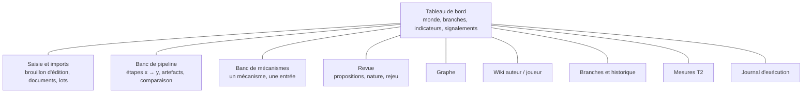
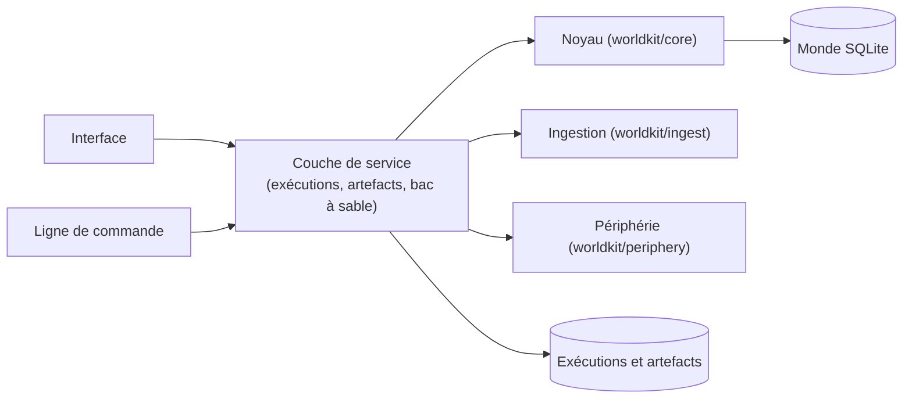

# Cadre de l'interface

**Objet :** vision, principes, découpage et points à trancher de l'interface de `worldkit`, conçue d'abord comme un **banc d'essai** : tester, suivre l'efficacité, contrôler, et obtenir des retours complets et explicites.
**Version :** 0.1 — 27 septembre 2026. S'appuie sur *cadre-fondation.md* v1.21 et *cadre-technique.md* v2.15, qu'il cite sans les dupliquer.
**Statut :** de travail. Chaque décision porte un statut : **validé** (acté avec l'auteur) ou **proposé** (en attente). En cas de divergence, le cadre de la fondation puis le cadre technique prévalent.

**Conventions**
- Les décisions d'interface portent un identifiant stable `I-XXX-nn`. Les règles et décisions des autres cadres sont citées par leur identifiant (`R-XXX-nn`, `T-XXX-nn`).
- Les questions ouvertes sont numérotées `QI-nn` (§11) et tranchées une à une, avec des options et une recommandation.
- Nommage technique en anglais, prose en français (comme les autres cadres).

---

## 1. Objectifs

L'interface n'est pas d'abord un outil d'écriture confortable. C'est un **instrument de mesure et de pilotage** du noyau et de l'ingestion, qui rend les tests humains praticables (retcon d'Aldren, Loup sous deux systèmes…) et rend visible ce que la ligne de commande laisse enfoui.

| ID | Objectif |
|---|---|
| I-OBJ-01 | **Tester un pipeline entier** : d'un document (ou d'un lot) jusqu'aux vues, en voyant chaque étape. |
| I-OBJ-02 | **Tester un mécanisme seul** : une entrée donnée à la main, la sortie de ce seul mécanisme (valider un schéma, calculer des clés, appliquer une édition, qualifier un changement, transposer…). |
| I-OBJ-03 | **Exécuter un pipeline partiel, de l'étape x à l'étape y** : injecter une entrée intermédiaire (des brouillons écrits à la main, une extraction enregistrée) et s'arrêter où l'on veut. |
| I-OBJ-04 | **Suivre l'efficacité** : indicateurs à chaque étape (volumes, étiquettes, erreurs, durées, appels au modèle), qualité mesurée (T2), et leur évolution d'une exécution à l'autre. |
| I-OBJ-05 | **Contrôler** : rien ne s'écrit dans un monde sans action explicite ; on peut essayer dans un bac à sable, comparer, puis appliquer. Les décisions humaines (revue, nature, rejeu) se prennent dans l'interface. |
| I-OBJ-06 | **Retours complets et explicites** : chaque résultat montre ses entrées, ses sorties, les signalements avec la règle citée, et le chemin qui y a mené. |
| I-OBJ-07 | **Voir** : le graphe, le wiki (auteur et joueur), les branches et l'historique. |
| I-OBJ-08 | **Alimenter** : saisie directe d'éditions (brouillon) et imports (documents, lots, fichiers d'éditions, scénarios). |

## 2. Principes (proposés)

| ID | Principe |
|---|---|
| I-PRI-01 | **Clarté avant beauté.** Tables denses, identifiants visibles, textes bruts accessibles, aucune information cachée derrière une animation. Le maximum de réponse rendue et d'indicateurs. |
| I-PRI-02 | **Aucune logique métier dans l'interface.** Elle appelle les mêmes fonctions que la ligne de commande (noyau, ingestion, périphérie), par une couche de service mince. Même entrée, même sortie (T-ARC-01). |
| I-PRI-03 | **Tout résultat est traçable** : entrée, sortie, règle citée (`R-…`, `T-…`), version du code et de l'extracteur, durée. |
| I-PRI-04 | **Essai avant écriture** : une exécution de test ne modifie jamais le monde de travail sans confirmation (bac à sable, QI-03). |
| I-PRI-05 | **Le déterminisme se voit** : rejouer une exécution et comparer ; une différence sur une étape déterministe est une anomalie signalée. |
| I-PRI-06 | **Le coût se voit et se contrôle** : toute étape qui appelle un modèle affiche une estimation (nombre d'appels) et demande confirmation ; le cache d'extraction est visible (T-ING-09). |
| I-PRI-07 | **Parité avec la ligne de commande** (à trancher, QI-09) : ce que fait l'interface reste faisable en ligne de commande, pour les tests automatiques et la reproductibilité. |

## 3. Ce qu'on teste : catalogue des mécanismes

Chaque mécanisme est testable seul (I-OBJ-02), avec une entrée saisie ou importée et une sortie commentée.

| Mécanisme | Module | Entrée | Sortie montrée | Règles |
|---|---|---|---|---|
| Validation de schéma | M1 | YAML de schéma (monde ou système) | valide / rejeté, signalements | R-SCH-01, R-SCH-02, T-SCH-01 |
| Clés de fait | M1 | un changement + état | clés calculées, forme lisible | R-FAI-05, T-FAI-01 |
| Vérification d'un changement | M1 | changement + état | hors schéma, valeur invalide, entité inconnue | R-SCH-06, R-EDI-04 |
| Application d'une édition | M4 | édition + état | collisions, lectures, écritures, état après, diff | R-FAI-05, R-EDI-03 |
| Projection | M3 | journal jusqu'à un point | état, déterminisme vérifié | R-HIS-02 |
| Notoriété effective et vues | M10–M11 | état + filtre | pages, export, faits masqués | R-NOT-03, R-NOT-04, R-NOT-07 |
| Conformité | M1 | état | non-conformités, fiches manquantes | R-SCH-10, R-MET-06 |
| Déclaration et passages | M6 | document | en-tête, passages, segments, empreintes, nature déclarée | R-DOC-02, R-DEC-01, R-DEC-04 |
| Extraction | M7 | passage + contexte | brouillons bruts (oracle ou LLM), prompt, réponse brute, durée | T-LLM-01, T-ING-17 |
| Traduction des formes réduites | M9 | `sheet_values` + état | changements produits | T-ING-20 |
| Résolution des entités | M8 | brouillons du lot | entités nouvelles, regroupements, reprises | T-ING-07 |
| Qualification et propositions | M9 | changements + état de base | étiquettes, supports, dépendances, concurrence | T-ING-02 à T-ING-05, T-ING-18 |
| Revue et décisions | M9 | proposition + décision | édition appliquée ou dérivée, trace | R-PRI-04, T-ING-04 |
| Ré-ingestion | M6–M9 | nouvelle version d'un document | passages inchangés, retirés, décisions reprises | T-ING-08 à T-ING-11 |
| Transposition | M4 | édition + branche cible | indépendante, dépendante, contradictoire | R-HIS-05, §6.3 |
| Scénarios et déroulés | M5 | version + confirmations | pistes appliquées, en conflit | R-SCN-01 à R-SCN-09 |
| Redéfinition et rejeu | M5 | changements + ancrage | aperçu d'impact, pas du rejeu, conflits | R-RED-01 à R-RED-05, T-RED-01 |
| Mesure T2 | périphérie | lot + extracteur | précision, rappel, pièges, par opération | T-ING-19, T-TST-01 |

## 4. Le pipeline d'ingestion découpé en étapes

Pour exécuter « de x à y » (I-OBJ-03), le pipeline d'ingestion doit être découpé en **étapes nommées**, chacune avec une entrée et une sortie **sérialisables** (un artefact) qu'on peut enregistrer, inspecter, modifier et réinjecter.

| Étape | Entrée | Artefact produit | Déterministe |
|---|---|---|---|
| E1 Déclaration | fichier | axes, erreurs de déclaration | oui |
| E2 Passages | document déclaré | passages, segments, empreintes | oui |
| E3 Nature | passages | nature déclarée par passage | oui |
| E4 Extraction | passages + contexte | brouillons, affirmations, drapeaux, prompt et réponse brute | **non** (LLM) ; oui (oracle, cache) |
| E5 Traduction | brouillons + état | changements | oui |
| E6 Classement | changements + natures | retenus, écartés (garde), en attente de nature | oui |
| E7 Résolution | changements du lot | entités nouvelles, regroupements | oui |
| E8 Qualification | changements + état de base | changements qualifiés, supports | oui |
| E9 Propositions | changements qualifiés | propositions, dépendances, concurrence | oui |
| E10 Revue | propositions + décisions | décisions tracées, éditions | humain |
| E11 Application | éditions | journal, état | oui |
| E12 Vues | état | pages, export, signalements | oui |

Aujourd'hui, `ingest` enchaîne E1 à E9 d'un bloc et n'expose que le résultat. Découper ces étapes est un **travail côté noyau et ingestion** (refactorisation sans changement de comportement, vérifiée par les tests existants), préalable au banc de pipeline (QI-04).

## 5. Espaces de l'interface (proposés)

| ID | Espace | Contenu |
|---|---|---|
| I-VUE-01 | **Tableau de bord** | Monde ouvert, branche de référence, branches, rang de tête ; compteurs (entités, faits, propositions en attente, questions de nature, rejeux ouverts) ; signalements par famille ; dernières exécutions ; état des tests d'acceptation (W00–W17). |
| I-VUE-02 | **Saisie et imports** | Brouillon d'édition (YAML avec validation en direct : clés, collisions, signalements avant d'appliquer) ; import de documents et de lots, de fichiers d'éditions, de scénarios, de pistes. |
| I-VUE-03 | **Banc de pipeline** | Choix des étapes (E1 à E12, de x à y), des entrées (document, lot, artefact enregistré, saisie), de l'extracteur ; exécution ; pour chaque étape : artefact, indicateurs, durée, signalements ; comparaison de deux exécutions (diff par étape). |
| I-VUE-04 | **Banc de mécanismes** | Un mécanisme du catalogue (§3), son entrée, sa sortie commentée, avec la règle en cause pour chaque signalement. |
| I-VUE-05 | **Revue** | Propositions (étiquettes, détail, dépendances, concurrence, diff contre l'état) ; questions de nature ; décisions ; rejeux ouverts et leurs conflits ; aperçu d'impact d'une redéfinition. |
| I-VUE-06 | **Graphe** | Entités et relations, filtrés par branche, point, filtre (auteur / joueur), portée (monde, systèmes, fiches) ; mise en évidence des faits masqués, secrets, redéfinis plus tard, orphelins. |
| I-VUE-07 | **Wiki** | Pages auteur et joueur côte à côte, à un point de l'historique ; provenance de chaque fait. |
| I-VUE-08 | **Branches et historique** | Lignée des branches, points nommés, journal par branche, éditions (origine, lectures, écritures), transpositions, rejeux, historique des références ; comparaison de deux états. |
| I-VUE-09 | **Mesures** | Mesures T2 (par lot, par opération, pièges, stabilité), historique des mesures, comparaison de modèles ou de prompts. |
| I-VUE-10 | **Journal d'exécution** | Toutes les exécutions (qui, quoi, entrées, durée, appels au modèle, résultat), rejouables. |

## 6. Indicateurs (proposés)

| Famille | Indicateurs |
|---|---|
| Pipeline | passages (total, extraits, relus du cache, inchangés, retirés) ; brouillons par opération ; changements écartés par la garde ; questions de nature ; propositions par étiquette ; supports ; erreurs d'extraction ; durée par étape ; appels au modèle et temps de réponse. |
| Qualité (T2) | précision et rappel (globaux, sur les questions, par opération) ; pièges tombés ; erreurs d'attribution ; affirmations ; stabilité. |
| État | entités, faits par notoriété, signalements par famille (`history`, `conformity`, `identity`), faits orphelins, faits masqués. |
| Revue | décisions par type, propositions en attente par ancienneté, décisions reprises sans question (R-PRI-04). |
| Acceptation | parcours W00–W17 : passés, échoués, non automatisés ; tests `pytest` : nombre, durée. |
| Déterminisme | exécutions rejouées identiques / différentes, par étape déterministe. |

## 7. Forme commune d'un retour (proposée)

Chaque exécution (mécanisme, étape, pipeline) rend un **résultat** de même forme, affiché de la même façon partout :

| Champ | Contenu |
|---|---|
| statut | réussi, refusé, en attente de décision, erreur |
| entrée | ce qui a été donné (lien vers l'artefact) |
| sortie | ce qui a été produit (artefact), avec un diff contre l'état quand il y a lieu |
| signalements | code, gravité, message, **règle citée**, chemin (`changes[2]`) |
| indicateurs | propres à l'étape (§6) |
| trace | durée, versions (code, schéma, extracteur, prompt), appels au modèle, graine du bac à sable |

## 8. Architecture (proposée, à trancher)

- **Couche de service** : une API Python qui expose les mécanismes (§3) et les étapes (§4) sous la forme commune d'un résultat (§7). L'interface et, à terme, la ligne de commande passent par elle (I-PRI-02, I-PRI-07).
- **Exécutions et artefacts** : où et comment ils sont enregistrés (QI-05).
- **Bac à sable** : une copie du monde pour essayer sans risque (QI-03).
- **Technologie de l'interface** : à trancher (QI-01).

## 9. Périmètre

| Dans le périmètre | Préparé (possible plus tard) | Hors périmètre |
|---|---|---|
| Usage local, un seul utilisateur (l'auteur) ; tout ce qui est décrit aux §3 à §7 | Édition confortable du wiki, mise en forme soignée ; lecture par les joueurs | Multi-utilisateur, comptes, déploiement en ligne (cadre de la fondation §1.4) |

## 10. Jalons (proposés, à ajuster après les questions)

| Jalon | Contenu | Test |
|---|---|---|
| I0 | Cadre d'interface validé (ce document) | — |
| I1 | Couche de service et forme commune d'un résultat ; exécutions enregistrées | tests automatiques de la couche |
| I2 | Squelette de l'interface : tableau de bord, wiki, branches (lecture seule) | tests humains de lecture |
| I3 | Banc de mécanismes et saisie d'éditions en brouillon | retcon d'Aldren (J7) |
| I4 | Découpage du pipeline (E1 à E12) et banc de pipeline, de x à y | Loup sous deux systèmes (J8) |
| I5 | Revue complète (propositions, nature, rejeu) | sessions de curation chronométrées |
| I6 | Graphe, mesures T2, comparaison d'exécutions | choix du modèle sur le second jet du corpus |

## 11. Questions ouvertes

À trancher une à une, dans cet ordre (chacune peut en faire naître d'autres) :

| # | Question |
|---|---|
| QI-01 | **Technologie** : application web locale en Python seul (NiceGUI, Streamlit…), web local avec une API et une page HTML/JS (FastAPI + bibliothèques de graphe), ou application de bureau ? |
| QI-02 | **Premier incrément** : par quoi commencer pour débloquer au plus vite les tests humains ? |
| QI-03 | **Bac à sable** : où s'exécutent les essais (copie du fichier du monde, transaction annulée, monde en mémoire) et comment un essai devient-il réel ? |
| QI-04 | **Découpage du pipeline** : granularité des étapes (celle du §4 ?) et format des artefacts intermédiaires (JSON, YAML) réinjectables. |
| QI-05 | **Exécutions** : enregistrées où (dans le fichier du monde, dans un fichier à côté) et combien de temps ; ce qu'on garde (entrées, sorties, prompts, réponses brutes). |
| QI-06 | **Tests d'acceptation** : rendre les parcours W00–W17 exécutables depuis l'interface (et donc hors `pytest`), avec leurs attendus vérifiés ? |
| QI-07 | **Graphe** : bibliothèque de rendu, disposition, taille visée, filtres ; branches dessinées comment. |
| QI-08 | **Saisie** : éditeur YAML avec validation en direct, formulaires, ou les deux. |
| QI-09 | **Parité avec la ligne de commande** : obligatoire, souhaitée, ou abandonnée pour l'interface. |
| QI-10 | **Coût des modèles** : confirmation avant appel, plafond par exécution, affichage du cache. |

## 12. Glossaire de l'interface

| Terme | Nom technique | Définition |
|---|---|---|
| Banc de pipeline | `pipeline_bench` | Espace qui exécute des étapes du pipeline, de x à y, et montre leurs artefacts. |
| Banc de mécanismes | `mechanism_bench` | Espace qui exécute un seul mécanisme sur une entrée donnée. |
| Étape | `Stage` | Partie nommée du pipeline d'ingestion (E1 à E12), avec une entrée et un artefact sérialisables. |
| Artefact | `Artifact` | Sortie enregistrée d'une étape ou d'un mécanisme, inspectable et réinjectable. |
| Exécution | `Run` | Une exécution enregistrée (mécanisme, étapes ou pipeline), avec ses entrées, sorties, indicateurs et trace. |
| Résultat | `Result` | Forme commune du retour d'une exécution (§7). |
| Bac à sable | `sandbox` | Copie du monde où l'on essaie sans modifier le monde de travail. |
| Couche de service | `service` | API Python entre l'interface (et la ligne de commande) et le code métier, sans logique propre. |
