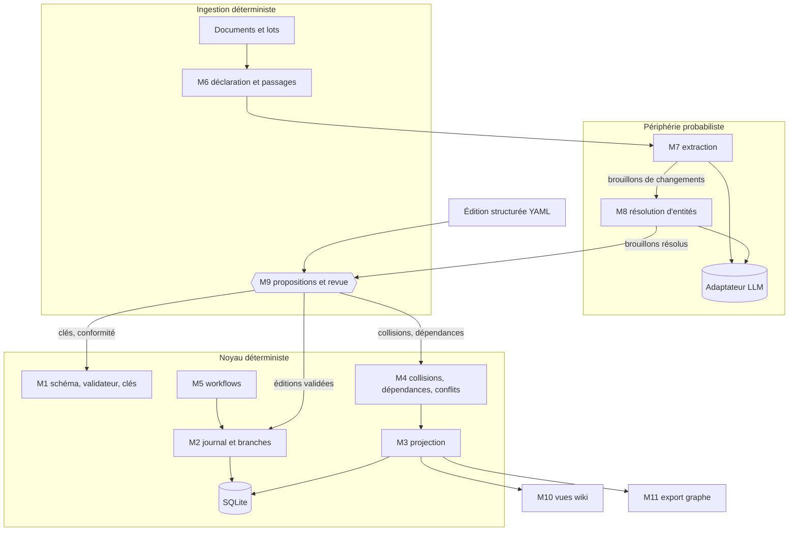
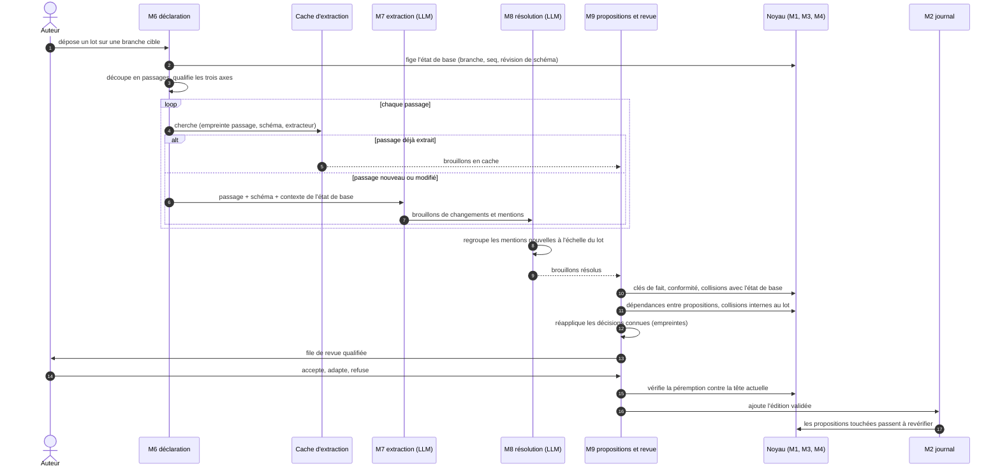
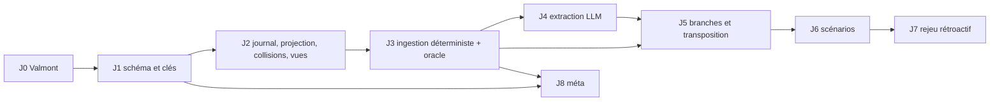

# Cadre technique de la fondation

**Objet :** décisions techniques de la fondation : éléments structurants, découpage en modules, architecture, articulation entre le noyau et l'ingestion, stratégie de test et étapes de construction.
**Version :** 2.11 — 27 septembre 2026. S'appuie sur *cadre-fondation.md* v1.18, qu'il cite sans le dupliquer.
**Statut :** de travail. Chaque décision porte un statut : **validé** (acté avec l'auteur) ou **proposé** (argumenté, en attente de validation). En cas de divergence, *cadre-fondation.md* prévaut.

**Conventions**
- Les décisions techniques portent un identifiant stable `T-XXX-nn`. Les règles du cadre sont citées par leur identifiant `R-XXX-nn`.
- Nommage technique en anglais (types, champs, opérations, modules) ; la prose reste en français. Glossaire en §10.

---

## 1. Principe directeur : noyau déterministe, périphérie probabiliste

Le système est découpé en deux régimes que rien ne mélange.

| | Noyau (`core`) | Périphérie (`periphery`) |
|---|---|---|
| Contenu | Schéma, journal des éditions, branches, projection des états, notoriété, clés de fait, dépendances, contradictions, vues, workflows | Extraction, résolution d'entités, détection d'indices |
| LLM | Aucun | Oui, derrière un adaptateur unique |
| Comportement | Même entrée → même sortie | Sortie variable, mise en cache |
| Droit d'écriture | Seul à écrire dans l'état, par des éditions validées | **Aucun** : produit uniquement des propositions (`Proposal`) |
| Mode de test | Assertions exactes, tests de propriétés | Métriques sur un corpus de référence |

| ID | Décision | Statut | Règles |
|---|---|---|---|
| T-ARC-01 | Le noyau ne contient aucun appel à un LLM ; pour une même entrée, il produit toujours la même sortie. | validé | R-HIS-02, invariant 2 |
| T-ARC-02 | La périphérie n'a qu'un droit : produire des éditions en attente (`Proposal`). Elle n'écrit jamais dans l'état. | validé | R-ALI-01, R-DEC-02, invariants 4 et 5 |
| T-ARC-03 | La **détection des contradictions est une fonction du noyau**, calculée sur les clés de fait. Elle n'est jamais déléguée au LLM. Le LLM extrait ; le noyau compare. | validé | R-FAI-05, R-CON-01, R-HIS-05 |

T-ARC-03 est la conséquence la plus structurante pour l'ingestion (§5). Elle écarte l'approche de Graphiti, qui fait comparer chaque nouvelle arête aux arêtes voisines par un LLM : cette comparaison est coûteuse, non reproductible et impossible à tester exactement.

---

## 2. Éléments structurants

| ID | Élément | Décision | Alternatives écartées | Statut | Règles |
|---|---|---|---|---|---|
| T-FAI-01 | Clé de fait | Définie par R-FAI-05. Compléments techniques : les métadonnées d'un fait sont adressées par des sous-clés (`(clé, visibility)`), pour que changer la notoriété d'un fait ne soit pas en conflit avec la modification de sa valeur. De même, la qualification d'une affirmation occupe la sous-clé `(claim, qualification)`, avec sa propre notoriété (R-DOC-07). Les attributs à valeurs multiples ont une clé par valeur : l'extracteur produit des `add_value`, si bien que deux documents qui ajoutent chacun un vœu aux Veilleurs ne sont jamais en collision. Les éléments de schéma ont une clé **provisoire** `(portée, type|relation, nom[, attribut])`, en attendant la lacune L6. Remplacer une valeur par `set_attribute` sans notoriété explicite garde la notoriété du fait ; la sous-clé `(clé, visibility)` n'est écrite que par une notoriété explicite ou par `set_visibility`. | Clé fixe `(sujet, prédicat)` : ne voit pas que « le roi gouverne Brume » et « le conseil gouverne Brume » se contredisent. | validé | R-FAI-05, R-EDI-03 |
| T-STO-01 | Représentation des états | Un **journal d'éditions en ajout seul** fait foi. Un état est une **projection** du journal. La tête de chaque branche est matérialisée ; un état antérieur est recalculé depuis le point de sauvegarde (`checkpoint`) le plus proche. Précisions (J2) : la tête en cache porte un numéro de format ; un format périmé est ignoré et l'état rejoué, le journal seul faisant foi. Pas encore de point de sauvegarde : aucun besoin mesuré (Valmont se rejoue instantanément). Le nom donné à un rang du journal (`@base`) est un **point nommé** (`named_point`), distinct d'un point de sauvegarde. | Instantanés complets : duplication. Modèle bi-temporel de Graphiti (`valid_from`/`valid_to`) : pas de branches. | validé | R-HIS-01, R-HIS-02, R-HIS-04, R-CYC-01 |
| T-STO-02 | Stockage | **SQLite**, un fichier par monde. Les documents sources restent des fichiers à côté, référencés par empreinte de contenu. | Neo4j : serveur, pas de versionnement, trop lourd en local. Fichiers markdown seuls : dépendances et requêtes pénibles. Kuzu : envisageable plus tard comme index de requêtes, pas comme source de vérité. | validé | §1.1, §1.3 |
| T-BRA-01 | Branche | Triplet (branche parente, point de divergence, suite ordonnée d'éditions). Un `branch_id` figure partout **dès le jalon J2**, même avec une seule branche. Précisions (J5) : l'état d'une branche = journal de ses ancêtres jusqu'au point de divergence, puis ses propres éditions ; les rangs continuent après le point de divergence ; un point nommé d'une ancêtre antérieur à la divergence reste visible (`@base` vu de la variante). La liste des systèmes et les fiches exigées restent une donnée du monde commune aux branches ; le contenu des systèmes, versionné, peut différer (R-MON-04). | Ajouter les branches plus tard : migration de tout le journal. | validé | R-HIS-03, R-MON-04, invariant 10 |
| T-SCH-01 | Langage de schéma | L'auteur écrit schéma de monde et systèmes en **YAML**. Un **méta-schéma unique écrit dans le code** (pydantic) fixe ce qu'un schéma peut déclarer : types d'attributs (`text`, `integer`, `boolean`, `list[...]`, référence à un type), contraintes (`required`, bornes `min` / `max`), `extends`, `cardinality`, `symmetric`, `labels`. Le même validateur (M1) sert trois usages : valider un schéma ; calculer les clés de fait (R-FAI-05) ; vérifier un changement ou une fiche (hors schéma R-SCH-06, non-conformité R-SCH-10). Exemple : la fiche du Loup de cendre (5 PV) est conforme au système A (« PV de 1 à 10 ») ; si le système passe à « PV de 6 à 10 », elle est signalée non conforme, sans être modifiée. Précisions (J1) : toute clé inconnue du méta-schéma est refusée (une faute de frappe ne retombe pas sur une valeur par défaut) ; bornes réservées aux attributs `integer` ; un sous-type ne redéfinit pas un attribut hérité ; types et relations noyau refusés dans tout schéma, de monde ou de système (R-NOY-01) ; R-SCH-07 vérifiée par une heuristique de forme sur les schémas de monde — types en `PascalCase` ASCII, attributs et relations en `snake_case` ASCII, sans dictionnaire (`cause_de_la_mort` passerait) ; une édition est vérifiée contre le schéma obtenu après **tous** ses changements `schema_*`, quel que soit leur ordre dans l'édition. | JSON Schema brut : peu lisible pour un auteur. OWL/RDF : trop lourd, réservé à un export éventuel. Format sur mesure avec son propre analyseur : travail en plus sans gain sur YAML. | validé | R-SCH-01, R-SCH-02, R-MET-06 |
| T-EDI-01 | Catalogue d'opérations | Catalogue fermé du cadre §6.1 ; chaque opération est un type `Change` validé. Précisions (J2) : une édition refusée à l'application directe n'est pas enregistrée ; une édition soumise l'est toujours, en attente, même non applicable (R-SCH-06) ; retirer un fait absent est refusé ; ajouter un fait identique à un fait présent est sans effet ; `delete_entity` retire aussi les faits qui mentionnent l'entité, par référence comprise. Le chargeur de monde génère l'édition `e000` (origine `enrichment`), qui construit schéma de monde et systèmes ; la liste des systèmes et les fiches exigées relèvent de la déclaration du monde, non versionnée (à revoir en J5, R-MON-04). | — | validé | R-EDI-01, R-EDI-06, R-EDI-07 |
| T-LLM-01 | Frontière LLM | Un adaptateur unique (`LLMAdapter`) ; l'extraction a la forme `extract(passage, schema, context) → ChangeDraft[]`. Le choix du modèle (local, cloud, mixte) est reporté et se fera étape par étape, sur mesures. Précisions (J4) : plusieurs modèles sont branchables et **routés par tâche** : un profil = adaptateur + modèle + effort, une tâche = un profil (`worldkit-llm.yaml`). Trois adaptateurs : `claude-code` (abonnement de l'auteur, via Claude Code en mode non interactif `claude -p` ; **usage personnel seulement** : un produit distribué passe par des clés d'API), `anthropic-api` (clé d'API, SDK officiel, sorties structurées), `ollama` (local, préparé). Premier branchement : `claude-code` avec des modèles légers (Claude Haiku 4.5, Claude Sonnet 5). La sortie du modèle est un schéma JSON imposé ; seuls les champs propres à chaque opération sont gardés ; le noyau revalide tout (T-ING-17). | Choisir un LLM maintenant, sans corpus de mesure. | validé | R-LLM-01 |
| T-FWK-01 | Framework | **Noyau sur mesure.** Graphiti, GraphRAG et LightRAG ne gèrent ni les branches, ni les éditions en attente, ni le rejeu ; Graphiti détecte en outre les contradictions par LLM (contraire à T-ARC-03). Réutilisation ponctuelle de briques qui n'imposent rien : similarité de noms, embeddings (J4). | Étendre Graphiti : il faudrait défaire son modèle temporel pour y greffer les branches. | validé | analyse §9 |
| T-LNG-01 | Langage et interface | **Python** (pydantic pour le validateur, écosystème LLM, tests de propriétés avec *hypothesis*). **Interface en ligne de commande d'abord**, sous le nom provisoire `worldkit` (ex. `worldkit ingest valmont notes-baron.md`, puis `worldkit review`) ; interface graphique après J4. | TypeScript : défendable si l'interface web devient prioritaire, mais sans pydantic ni *hypothesis*. | validé | — |

### 2.1 Tables principales

Esquisse du stockage SQLite ; les noms sont indicatifs.

| Table | Contenu | Écriture |
|---|---|---|
| `branches` | `branch_id`, parente, point de divergence, statut (active, archivée) | Ajout, changement de statut |
| `journal` | `(branch_id, seq) → edit_id` : l'ordre des éditions appliquées | Ajout seul |
| `edits` | Édition : origine, étiquettes, statut, état de base, lectures, écritures, lien `derived_from` | Ajout ; statut modifiable tant que `pending` |
| `changes` | Changements d'une édition, avec leur clé de fait | Ajout seul |
| `heads` | Projection matérialisée de la tête de chaque branche | Recalculée |
| `checkpoints` | Projections sauvegardées à intervalles | Recalculée |
| `batches`, `documents`, `document_versions`, `passages` | Ingestion : lots, documents, versions par empreinte, passages | Ajout seul |
| `supports` | Corroborations : un passage soutient une clé et une valeur (T-ING-11) | Ajout, retrait à la ré-ingestion |
| `decisions` | Décisions humaines par empreinte de changement (T-ING-08) | Ajout seul |
| `conflicts` | Contradictions et leurs éléments en cause | Ajout, résolution |
| `extraction_cache` | Sorties d'extraction par passage (T-ING-09) | Ajout |

---

## 3. Découpage en modules

Chaque module a un contrat d'entrée et de sortie et se teste isolément.

| Catégorie | Module | Entrée → sortie | Régime |
|---|---|---|---|
| **A. Modèle** | M1 `schema` : langage, validateur, conformité, calcul des clés | YAML → schéma validé ; changement → clé de fait ; état → non-conformités | Déterministe |
| | M2 `journal` : éditions, changements, branches | Édition → ajout au journal, avec lectures et écritures | Déterministe |
| | M3 `projection` : état à un point, notoriété effective, `same_as` | (branche, point) → état | Déterministe |
| **B. Dynamique** | M4 `conflicts` : collisions de clés, dépendances, péremption, contradictions | Édition + état (ou éditions) → dépendances et contradictions qualifiées | Déterministe |
| | M5 `workflows` : pistes, scénarios, déroulés, transposition, rejeu | Commandes → éditions | Déterministe |
| **C. Ingestion** | M6 `declaration` : lots, versions, passages, en-têtes, marqueurs | Document → passages qualifiés, diff de versions | Déterministe |
| | M7 `extraction` | Passage + schéma + contexte → brouillons de changements | **Probabiliste** |
| | M8 `resolution` : entités, alias, regroupement au niveau du lot | Mentions → entités existantes ou nouvelles candidates | **Probabiliste** |
| | M9 `review` : assemblage des propositions, file de revue, décisions | Brouillons → propositions ; décisions → éditions appliquées | Déterministe + humain |
| **D. Restitution** | M10 `views` : rendu du wiki | Vue (branche, point, filtre) → pages | Déterministe |
| | M11 `export` : graphe pour un LLM | Vue → JSON | Déterministe |

M9 est volontairement placé du côté déterministe : c'est lui, et non l'extracteur, qui transforme des brouillons en propositions, calcule leurs clés, leurs dépendances et leurs collisions en appelant M1 et M4.

Précisions (J2) sur M10 : les pages affichent les identifiants, les libellés restant préparés (R-SCH-08) ; un groupe de doublons est représenté par l'entité créée en premier (R-IDT-04).

---

## 4. Monde de démonstration et questions de compétence

L'artefact central des tests est le **monde Valmont écrit en double** :

- `valmont/edits/` : la vérité structurée, sous forme d'éditions YAML. Elle sert à tester le noyau.
- `valmont/docs/` : les textes censés produire cette vérité, organisés en lots. Chaque passage est **annoté** avec les changements et les conclusions attendus (`valmont/gold/`), ce qui sert à la fois de corpus de référence pour l'extraction et d'entrée à l'extracteur oracle (T-ING-19).
- `valmont/walkthroughs/` : des **parcours de test** (suites d'actions et résultats attendus), chacun rattaché au jalon où il devient exécutable.
- `valmont/questions.yaml` : les questions de compétence, avec une réponse attendue **par vue** (branche, point, filtre).

| ID | Décision | Statut |
|---|---|---|
| T-TST-01 | Le corpus est construit en **plusieurs jets**. Premier jet **synthétique**, écrit pour exercer le plus grand nombre de règles du cadre ; second jet **écrit à la main par l'auteur**, plus proche de vraies notes. Les métriques d'extraction mesurées sur le premier jet sont optimistes par construction ; seules celles du second jet servent à choisir le LLM (J4). | validé |
| T-TST-02 | Le corpus est accompagné d'un **contrôle de cohérence** (`tools/check_corpus.py`) qui garantit que vérité structurée, schémas et annotations ne se contredisent pas. | validé |

Le premier jet (*corpus-valmont-v1*) couvre la plupart des règles du cadre ; sa matrice de couverture et les lacunes qu'il a révélées sont décrites dans sa documentation.

---

## 5. Impact du noyau sur l'ingestion

L'ordre de construction retenu (§7) place l'ingestion avant le noyau dynamique complet. Cette section détaille ce que le noyau impose à l'ingestion **dès le premier jour**, pour que rien ne soit à reprendre quand les branches, la transposition et le rejeu arriveront. Chaque point est une décision `T-ING-nn`.

### 5.1 Vue d'ensemble

### 5.2 Synthèse

| Mécanisme du noyau | Exigence pour l'ingestion | Réponse | ID | Jalon |
|---|---|---|---|---|
| Une édition est écrite contre un état (R-EDI-04) | Une proposition sait contre quel état elle a été extraite | État de base figé au niveau du lot | T-ING-01, T-ING-07 | J3 |
| Lectures et écritures (R-EDI-03) | Une proposition déclare ses clés lues et écrites | Écritures = clés modifiées ; lectures = clés supposées, existence des entités citées ; le contexte du LLM n'est pas une lecture | T-ING-02 | J2–J3 |
| Clé de fait (R-FAI-05) | La contradiction se calcule sans LLM | Collision de clé, qualifiée par le mode | T-ING-03 | J2–J3 |
| Application en bloc et confirmation partielle (R-EDI-02, R-EDI-08) | La granularité des propositions conditionne la revue | Une proposition = une unité d'intention ; confirmation partielle ou adaptée | T-ING-04 | J3 |
| Dépendances (§6.3) | Les propositions dépendent les unes des autres | Même calcul que pour les éditions ; identifiants attribués dès la proposition | T-ING-05 | J3 |
| Historique qui avance (R-HIS-05) | Une proposition peut devenir périmée avant sa validation | Contrôle de péremption à la confirmation ; « à revérifier » | T-ING-06 | J3 |
| Lots symétriques (R-PRI-03) | L'ordre des documents d'un lot ne doit rien changer | Base unique, résolution au niveau du lot, collisions symétriques | T-ING-07 | J3–J4 |
| Décisions tracées (R-PRI-04) | Une décision ne se redemande pas | Empreinte de changement stable | T-ING-08 | J3 |
| Déterminisme (T-ARC-01) | Le LLM ne l'est pas | Cache d'extraction par passage | T-ING-09 | J4 |
| Diff à la ré-ingestion (R-DOC-04) | Identifier ce qui a changé dans un document | Passages déterministes identifiés par empreinte | T-ING-10 | J3 |
| Provenance (R-FAI-01, R-DOC-05) | Corroborer sans réécrire | Supports hors journal ; statut de document calculé par vue | T-ING-11 | J3 |
| Affirmations (R-DOC-06 à 08) | Qualifier sans décider | Affirmations structurées, espace de clés séparé | T-ING-12 | J3 |
| Schéma dans l'état (R-SCH-03, R-SCH-06) | Hors schéma et non-conformité ne se traitent pas pareil | Hors schéma non applicable en l'état ; extension du schéma dans la même édition | T-ING-13, T-ING-14 | J3 |
| Notoriété (R-NOT-04) | Ne pas écrire ce qui se calcule | Propagation calculée à la projection | T-ING-15 | J2 |
| Branches (R-HIS-03, R-RED-03) | Une proposition appartient à une branche | Branche cible du lot ; rebase = transposition | T-ING-16 | J3, J5 |
| Validateur unique (R-SCH-02) | La sortie du LLM doit être typée | Brouillons validés contre le schéma de base | T-ING-17 | J4 |
| Premier arrivé, premier servi (R-PRI-02) | Deux lots en attente peuvent viser la même clé | Propositions concurrentes signalées | T-ING-18 | J3 |
| Tests exacts du noyau | Tester l'ingestion sans LLM | Extracteur oracle lisant le corpus de référence | T-ING-19 | J3 |

### 5.3 Détail

**T-ING-01 — Une proposition est une édition en attente, écrite contre un état de base.** *(validé ; R-EDI-04, R-CYC-04)*
Chaque proposition enregistre son état de base : `base = (branch_id, seq, schema_rev)`, où `schema_rev` est la position de la dernière édition de schéma. Elle est stockée dans `edits` avec le statut `pending`, et n'entre dans `journal` qu'une fois appliquée. Ainsi, une proposition, une piste et un diff du mode `edit` sont techniquement le même objet (invariant 1) ; seules l'origine et la qualification changent.

**T-ING-02 — Ce qu'une proposition lit et écrit.** *(validé ; R-EDI-03)*
- **Écritures** : les clés de fait modifiées par ses changements.
- **Lectures** : les clés dont elle suppose la valeur (l'ancienne valeur, affichée dans le diff) et l'existence (`(entity)`) de chaque entité existante qu'elle cite.
- **Pas de lecture implicite** : le contexte fourni au LLM (liste d'entités connues, extraits de l'état) n'est pas enregistré comme lecture. Sinon, chaque proposition dépendrait de tout l'état, et toute validation rendrait toutes les autres propositions « à revérifier ».

Exemple : la proposition « le baron devient régent » écrit `(baron, title)`, lit `(baron, title)` (ancienne valeur « baron ») et `(baron)`.

**T-ING-03 — La contradiction à l'ingestion est une collision de clé.** *(validé ; R-FAI-05, R-ING-02, §5.2 du cadre)*
Un changement entre en contradiction avec l'état de base quand il écrit une clé déjà occupée par une valeur différente. Le mode ne change pas la détection, seulement la qualification : anomalie en mode `source`, intention présentée en diff en mode `edit`.

Exemple : l'état contient « le roi gouverne Brume ». Les notes sur le baron disent « le conseil des marchands gouverne Brume ». Avec `rules` en `one_to_many`, les deux faits occupent la clé `(rules, Brume)` : anomalie en mode `source`. Avec `rules` en `many_to_many`, pas de collision : la proposition est un enrichissement (« Brume a deux gouvernants »), qui passe tout de même en revue (R-PRI-05).

Conséquences :
- **Seules les contradictions exprimables dans le schéma sont détectées.** La qualité de la détection dépend des cardinalités déclarées. Le schéma fantasy par défaut (R-SCH-05) doit donc déclarer avec soin les relations exclusives (`rules`, `located_in`, `parent_of`…).
- **Pas d'attribut de prose libre dans le schéma par défaut.** Un attribut `description` serait en collision à chaque nouveau document. La prose reste dans les documents, affichés sur la page de l'entité (R-DOC-04, R-VUE-02).
- **Contradiction interne à un document** (R-ING-02) : deux changements du même document écrivant la même clé avec des valeurs différentes. Même calcul.

**T-ING-04 — Granularité des propositions et confirmation partielle.** *(validé ; R-EDI-02, R-EDI-08, R-CYC-01)*
Une proposition regroupe les changements d'une **unité d'intention** : une entité sujet dans un passage. Une entité nouvelle est proposée avec ses faits initiaux dans la même proposition. La revue peut **accepter une partie** des changements ou les **modifier** : l'édition appliquée est alors une nouvelle édition, liée à la proposition par `derived_from`, et chaque changement écarté reçoit une décision tracée. C'est la « confirmation éventuellement adaptée » du cycle de vie, appliquée aux propositions.
Exemple : la proposition « le baron devient régent + le baron est membre du conseil des marchands » est confirmée pour le titre seulement. L'édition appliquée ne contient que `set_attribute(baron, title, régent)`, avec `derived_from` vers la proposition ; l'appartenance au conseil reçoit une décision de refus, qui ne sera pas redemandée à la ré-ingestion (T-ING-08).
Précisions (J3) : accepter entièrement applique la proposition elle-même ; une confirmation partielle, sans les changements facultatifs, ou adaptée applique une édition dérivée (`derived_from`) et clôt la proposition. **Accepter une anomalie ou une intention sur une relation ajoute à l'édition le retrait explicite du fait qui occupe la clé**, montré avant confirmation (« − rules(odon, brume) », R-FAI-05). Décisions en ligne de commande : une commande par décision (`accept`, `refuse`, `abandon`, `choose`, `adapt`, `qualify`, `promote`, `dismiss`). `choose` accepte une proposition et refuse, avec trace, les changements des autres propositions qui visent la même clé avec une autre valeur. Une proposition dont tous les changements sont devenus des supports est close (`abandoned`, motif « support »). Une proposition dépend d'une autre si elle lit une clé que l'autre écrit ; deux écritures de la même clé relèvent de la contradiction ou de la concurrence, jamais de la dépendance (§6.3 du cadre).

**T-ING-05 — Dépendances entre propositions.** *(validé ; R-EDI-03, §6.3 du cadre)*
L'identifiant d'une entité nouvelle est attribué dès la proposition. Une proposition qui cite cette entité lit sa clé d'existence et **dépend** donc de la proposition qui la crée. La revue présente les propositions dans l'ordre des dépendances ; refuser la création du conseil des marchands met « à revérifier » la proposition « le baron est membre du conseil ». Le calcul est celui de M4, déjà utilisé pour les transpositions.

**T-ING-06 — Péremption.** *(validé ; R-HIS-05, R-CYC-04)*
Entre l'extraction et la validation, la branche avance (autre proposition validée, édition structurée). À la confirmation, M4 compare les lectures et écritures de la proposition avec les écritures appliquées depuis sa base :
- aucune intersection : la base est avancée sans intervention (rebase silencieux, rien ne change pour l'utilisateur) ;
- intersection : la proposition passe **à revérifier** (`needs_recheck`) et est requalifiée contre la tête.

C'est une transposition sur la même branche : le mécanisme de J5 est donc construit dès J3, dans sa forme la plus simple.

**T-ING-07 — Le lot a une base unique.** *(validé ; R-DOC-01, R-PRI-03, R-PRI-07, T-ING-05)*
Tous les documents d'un lot sont extraits contre le **même état de base**, figé à l'ouverture du lot. Conséquences :
- l'ordre des documents dans le lot n'a aucun effet (symétrie, R-PRI-03) ;
- deux propositions du lot qui écrivent la même clé différemment forment une contradiction symétrique : aucune ne l'emporte ;
- la résolution d'entités comporte une **étape au niveau du lot** : les mentions nouvelles de tous les documents sont regroupées avant la création d'entités. Sans elle, le baron mentionné dans deux documents du même lot serait créé deux fois ;
- la résolution voit aussi les **entités proposées par les autres lots encore en attente** sur la même branche. Une mention qui correspond à une création en attente (même empreinte `(type, nom normalisé)`, T-ING-08) reprend l'identifiant proposé, et la proposition qui la cite **dépend** de cette création (T-ING-05) : acceptée, elle devient applicable ; refusée, les propositions dépendantes passent à revérifier. Une entité n'a jamais qu'une seule proposition de création. Exemple : le lot b5 cite le conseil des marchands, dont la création n'est proposée que par le lot b1, en attente ; b5 réutilise cet identifiant au lieu de proposer une seconde création.

**T-ING-08 — Empreinte de changement et mémoire des décisions.** *(validé ; R-PRI-04, R-CYC-02)*
Chaque changement proposé reçoit une empreinte stable : `hash(opération, clé de fait canonique, valeur normalisée)`. Pour une entité nouvelle, la clé canonique utilise `(type, nom normalisé)` à la place de l'identifiant. Les décisions sont stockées par empreinte et par passage. À la ré-ingestion, un changement dont l'empreinte a déjà une décision reprend cette décision sans la redemander. Une décision prise sur une branche vaut pour les branches qui en descendent après la décision. Précision (J3) : la décision est retrouvée par empreinte **et par document** (et non par passage : un passage modifié change d'empreinte, et la décision serait perdue) ; un refus est repris, une acceptation n'a rien à reprendre (le fait est dans l'état, le changement y est un support).

**T-ING-09 — Cache d'extraction par passage.** *(validé ; T-ARC-01, R-PRI-04)*
La sortie de l'extraction est mise en cache par `(empreinte du passage, empreinte du schéma, version de l'extracteur)`. Un passage inchangé n'est pas renvoyé au LLM : il produit exactement les mêmes brouillons, donc les mêmes empreintes, donc les mêmes décisions. Le non-déterminisme du LLM ne touche que les passages nouveaux ou modifiés. Changer de modèle ou de prompt invalide le cache explicitement (nouvelle version d'extracteur). Précision (J4) : la version d'un extracteur LLM = profil (adaptateur, modèle, effort) + empreinte du prompt et du schéma de sortie ; la mesure T2 relit ce cache, et mesure la stabilité hors cache.

**T-ING-10 — Passages déterministes.** *(validé ; R-DOC-04, R-DEC-01)*
M6 découpe un document en passages de façon déterministe (titres, paragraphes, marqueurs `[in_world]`, `[meta]`). Un passage est identifié par l'empreinte de son contenu normalisé. À la ré-ingestion d'une nouvelle version, les passages sont alignés par empreinte, puis par similarité pour les passages modifiés : seuls les passages ajoutés ou modifiés sont extraits, les passages supprimés retirent leurs supports (T-ING-11). Précisions (J3) : un passage déjà ingéré pour ce document sur la branche n'est ni extrait ni reproposé ; un passage modifié est traité comme un retrait et un ajout, l'alignement par similarité ne servant qu'à l'affichage du diff (reporté à J4) ; les marqueurs découpent un passage en segments qui portent leurs propres axes (niveau 2, R-DEC-01).

**T-ING-11 — Provenance, corroboration et statut des documents.** *(validé ; R-FAI-01, R-FAI-06, R-DOC-04, R-DOC-05)*
- La provenance d'un fait est l'édition qui l'a établi, plus ses supports documentaires.
- Tout passage qui affirme une valeur pour une clé est enregistré comme **support** (`Support`), hors journal, dans la table `supports` : `(passage, clé, valeur)`. C'est le cas du passage qui a produit le fait comme de ceux qui le **confirment** ensuite. Une confirmation (même clé, même valeur) ne produit pas d'édition : rien ne change dans l'état.
- Les supports ne dépendent pas de la branche : un support confirme un fait dans une vue si la valeur de la clé y est la même. Exemple : la Chronique de la Chute soutient « le conseil des marchands gouverne Brume » ; sur une variante où le roi gouverne Brume, le même support apparaît comme contradiction du document, sans rien stocker de plus.
- Le statut d'un document (`integrated`, `partially_contradicted`) est **calculé par vue** à partir de ses supports, de ses propositions et de l'état : il peut différer d'une branche à l'autre sans rien stocker. Seul `obsolete` est une décision, prise par édition (`set_document_obsolete`).
- Un passage supprimé retire ses supports ; un fait d'origine documentaire qui n'a plus aucun support est signalé comme **orphelin**, sans retrait automatique (R-FAI-06, R-PRI-01). Un fait issu d'une édition structurée n'a pas besoin de support et n'est jamais orphelin.

**T-ING-12 — Affirmations structurées.** *(validé ; R-DOC-06 à R-DOC-08, R-DEC-02)*
En énonciation `in_world`, l'extraction produit des `add_claim` portant le texte et, quand c'est possible, le **changement revendiqué** sous forme structurée (clé et valeur). Les affirmations ont leur propre espace de clés (`(claim)`) : elles n'entrent jamais en collision avec les faits (R-DOC-08). Le noyau compare le changement revendiqué à l'état et en tire une **suggestion** de qualification (`qualify_claim`), toujours présentée comme proposition.
Exemple : la Chronique affirme « Aldren est mort au combat » ; l'état contient un fait secret « Aldren a été empoisonné » ; le noyau suggère « fausse ».
Précisions (J3) : une proposition par affirmation ; l'énonciateur est celui du marqueur, sinon celui de l'en-tête ; l'affirmation hérite de la notoriété du document (R-NOT-05). Suggestion : même valeur → `true` ; clé occupée autrement, ou entité ouverte quand sa clôture est revendiquée → `false` ; sinon `undetermined`. Qualifier une affirmation en attente applique l'affirmation et sa qualification ensemble ; la promouvoir y ajoute le changement revendiqué (origine `redefinition` ponctuelle si la suggestion était « fausse »).

**T-ING-13 — Hors schéma et non-conformité.** *(validé ; R-SCH-04, R-SCH-06, R-SCH-10, R-MET-05)*
- **Hors schéma** : un changement qui cite un type, un attribut ou une relation que le schéma de l'état de base ne déclare pas. Il ne peut pas être appliqué en l'état. La revue l'adapte (vers un type existant) ou ajoute dans **la même édition** un changement `schema_*` qui le rend représentable.
- **Non-conformité** : un fait valide au moment de son écriture, devenu invalide après une modification du schéma. Il est toléré et signalé (famille `conformity`).
Exemple : les notes sur le baron disent « le baron est vassal du roi Aldren », sans relation `vassal_of` dans le schéma de Valmont. La revue peut rattacher le fait à un élément existant, ou confirmer une édition qui contient `schema_set_relation(vassal_of)` puis `add_relation(baron, vassal_of, Aldren)`. M1 refuse d'appliquer une édition dont un changement reste hors schéma par rapport au schéma obtenu après ses propres changements `schema_*`.

**T-ING-14 — Révision de schéma.** *(validé ; R-SCH-03)*
Si le schéma a changé entre la base d'une proposition et sa confirmation (`schema_rev` différent), le contrôle de péremption (T-ING-06) inclut une revalidation par M1.

**T-ING-15 — Notoriété à l'ingestion.** *(validé ; R-NOT-01, R-NOT-04, R-NOT-07, R-DEC-01)*
La notoriété déclarée (en-tête, marqueurs) est portée par les changements produits. Les indices (« en secret », « nul ne sait que ») produisent des propositions `set_visibility` distinctes. Le plafonnement par les entités mentionnées (R-NOT-04) est **calculé par la projection** (M3), qui produit aussi la liste des faits publics masqués (R-NOT-07) ; il n'est jamais écrit par l'ingestion : seule la levée de propagation (`propagation_lifted`) est une édition. Exemple : « le conseil des marchands gouverne Brume » est déclaré public, mais le conseil n'est pas qualifié ; en vue joueur, le fait est masqué et signalé à l'auteur ; levé, il s'affiche comme « Brume est gouvernée par une entité non publique ».

**T-ING-16 — Branche cible.** *(validé ; R-HIS-03, R-RED-03)*
Chaque lot vise une branche (la branche de référence par défaut). Déplacer une proposition vers une autre branche est une transposition (J5). Précision (J5) : la copie, identifiée `proposition@branche`, est requalifiée contre la tête de la cible ; l'originale est close (motif « déplacée »). Après une redéfinition rétroactive, les propositions en attente sont rebasées sur la nouvelle branche et passent à revérifier comme les pistes.

**T-ING-17 — Sortie du LLM contrainte.** *(validé ; R-SCH-02, T-SCH-01)*
L'extracteur produit une liste de brouillons de changements (`ChangeDraft`) validés par le même validateur que le reste (M1), contre le schéma de l'état de base. Une sortie invalide est une **erreur d'extraction** journalisée et relancée, jamais une proposition. Précision (J4) : une relance, puis le passage est marqué `extraction_error` et n'est pas mis en cache ; les passages sont extraits en parallèle (option `concurrency` du profil), sans effet sur le résultat. Les mentions non résolues restent des références textuelles jusqu'à M8.

**T-ING-18 — Propositions concurrentes entre lots.** *(validé ; R-PRI-02, R-PRI-07)*
Deux propositions en attente issues de lots différents qui écrivent la même clé avec des valeurs différentes ne sont pas en contradiction avec l'état (aucune n'est appliquée). M4 les détecte par collision de clés entre éditions en attente et les marque **concurrentes** ; M9 les présente ensemble, avec la priorité suggérée au lot le plus ancien. Après confirmation de l'une, les autres passent à revérifier (T-ING-06).
Exemple : lundi, les notes sur le baron proposent « le conseil des marchands gouverne Brume » ; mardi, avant validation, la Chronique de la Chute propose « le roi gouverne Brume ». Avec `rules` en `one_to_many`, les deux visent `(rules, Brume)` : elles sont présentées ensemble, la proposition du lundi est suggérée en premier.

**T-ING-19 — Extracteur oracle.** *(validé)*
Une implémentation de l'extracteur lit les annotations de `valmont/gold/` au lieu d'appeler un LLM. Elle permet de tester **exactement** toute la chaîne d'ingestion (passages, lots, propositions, collisions, dépendances, décisions, ré-ingestion) dès J3, sans LLM. À J4, le LLM remplace l'oracle derrière la même interface, et l'écart entre les deux devient la métrique d'extraction.

**Précisions de mise en œuvre (J3).**
- Une entité nouvelle reçoit comme identifiant l'étiquette de l'extracteur (`conseil-marchands`), suffixée si elle est prise ; une création déjà proposée par un lot en attente est reprise par son étiquette ou par son empreinte `(type, nom normalisé)` (T-ING-07).
- Un changement peut porter plusieurs qualifications (« anomalie + contradiction interne », « enrichissement + conflit dans le lot »).
- La notoriété de l'en-tête s'applique aux changements extraits qui n'en déclarent pas (niveau 1, R-DEC-01).
- Avant J8, un passage de nature méta est conservé sans proposition ; une sortie d'extracteur inexploitable marque le passage `extraction_error` (T-ING-17).
- Une entité créée sans ses attributs requis porte le signalement `missing_required` (R-SCH-06).
- La requalification contre la tête a lieu à chaque lecture de la revue et avant chaque décision : son résultat ne dépend pas de ce qui a fait avancer la branche (T-ING-06).

### 5.3 bis Transposition (J5)

*(R-HIS-05, R-EDI-02 ; cadre de la fondation §6.3.)* Une édition appliquée transposée sur une autre branche est confrontée, clé par clé (lectures et écritures, sous-clés de notoriété comprises), à ce qu'elle **supposait** : l'état de sa branche d'origine juste avant elle. *Indépendante* si rien n'a divergé, ou si la cible contient déjà ce qu'elle écrit : transposée automatiquement. *Dépendante* si elle lit un fait ou une entité absents de la cible : non applicable, même en la gardant. *Contradictoire* si la cible occupe une de ses clés autrement : décision humaine — **garder** (le fait occupant est retiré explicitement ; un retrait de l'édition devenu sans objet sur la cible est abandonné et noté), **adapter** (autres changements), **écarter**. L'édition transposée est une nouvelle édition `édition@branche`, de même origine, liée par `transposed_from` ; chaque transposition est tracée. Exemple : « le conseil prend Brume », écrite quand Odon gouvernait, est contradictoire sur une variante où Mervin gouverne, et dépendante tant que le conseil n'y existe pas.

Vues antérieures (R-VUE-03) : un fait dont la clé est réécrite plus tard, sur la même branche, par une édition d'origine `redefinition` est marqué « redéfini plus tard ».

### 5.4 Règles du cadre issues de cette analyse

L'analyse ci-dessus a conduit à préciser *cadre-fondation.md* sur cinq points.

| Décision | Règles du cadre | Effet sur l'ingestion |
|---|---|---|
| T-ING-04 | R-EDI-02, R-EDI-08 | Une proposition peut être confirmée partiellement ou adaptée ; l'édition appliquée est dérivée (`derived_from`) |
| T-ING-11 | R-FAI-01, R-FAI-06 | Une confirmation produit un support, pas une édition ; un fait sans support est signalé orphelin |
| T-ING-13 | R-SCH-06, R-SCH-10 | Un changement hors schéma n'est applicable qu'adapté ou avec une extension du schéma dans la même édition |
| T-ING-18 | R-PRI-07 | Les propositions de lots différents sur la même clé sont présentées comme concurrentes |
| T-FAI-01 | R-FAI-05, §6.1 | Un attribut à valeurs multiples a une clé par valeur (`add_value`, `remove_value`) |

---

## 6. Stratégie de test

| Niveau | Objet | Exemples |
|---|---|---|
| **T1 — automatique, exact** | Propriétés et invariants du noyau et de l'ingestion déterministe | Le journal ne fait que s'allonger (invariant 2). La projection est déterministe. Deux éditions sans clé commune commutent (§6.3). Un filtre public ne laisse passer aucun fait `secret` ou `unqualified` (R-NOT-03). Un doublon `same_as` s'affiche comme une seule entité (R-IDT-04). Ré-ingérer un document inchangé ne produit aucune question (R-PRI-04). L'ordre des documents d'un lot ne change pas les propositions (R-PRI-03). |
| **T2 — automatique, statistique** | Qualité de la périphérie, sur le corpus Valmont | Précision et rappel par opération, contre l'oracle. Exactitude des trois axes. Pièges de résolution (« le Roi Gris » face à « Aldren II »). Taux de faux conflits. Stabilité : deux extractions d'un même passage hors cache. |
| **T3 — humain** | Questions de compétence, sessions de curation chronométrées | Temps pour valider l'ingestion de dix lignes de notes. Nombre de propositions jugées inutiles. Lisibilité du wiki d'auteur et du wiki joueur. |

---

## 7. Étapes de construction

Ordre validé : **l'ingestion avant le noyau dynamique complet**. L'analyse du §5 déplace une partie de M4 (collisions, lectures et écritures, péremption) avant l'ingestion : sans elle, les propositions ne pourraient être ni qualifiées ni confirmées correctement.

| Jalon | Contenu | Test automatique | Test humain |
|---|---|---|---|
| **J0** | Monde Valmont en double (éditions, documents, annotations), schéma fantasy par défaut, questions de compétence | — | L'auteur rédige les questions et leurs réponses |
| **J1** | M1 : langage de schéma, validateur, cardinalités, calcul des clés de fait | Schémas valides et invalides ; clés attendues | Écrire le schéma de Valmont est-il supportable ? |
| **J2** | M2, M3, M10 et le cœur de M4 sur une branche : édition structurée en YAML, notoriété effective, lectures et écritures, collisions, péremption ; wiki d'auteur et wiki joueur | T1 sur le noyau | Saisir Valmont à la main, lire les deux wikis |
| **J3** | M6 et M9 : lots à base unique, passages, trois axes, propositions, dépendances, décisions par empreinte, supports, ré-ingestion, file de revue en ligne de commande ; **extracteur oracle** | T1 sur l'ingestion (oracle) | Ingérer la Chronique et les notes sur le baron, les réécrire, ré-ingérer |
| **J4** | M7 et M8 : extraction et résolution par LLM derrière l'adaptateur, cache d'extraction, regroupement au niveau du lot | T2 sur Valmont | Sessions de curation chronométrées |
| **J5** | Plusieurs branches : états antérieurs, transposition, rebase des propositions, redéfinition ponctuelle | Commutation, conflits injectés | Créer une variante où le roi gouverne Brume |
| **J6** | Pistes, scénarios, déroulés | Applicabilité, dépendances | Jouer le scénario X, puis le transposer |
| **J7** | Redéfinition rétroactive (rejeu) | Rejeu, pistes et propositions à revérifier | Retcon de la mort d'Aldren |
| **J8** | Méta : systèmes et fiches ; ingestion de nature `meta_system` et `meta_sheet` | Conformité des fiches | Loup de cendre sous deux systèmes |

Avant J8, les passages de nature méta sont découpés et conservés, mais ne produisent pas de propositions. J8 coûte peu grâce au validateur unique (R-SCH-02) et peut être avancé si le besoin apparaît.

---

## 8. Points ouverts techniques

| Point | Quand le trancher |
|---|---|
| Choix du LLM par étape (local, cloud, mixte) | Outillage en place (J4) : profils routés par tâche, mesure `worldkit eval extraction`. Premières mesures sur Valmont v1, optimistes par construction (T-TST-01) : Claude Sonnet 5 précision 0,73 / rappel 0,86, Claude Haiku 4.5 0,61 / 0,79. **Choix sur le second jet du corpus**, écrit par l'auteur |
| Stratégie d'extraction (une passe ou plusieurs) et contexte fourni | J4 : une passe par passage, contexte = schéma + entités connues et en attente. Limite observée : un passage isolé ne résout pas « son frère », « ils » ; ablation à faire : fournir le passage précédent |
| Résolution d'entités : similarité de noms, embeddings, seuils | J4 : résolution par le modèle contre la liste des entités connues, puis regroupement au niveau du lot par (type, nom normalisé sans article). Le piège « le Roi Gris » tombe avec Haiku comme avec Sonnet ; à mesurer avec un profil dédié à la résolution avant d'envisager des embeddings |
| Fréquence des points de sauvegarde | Reportée : aucun besoin mesuré en J2 ; à reprendre quand un monde réel ralentira la projection |
| Interface au-delà de la ligne de commande | Après J4 |
| Lacunes L1 à L7 révélées par le corpus v1 (lien double face, forme des fiches, résolution contre les entités en attente, notoriété des qualifications, propagation contre notoriété explicite, clés des éléments de schéma, origine des décisions documentaires) | Avant J8 (L1, L2, L6) ; L3, L4, L5 et L7 tranchées |
| Export vers une ontologie de référence (GOLEM, CIDOC-CRM) | Hors fondation ; export possible depuis M11 |

---

## 9. Correspondance avec le cadre

| Sujet du cadre §10.2 | Décisions |
|---|---|
| Stockage | T-STO-01, T-STO-02, T-BRA-01 |
| Calcul des vues | T-STO-01, M3, M10 |
| Langage de schéma | T-SCH-01, T-FAI-01 |
| Extraction | T-LLM-01, T-ING-09, T-ING-17 ; ouvert (§8) |
| Résolution d'entités | T-ING-07 ; ouvert (§8) |
| LLM | T-LLM-01 ; ouvert (§8) |
| Framework | T-FWK-01 |
| Ontologies de référence | Ouvert (§8) |
| Tests | §4, §6, T-ING-19 |

---

## 10. Glossaire technique

Complète le glossaire de *cadre-fondation.md* §3.

| Terme | Nom technique | Définition |
|---|---|---|
| Noyau | `core` | Partie déterministe : modèle, journal, projection, conflits, vues. |
| Périphérie | `periphery` | Partie probabiliste : extraction, résolution d'entités, détection d'indices. |
| Adaptateur LLM | `LLMAdapter` | Interface unique vers un modèle de langage. |
| Outil en ligne de commande | `worldkit` | Nom provisoire de l'outil et de sa commande. |
| Journal | `journal` | Suite ordonnée des éditions appliquées d'une branche ; ajout seul. |
| Projection | `projection` | Calcul d'un état à partir du journal. |
| Point de sauvegarde | `checkpoint` | Projection enregistrée pour accélérer le calcul d'un état antérieur. |
| Profil de modèle | `Profile` | Adaptateur + modèle + effort, désigné par un nom ; une tâche (extraction…) est routée vers un profil (T-LLM-01). |
| Contexte d'extraction | `ExtractionContext` | Ce que l'extracteur voit de l'état de base : schéma, entités connues et en attente, énonciation. N'est pas une lecture (T-ING-02). |
| Transposée de | `transposed_from` | Lien d'une édition transposée vers l'édition d'origine, sur une autre branche (R-HIS-05). |
| Point nommé | `named_point` | Nom donné à un rang du journal d'une branche (`@base`) ; le `@` est facultatif à la saisie. |
| Édition de schéma initiale | `e000` | Édition générée par le chargeur de monde, qui construit le schéma de monde et les systèmes (R-SCH-03). |
| Tête | `head` | Dernier état d'une branche, matérialisé. |
| État de base | `base` | État contre lequel une édition en attente a été écrite : `(branch_id, seq, schema_rev)`. |
| Révision de schéma | `schema_rev` | Position de la dernière édition de schéma dans la branche. |
| Lectures, écritures | `reads`, `writes` | Clés de fait lues et modifiées par une édition. |
| Collision | `collision` | Deux écritures de la même clé avec des valeurs différentes. |
| À revérifier | `needs_recheck` | Indicateur d'une édition en attente dont l'état de base a été modifié sur ses clés. |
| Rebase | `rebase` | Avancée de l'état de base d'une édition en attente sans collision. |
| Dérivée de | `derived_from` | Lien entre une édition appliquée et l'édition en attente qu'elle adapte. |
| Passage | `Passage` | Segment déterministe d'un document, identifié par l'empreinte de son contenu. |
| Version de document | `DocumentVersion` | Contenu d'un document à une ingestion, identifié par empreinte. |
| Brouillon de changement | `ChangeDraft` | Sortie typée de l'extracteur, avant résolution et assemblage en proposition. |
| Empreinte de changement | `fingerprint` | Identifiant stable d'un changement proposé, clé de la mémoire des décisions. |
| Décision | `Decision` | Choix humain tracé sur un changement proposé. |
| Support | `Support` | Corroboration d'un fait par un passage, hors journal. |
| Fait orphelin | `orphan_fact` | Fait qui n'a plus aucun support documentaire. |
| Propositions concurrentes | `competing_proposals` | Propositions en attente de lots différents sur la même clé. |
| Cache d'extraction | `extraction_cache` | Sorties d'extraction par passage, schéma et version d'extracteur. |
| Extracteur oracle | `OracleExtractor` | Extracteur de test lisant les annotations de référence. |
| File de revue | `review` | Propositions en attente, requalifiées contre la tête à chaque lecture (T-ING-06). |
| Proposition bloquée | `blocked` | Proposition dont le document est obsolète : ni acceptable ni close (R-DOC-05). |
| Segment | `Segment` | Partie d'un passage délimitée par un marqueur, avec ses propres axes (R-DEC-01). |
| Contexte de vérification | `SchemaContext` | Schémas de l'état visé, entités connues et fiches exigées : entrée pure de M1. |
| Signalement | `Issue` | Résultat de M1 : code, message en français, identifiant de règle, gravité (`error` bloquant, `warning` signalé). |
