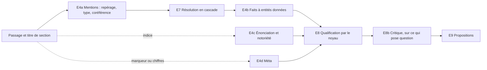

# Chantier : faire évoluer l'ingestion

**Statut :** document de travail, version 0.1 — 28 septembre 2026. Ce n'est pas un cadre : il consigne une réflexion en cours (brainstorm, mesures, choix déjà faits, questions ouvertes) pour qu'on puisse la reprendre. En cas de divergence, les cadres priment. Quand un choix sera acté, il passera dans *cadre-technique.md* (décisions `T-ING`) et dans l'analyse (section 00.xx), et sortira d'ici.

## 1. Point de départ

L'auteur a rassemblé des techniques d'ingestion de documents vers un graphe dans une note personnelle, hors dépôt (`ingestion-documents-graphe.md`). En résumé :

- une **chaîne d'étages spécialisés** plutôt qu'un gros modèle qui fait tout : parsing structurel, restructuration, extraction en cascade, résolution d'entités, validation, double indexation (graphe et vecteurs) ;
- une **cascade de coût** : règles et expressions régulières, NLP classique (spaCy), encodeurs spécialisés (GLiNER), petit modèle, gros modèle pour les cas ambigus, avec routage par confiance, pré-filtrage et distillation ;
- des **rôles spécialisés** : ontologiste, extracteurs d'entités, de relations, d'événements et d'affirmations, résolveur, critique, synthèse ; *gleaning* (« as-tu oublié quelque chose ? ») et vote entre extracteurs ;
- la **restructuration du texte** : contexte ajouté aux passages, coréférence résolue, réécriture en propositions autonomes, résumés hiérarchiques ;
- la **résolution d'entités en cascade** : normalisation, présélection, similarité, juge LLM pour les seuls cas ambigus ;
- des embeddings articulés au graphe, surtout utiles pour interroger le graphe (côté consommation plus qu'ingestion).

**Objectif du chantier** : étendre et optimiser l'ingestion de worldkit au-delà d'un seul appel à un gros modèle, pour un outil générique. Valmont ne suffira pas à établir ce cadre : il faudra plusieurs corpus (§7).

## 2. L'ingestion aujourd'hui

**Déjà déterministe, et plus complet que ce que suppose la note** : passages découpés et identifiés par empreinte (T-ING-10), cache d'extraction par passage (T-ING-09), ré-ingestion limitée au diff, regroupement des créations au niveau du lot (T-ING-07), qualification par le noyau (collisions, hors schéma, dépendances ; T-ING-03, T-ING-05), provenance par supports (T-ING-11), sortie contrainte et revalidée (T-ING-17), mesure T2 contre le gold.

**Un seul appel au modèle par passage fait six métiers** (`worldkit/periphery/llm_extractor.py`, prompt `SYSTEM`, 13 règles) : repérer les entités ; résoudre les mentions vers les identifiants connus ; extraire attributs et relations ; repérer les indices de notoriété ; gérer l'énonciation (affirmations *in_world*, paroles rapportées) ; produire le méta (`sheet_values`, `schema_constraint`). Le routage par tâche existe (T-LLM-01), mais une seule tâche est déclarée (`TASKS = ("extraction",)`).

| Idée de la note | Chez nous |
|---|---|
| Graphe lexical, provenance | partiel : document → passage → support ; **les titres de section sont jetés** (`declaration.py`), ni listes ni tableaux |
| Ingestion incrémentale | fait (T-ING-09, T-ING-10) |
| Restructuration (contexte, coréférence) | absent ; limite déjà notée au cadre technique §8 (« son frère », « ils ») |
| Cascade de modèles | absent : un seul niveau |
| Sorties structurées | fait (schéma JSON imposé, validateur unique M1) |
| Rôles spécialisés | absent |
| Critique | partiel : M1 vérifie la *forme* ; seul l'humain vérifie que le texte *soutient* le fait |
| Résolution d'entités en cascade | minimale : le modèle reçoit **toutes** les entités connues, puis regroupement par (type, nom normalisé) |
| Ontologiste, schéma guidé ou libre | absent ; le hors schéma est signalé (T-ING-13), rien ne le regroupe |
| Évaluation continue | fait (T2, `/measures`), sur un seul corpus |

## 3. Ce qu'on optimise

La note optimise un coût au volume. Notre situation est différente :

- **La ressource rare est l'attention de l'auteur.** Chaque proposition fausse coûte un geste de revue (T3). On optimise d'abord la **précision des propositions qui posent une question** et le **temps de revue**.
- **Le quota de l'abonnement est plafonné**, et aucun modèle local ne tourne sur la machine de l'auteur. Distillation, fine-tuning et petits modèles locaux ne sont pas réalistes aujourd'hui. L'auteur passe à l'API pour mesurer dans des conditions proches de l'usage attendu (facturé au token).
- **Le noyau sert de filet.** Un indice de secret raté ne fuit pas : le fait reste non qualifié, donc invisible en vue joueur (R-NOT-03). Une erreur d'extraction coûte de la revue, pas une fuite.
- **Un monde persistant fait revenir la question du coût** : envoyer toutes les entités connues à chaque appel ne tient pas à quelques centaines d'entités.

## 4. Mesures faites

Toutes sur le lot b1 de Valmont v1 (12 passages : `lieux-de-valmont`, `notes-baron` v1), Claude Sonnet 5, prompt version 3.

### 4.1 Qualité (mesure T2)

Précision 0,84, rappel 0,81 ; sur les seuls changements qui posent une question, précision 0,83, rappel 0,79. Classement des écarts :

| Passage | Écart | Classe | Coût en revue |
|---|---|---|---|
| notes p1 « Il gouverne la cité portuaire » | en trop : `brume.category = cité portuaire` | S, une désignation prise pour une valeur | une fausse anomalie (collision avec `port`) |
| notes p2 « du roi Mervin » | en trop : `mervin.title = roi` | G, vrai, absent du gold | aucun (support) |
| lieux p4 « Le Roi Gris régnait autrefois » | entité « Roi Gris » créée, alias d'Aldren II manqué | R, le piège connu | une fausse création |
| lieux p3 « repaire des contrebandiers » | faction, nom, `based_in` manqués | changements **optionnels** du gold | aucun |
| lieux p5 « plaines de Cendrelande » | `category = plaines` manqué | support omis | aucun |

**Lecture** : aucune hallucination sur b1. Les deux erreurs qui coûtent de la revue sont une valeur hors vocabulaire et une résolution ratée, malgré un monde minuscule : c'est un manque de contexte, pas d'échelle. L'erreur « cité portuaire » est **systématique** (6 appels sur 6). Prudence : 12 passages, une exécution, corpus optimiste (T-TST-01) ; b1 ne contient ni affirmations *in_world* ni méta. La mesure de J4 (0,73) portait sur tout le corpus, avec une version antérieure du prompt.

**Défauts de la mesure elle-même** : les changements `optional` du gold comptent comme manqués (sans eux, rappel sur les questions de 0,79 à 0,94) ; les supports vrais absents du gold comptent comme erreurs.

### 4.2 Coût et latence d'un appel `claude -p`

Un appel envoie environ 9 200 caractères, dont **83** pour le passage : règles 3 269, schéma de Valmont et systèmes 1 864, entités connues et en-tête environ 840, schéma JSON de sortie 3 188.

| | Avant correctif | Appel isolé |
|---|---|---|
| Tokens en entrée par appel | 39 016 | **4 889** |
| Durée, effort par défaut | 12,6 s | 9,9 s |
| Durée, effort bas | 6,4 s | 5,6 s |
| Démarrage du processus | 2,5 s | 1,5 s |
| Tours par appel (sortie structurée) | 2 | 2 |
| 4 appels simultanés | — | 10,9 s en tout |

- Environ 34 000 tokens par appel venaient de l'environnement de Claude Code (compétences, MCP, réglages, `CLAUDE.md`, mémoire). Ils sont retirés par le correctif (branche `llm-claude-code-allege`, T-LLM-01).
- La **réflexion** du modèle domine la durée (787 tokens sur 1 159 à l'effort par défaut). L'effort bas a rendu le même résultat deux fois plus vite sur ce passage ; à confirmer sur un lot entier.
- Le cache est partagé entre processus ; le parallélisme fonctionne en appel isolé.
- Les 338 s affichées par la première mesure étaient une **somme** des durées de passages, pas un temps écoulé (corrigé : `seconds` est désormais le temps écoulé).

## 5. Choix faits

Validés par l'auteur au fil du brainstorm, pas encore actés dans les cadres.

1. **Ordre du chantier** : A, précision et temps de revue ; puis B, résolution à l'échelle d'un monde persistant ; puis C, diversité des sources.
2. **Le critique met de côté, de façon visible, sans décider.** Une proposition jugée non soutenue quitte la file principale pour une liste « écartées par le critique », consultable, d'où on la reprend en un geste. Ce n'est pas une décision : elle n'entre pas dans la mémoire des décisions (R-PRI-04), et une nouvelle version du critique peut la faire revenir.
3. **Indications d'ingestion dans le schéma du monde**, versionnées dans le journal comme le reste du schéma, avec une **empreinte séparée** : seuls les étages qui les lisent sont invalidés, pas tout le cache.
4. **Références résolues** (« il » → odon) :
   - **hors journal** pour l'extraction : le *passage résolu* (texte original et annotations sur segments) est un artefact de pipeline, en cache ;
   - **dans le journal** dès qu'une note entre au wiki : les références sont recopiées dans l'édition de la note, qui vit ensuite sa vie. Un désaccord ultérieur avec la couche hors journal est signalé et se corrige par une édition, jamais en silence (R-HIS-01).
5. **Diagnostic avant construction** : mesurer d'abord un échantillon (b1, fait), puis le second jet du corpus, avec la grille de classement (§6.1).
6. **Adaptateur `claude-code` corrigé** (fait, branche `llm-claude-code-allege`) : prompt par fichier, appel isolé, binaire natif préféré au lanceur npm, mesure honnête (temps écoulé, échec signalé). Puis passage à l'API.
7. **Clé d'API propre à worldkit** : `WORLDKIT_ANTHROPIC_API_KEY`, parce que Claude Code utiliserait aussi `ANTHROPIC_API_KEY` et quitterait l'abonnement (fait).

## 6. Pistes retenues, à étudier

### 6.1 Diagnostic (A0)

Grille de classement des écarts, en trop comme manquants :

| Code | Classe | Remède visé |
|---|---|---|
| H | non dit, halluciné | critique, preuve citée |
| I | inféré, vrai mais implicite | règle de prompt, indication de schéma |
| S | forme de surface | normalisation, vocabulaire du schéma |
| G | gold incomplet | corriger le gold |
| R | résolution | cascade de résolution (B) |
| N | granularité (alias pris pour une entité, lieu générique) | rôle mentions, noms génériques exclus |
| T | temporel (« régnait autrefois ») | fenêtre de validité (plus tard) |
| V | énonciation, notoriété | rôle énonciation |

Séparer les écarts qui posent une question en revue de ceux qui sont des supports. Métrique à ajouter : **l'effort de revue simulé**, c'est-à-dire le nombre de gestes (accepter, refuser, adapter) pour passer des propositions à l'état gold. Le gold contient déjà des `mentions` par passage : l'étage de repérage et de résolution se mesure seul, sans nouvelle annotation (les pronoms restent à annoter).

### 6.2 A — Précision et temps de revue

Découper l'étage E4 en rôles :

- **Preuve citée** : chaque brouillon porte `evidence`, la phrase exacte qui le soutient. Une citation absente du passage est détectée sans appel ; la revue affiche la phrase. Probablement le plus gros gain de revue pour le moindre coût.
- **Schéma découpé** pour E4b : seules les relations compatibles avec les types des entités repérées. Prompt plus court, moins de choix hors sujet. Avec `claude-code`, cela éloigne aussi les limites de longueur.
- **Étages conditionnels** : E4c et E4d ne partent que sur indice (marqueurs, « en secret », « murmure-t-on », chiffres de fiche).
- **Critique placé après la qualification** : il ne juge que ce qui pose une question, jamais les supports. Petit modèle ; granularité réglable. Son banc d'essai : les sorties des mesures, étiquetées par la grille. Sur b1 il n'aurait rien corrigé (aucune hallucination) : son intérêt reste à démontrer sur d'autres lots.
- **Leviers de revue** : tri par confiance et dépendances, acceptation en lot des enrichissements soutenus sans collision, phrase source affichée.
- **Stratégies comparables** : garder la stratégie actuelle, monolithique, comme profil ; comparer avec `runs.diff` et `/measures`. Élargir `TASKS` (`mentions`, `facts`, `voice`, `meta`, `critic`) et régler **l'effort par étage**.
- **Granularité par étage**, dans le profil (`batch: passage | document | n`) : avec `claude-code`, chaque appel a un coût fixe (démarrage, 2 tours), donc regrouper est avantageux ; avec l'API, le prompt système est en cache et seules latence et qualité comptent ; avec un petit modèle local, des appels courts et ciblés sont plus fiables.

### 6.3 B — Résolution à l'échelle

- **Index déterministe** des noms, `aliases` et **titres dans l'état courant** : « le baron » désigne l'entité qui porte aujourd'hui ce titre, si elle est unique (indication `identifying: true`).
- **Cascade** : correspondance exacte, similarité de chaînes compatible avec le type, puis **liste courte** envoyée au modèle avec des **fiches verbalisées** tirées de l'état (« Aldren II, roi, lié à Hautval, mort pendant la Chute »). Aucun attribut `description` n'est nécessaire (T-ING-03 l'exclut). Classer les candidats par voisinage avec les autres mentions résolues du passage.
- **L'apprentissage passe par l'état** : accepter « le Roi Gris = Aldren II » ajoute un alias ; la résolution suivante devient exacte, sans appel.
- E4a repère les mentions sans recevoir toute la liste des entités : la taille du monde ne pèse plus que sur la liste courte.
- À tester sur un Valmont grossi (400 entités, homonymes, épithètes) en plus d'un corpus écrit.

### 6.4 C — Diversité des sources

- **Parsing** : chemin de titres comme contexte (« Brume › Quartiers › Le Port »), éléments de liste et lignes de tableau comme unités, règles pour les blocs de caractéristiques (`sheet_values` sans modèle). PDF plus tard, par un parseur dédié.
- **Ontologiste** : regroupe les hors schéma de plusieurs lots (`vassal_of`, `sworn_to`, `liege_of`), propose une extension canonique sous forme de proposition. Mode d'amorçage pour un univers sans schéma : extraction libre, schéma proposé, puis extraction guidée avec une catégorie « autre » surveillée.
- **Couche haute d'ontologie**, que tout schéma de monde étend (`extends`) : Personne, Lieu, Organisation, Événement, Objet, Créature ; familles de relations (spatiale, parenté, hiérarchie et pouvoir, appartenance, possession, participation). Extraction en deux temps (famille, puis relation du monde), T2 comparable entre corpus, compatibilité de type pour la résolution. Risque : forcer un univers dans des cases ; la couche doit rester minimale, avec « autre ».
- **Contrôle de rappel déterministe** : noms propres qu'aucun brouillon ne couvre ; relance ciblée seulement dans ce cas.

### 6.5 Indications d'ingestion dans le schéma (choix 3)

| Porté par | Indication | Sert à |
|---|---|---|
| Type | définition d'une phrase, exemples, noms génériques exclus | prompts, précision |
| Relation | verbes et tournures typiques (« prête serment à » → `vassal_of`) | règles, routage, E4b |
| Attribut | vocabulaire attendu, forme courte | normalisation (corrigerait « cité portuaire » → « port ») |
| Attribut | `identifying: true` | résolution par l'état |
| Tout élément | `labels` (R-SCH-09, préparé) | lexique des règles, affichage |

Le validateur les ignore : elles ne changent pas le sens du schéma.

### 6.6 Ingérer plus que les faits

Le cadre exclut la prose des faits pour éviter les collisions (T-ING-03). On peut alimenter le wiki sans clés de fait, en quatre niveaux :

1. **Passages liés aux entités** qu'ils mentionnent (mentions d'E4a) : la page montre ce que disent les documents (prolonge R-DOC-04). Sans fait, sans modèle en plus.
2. **Ce qui n'a pas été capturé** : grâce aux citations, les phrases qui n'ont produit aucun brouillon. Utile à l'auteur, et entrée de l'ontologiste.
3. **Notes** (`add_note`) : un espace de clés sans collision, comme les affirmations (R-DOC-08) ; texte, **facette** (apparence, caractère, histoire, habitudes), références résolues, source.
4. **Descriptions consolidées** :
   - fragments rangés par facette, avec leurs sources ;
   - une facette récurrente ou divergente (« yeux pâles » contre « yeux noirs ») devient un **attribut proposé** : les notes sont l'incubateur du schéma ;
   - une **description canonique** rédigée par un modèle est une proposition ; acceptée, elle *lit* ses fragments et passe à revérifier quand un nouveau fragment arrive (même logique que T-ING-06) ;
   - garde-fous : distinguer la voix (une chronique *in_world* n'est pas un portrait d'auteur, R-DOC-06 à R-DOC-08) ; une synthèse **par niveau de notoriété**, celle du joueur construite seulement à partir de fragments publics dont toutes les références sont publiques (R-NOT-03, R-NOT-04) ; déterminisme préservé, car rien n'entre dans l'état sans acceptation (T-ARC-03).

Une idée d'intrigue (« le baron pourrait trahir ») peut devenir une piste d'auteur proposée (R-SCN-09). Rumeurs et croyances restent hors périmètre (cadre de la fondation §1.4).

**Traduire une fois, lire plusieurs fois** : la résolution des références (« il a pris le trône ») est faite une seule fois et gardée, sous forme d'annotations sur le texte original plutôt que de réécriture. Raisons : la notoriété d'une note redevient calculable par le noyau (plafonnement par les entités citées, R-NOT-04) ; l'identité peut évoluer (`same_as`, R-IDT-04, redéfinition) ; la provenance reste exacte (R-HIS-01). Le passage résolu nourrit l'extraction, les notes, la consolidation, l'ontologiste et l'export.

### 6.7 Écartés ou reportés

Distillation et fine-tuning ; API batch ; embeddings structurels ; résumés hiérarchiques et résumés de communautés (servent à interroger, pas à ingérer) ; vote entre deux extracteurs en production (double le coût ; gardé pour T2) ; spaCy et GLiNER (peu adaptés aux noms inventés ; un repérage des noms propres suffit pour le rappel).

## 7. Corpus à venir

Chaque nouveau corpus met un levier à l'épreuve ; chacun demande un gold (l'extraction actuelle peut en proposer un brouillon, que l'auteur corrige, en signalant le biais).

| Axe de variation | Levier testé |
|---|---|
| Notes télégraphiques ou prose longue (chronique de 20 pages) | contexte, coréférence |
| Monde persistant de 300 entités ou plus, homonymes, épithètes | résolution en cascade |
| Blocs de caractéristiques, tableaux, supplément PDF | parsing, règles |
| Univers sans schéma, autre genre (SF, contemporain, horreur) | ontologiste, généricité du prompt |
| Beaucoup de secrets, de rumeurs, de documents *in_world* | rôle énonciation |
| Notes réelles de l'auteur (ratures, « à faire », hors-sujet) | pré-filtrage, précision |
| Français et anglais mêlés | valeurs, alias |

Le second jet de Valmont, écrit par l'auteur, reste attendu pour choisir le modèle (T-TST-01).

## 8. Évolutions du cadre à prévoir

Le cadre est appelé à évoluer ; ces tensions sont attendues, pas des obstacles.

| Point du cadre | Évolution probable |
|---|---|
| T-ING-09 cache | un cache par étage ; la clé contient l'entrée de l'étage (passage, contexte de section, sortie amont, empreinte des indications) ; la version de l'extraction devient la chaîne des versions |
| T-ING-10 passages | le contexte de section entre dans la clé : renommer un titre relance l'extraction de ce qu'il contient |
| T-ING-11 supports | un support porte une citation (passage et phrase exacte) |
| T-ING-17 erreur d'extraction | une erreur par étage ; sort d'un passage dont E4a réussit et E4b échoue |
| T-ARC-03 | nouvelle notion : la confiance, annotation de la périphérie, distincte de la qualification du noyau |
| R-PRI-04 mémoire des décisions | ne retient que des décisions humaines ; l'avis du critique n'en est pas une |
| R-PRI-03 symétrie du lot | tout contexte pris hors du document ne doit pas dépendre de l'ordre des documents |
| I-LLM-01 | un budget par étage ou par passage, en plus du plafond par exécution |
| R-NOT-04 | plafonnement de la notoriété par les références d'une note |
| R-SCH-05 | couche haute d'ontologie fournie par l'outil |
| Schéma | indications d'ingestion, ignorées du validateur, empreinte séparée |
| Cadre de la fondation §1.4 | « extension du schéma » et « inférence de systèmes », préparés, deviennent concernés (ontologiste) ; « fenêtre de validité diégétique », préparée, pourrait recevoir ce qu'on jette aujourd'hui (« régnait autrefois ») |
| T2 | indicateurs par étage, effort de revue simulé, optionnels du gold exclus, classement des écarts |

## 9. Questions ouvertes

1. Couche haute d'ontologie : oui ou non, et quel contenu minimal ?
2. Granularité des appels par étage : valeurs par défaut par adaptateur ?
3. Notes (`add_note`) et facettes : quel modèle exact, quelles facettes par défaut ?
4. Description canonique : statut, affichage, péremption ?
5. Fenêtre de validité diégétique : l'extraire, et sous quelle forme ?
6. Parsing structurel : jusqu'où (listes, tableaux, PDF) ?
7. Plan de corpus : lesquels écrire en premier, et qui annote ?
8. Effort bas : le confirmer sur un lot entier, par étage.
9. Les hallucinations (classe H) existent-elles ailleurs que dans b1 ? La Chronique de la Chute (b2, *in_world*) est le meilleur candidat.

## 10. Prochaines étapes

1. Pousser la branche `llm-claude-code-allege` (le push a échoué : identifiants GitHub à renouveler), puis la fusionner.
2. Mettre la clé dans `WORLDKIT_ANTHROPIC_API_KEY` (variable d'environnement utilisateur), redémarrer VS Code.
3. Relancer b1 sans cache avec l'adaptateur corrigé, pour confirmer le gain en conditions réelles.
4. Vérifier les tarifs de l'API, estimer le coût, puis mesurer b1 avec `api-sonnet` : point de comparaison entre les deux adaptateurs.
5. Mesurer b2 à b8 et classer les écarts avec la grille (§6.1).
6. Corriger la mesure : optionnels du gold exclus du rappel.
7. Réordonner A selon le diagnostic, puis commencer par le moins coûteux : vocabulaire du schéma et preuve citée.

## 11. Références

- *cadre-technique.md* §5 (T-ING-01 à T-ING-20), §8 (points ouverts), T-LLM-01.
- *cadre-interface.md* : pipeline en étapes E1 à E12, I-LLM-01.
- Code : `worldkit/periphery/llm_extractor.py` (prompt), `worldkit/ingest/declaration.py` (passages), `worldkit/ingest/stages.py` (étapes), `worldkit/periphery/evaluation.py` (mesure T2), `worldkit/periphery/llm/adapters.py` (adaptateurs).
- Gold de b1 : `corpus/valmont-v1/valmont/gold/b1-*.yaml`.
