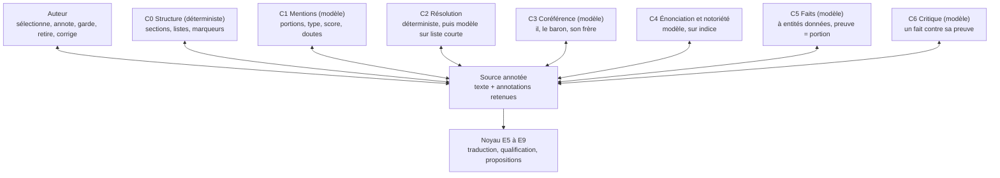

# Chantier : faire évoluer l'ingestion

**Statut :** document de travail, version 0.2 — 4 octobre 2026. Ce n'est pas un cadre : il consigne une réflexion en cours (brainstorm, mesures, choix déjà faits, questions ouvertes) pour qu'on puisse la reprendre. En cas de divergence, les cadres priment. Quand un choix sera acté, il passera dans *cadre-technique.md* (décisions `T-ING`), dans *cadre-interface.md* pour l'Atelier, et dans l'analyse (section 00.xx), et sortira d'ici. Le travail expérimental lui-même (fiches d'écart, expériences) vit dans [`docs/recherche-ingestion/`](recherche-ingestion/README.md).

## 1. Orientation

**Cible : des petits modèles.** L'ingestion est pensée pour bien marcher avec ce qu'offre un petit modèle (de l'ordre de 3 à 8 milliards de paramètres, contexte court), qu'il tourne en local ou soit hébergé. On cherche à faire **le mieux avec peu**. « Il faut un meilleur modèle » n'est jamais une solution admise ; ajouter du contexte à un prompt l'est, si le gain est mesuré.

**Une démarche de recherche.** Le chantier a aussi un but d'apprentissage. On ne court pas après le gold : on avance **par étape**, on observe des écarts précis, on les explique, on les corrige par le remède le moins coûteux, et on mesure (§4). Quand on bute sur un mur, on cherche dans la littérature et on essaie.

**Des couches spécialisées, mises à l'épreuve.** L'hypothèse de travail est qu'une chaîne de couches courtes et spécialisées, qui se communiquent leurs résultats, convient mieux à de petits modèles qu'un appel unique qui fait tout. C'est une hypothèse : chaque couche doit montrer ce qu'elle apporte, et l'architecture sera revue si elle ne tient pas.

**L'auteur dans la boucle.** L'attention de l'auteur n'est pas rare : elle est disponible, mais doit être bien employée. Quand une information n'existe que dans sa tête (« le Roi Gris est Aldren II »), on la lui demande plutôt que de multiplier les traitements pour la deviner. L'outil doit rendre cette contribution pratique et intuitive (§7).

## 2. Point de départ

L'auteur a rassemblé des techniques d'ingestion de documents vers un graphe dans une note personnelle, hors dépôt (`ingestion-documents-graphe.md`). En résumé :

- une **chaîne d'étages spécialisés** plutôt qu'un gros modèle qui fait tout : parsing structurel, restructuration, extraction en cascade, résolution d'entités, validation, double indexation (graphe et vecteurs) ;
- une **cascade de coût** : règles et expressions régulières, NLP classique (spaCy), encodeurs spécialisés (GLiNER), petit modèle, gros modèle pour les cas ambigus, avec routage par confiance, pré-filtrage et distillation ;
- des **rôles spécialisés** : ontologiste, extracteurs d'entités, de relations, d'événements et d'affirmations, résolveur, critique, synthèse ; *gleaning* (« as-tu oublié quelque chose ? ») et vote entre extracteurs ;
- la **restructuration du texte** : contexte ajouté aux passages, coréférence résolue, réécriture en propositions autonomes, résumés hiérarchiques ;
- la **résolution d'entités en cascade** : normalisation, présélection, similarité, juge LLM pour les seuls cas ambigus ;
- des embeddings articulés au graphe, surtout utiles pour interroger le graphe (côté consommation plus qu'ingestion).

Valmont ne suffira pas à établir le cadre : il faudra plusieurs corpus (§12).

## 3. L'ingestion aujourd'hui

**Déjà déterministe** : passages découpés et identifiés par empreinte (T-ING-10), cache d'extraction par passage (T-ING-09), ré-ingestion limitée au diff, regroupement des créations au niveau du lot (T-ING-07), qualification par le noyau (collisions, hors schéma, dépendances ; T-ING-03, T-ING-05), provenance par supports (T-ING-11), sortie contrainte et revalidée (T-ING-17), mesure T2 contre le gold.

**Un seul appel au modèle par passage fait six métiers** (`worldkit/periphery/llm_extractor.py`, prompt `SYSTEM`, 13 règles) : repérer les entités ; résoudre les mentions vers les identifiants connus ; extraire attributs et relations ; repérer les indices de notoriété ; gérer l'énonciation (affirmations *in_world*, paroles rapportées) ; produire le méta (`sheet_values`, `schema_constraint`). Le routage par tâche existe (T-LLM-01), mais une seule tâche est déclarée (`TASKS = ("extraction",)`). C'est exactement la forme de tâche qui met un petit modèle en difficulté.

| Idée de la note | Chez nous |
|---|---|
| Graphe lexical, provenance | partiel : document → passage → support ; **les titres de section sont jetés** (`declaration.py`), ni listes ni tableaux |
| Ingestion incrémentale | fait (T-ING-09, T-ING-10) |
| Restructuration (contexte, coréférence) | absent ; limite déjà notée au cadre technique §8 (« son frère », « ils ») |
| Cascade de modèles | absent : un seul niveau |
| Sorties structurées | fait (schéma JSON imposé, validateur unique M1) |
| Rôles spécialisés | absent |
| Critique | partiel : M1 vérifie la *forme* ; seul l'humain vérifie que le texte *soutient* le fait |
| Résolution d'entités en cascade | minimale : le modèle reçoit **toutes** les entités connues, puis regroupement par (type, nom normalisé) |
| Ontologiste, schéma guidé ou libre | absent ; le hors schéma est signalé (T-ING-13), rien ne le regroupe |
| Évaluation continue | fait (T2, `/measures`), sur un seul corpus |

## 4. Méthode : la boucle par écart

Le gold est un **instrument de diagnostic**, pas une cible. L'unité de travail est la **fiche d'écart** (modèle dans [`docs/recherche-ingestion/`](recherche-ingestion/README.md)) :

1. **Observer** un écart précis : un faux positif, un manque, une erreur de type ou de résolution.
2. **Classer** avec la grille (§10.1 : H, I, S, G, R, N, T, V).
3. **Expliquer** pourquoi le modèle s'est trompé : contexte manquant, vocabulaire absent, consigne ambiguë, tâche trop large, information absente du texte.
4. **Remédier**, dans cet ordre de préférence :
   1. corriger la mesure ou le gold ;
   2. une règle déterministe (parsing, normalisation, indication de schéma) ;
   3. une consigne ou un contexte différent, mesuré ;
   4. une contribution humaine (annotation, réponse à une question) ;
   5. une couche spécialisée nouvelle ou modifiée, traitée comme une **expérience** : hypothèse, mesure avant et après.
5. **Vérifier** : l'écart disparaît-il, sans en créer d'autres ? La fiche garde la trace.

Le remède 5 n'est pas un dernier recours honteux : c'est l'objet même de l'hypothèse des couches (§1). Mais il se justifie par une mesure, comme les autres.

Certains écarts ne sont pas un défaut du modèle mais **une information absente du texte**. « Le Roi Gris régnait autrefois » ne dit nulle part qu'il s'agit d'Aldren II : aucun traitement ne le trouvera de façon fiable, l'auteur le sait. Ces écarts relèvent du remède 4, et l'enjeu devient de rendre la contribution humaine rapide, puis réutilisable (l'alias accepté entre dans l'état et la résolution suivante est exacte, §10.3).

## 5. Ce qu'on optimise

- **La qualité atteignable avec un petit modèle**, couche par couche, et non la qualité du meilleur modèle disponible.
- **L'effort de l'auteur jusqu'à satisfaction** : nombre et coût des gestes (garder, retirer, corriger, ajouter) pour amener la source annotée et les propositions à l'état voulu. L'attention est disponible ; chaque geste doit rapporter.
- **Le rendement des contributions humaines** : une annotation posée par l'auteur doit économiser plus de gestes en aval qu'elle n'en coûte (§9).
- **Le coût et la latence par couche**, parce qu'un petit modèle local est lent et qu'un monde persistant fait revenir la question de l'échelle : envoyer toutes les entités connues à chaque appel ne tient pas à quelques centaines d'entités.

**Le noyau sert de filet.** Un indice de secret raté ne fuit pas : le fait reste non qualifié, donc invisible en vue joueur (R-NOT-03). Une erreur d'extraction coûte de la revue, pas une fuite.

## 6. Annotations : un tableau partagé

### 6.1 Principe

Les couches ne s'appellent pas entre elles : elles **lisent et écrivent des annotations sur le même texte**, et l'auteur intervient au même endroit. C'est l'architecture du *tableau noir* (*blackboard*) : des spécialistes autour d'un état commun. Les outils d'annotation assistée suivent ce modèle (Prodigy, INCEpTION et ses *recommenders*, les annotations déportées d'UIMA) : ce sont nos références.

**La source que le système connaît est la source annotée** : le texte (une copie de l'original si besoin) et les annotations retenues.

Les couches C1 à C6 découpent l'actuelle E4 (Extraction) et absorbent une partie d'E7 (Résolution). E5 à E9 restent au noyau, inchangées dans leur rôle. La liste des couches est elle-même une hypothèse : on en ajoutera, fusionnera ou retirera selon les mesures.

### 6.2 Forme d'une annotation

| Champ | Contenu |
|---|---|
| portée | une portion du texte (début, fin), un passage, ou la source entière |
| genre | mention, référence, ignorer, voix, secret, fait, note |
| valeur | selon le genre : type d'entité, identifiant (`aldren-ii`), changement proposé, texte libre |
| origine | l'auteur, ou une couche (nom, modèle, version du prompt) |
| score | confiance de la couche, en trois niveaux : `sure` (sûr), `likely` (probable), `doubt` (doute) |
| doutes | autres candidats, avec un motif court (« titre porté par deux entités ») |
| statut | proposée, gardée, retirée, corrigée |
| branche | `branch_id` (T-BRA-01) |

**Règle de relance.** Une couche relancée tient pour acquis tout ce que l'auteur a gardé, corrigé ou ajouté, et ne complète que le reste. Une annotation « ignorer » empêche la couche de reproduire un faux positif. Exemple : C1 propose « cité portuaire » comme lieu et rate « le Roi Gris » ; l'auteur pose « ignorer » sur le premier, sélectionne le second, relance ; C1 garde ces deux décisions et ne cherche que le reste.

**Score en niveaux.** Au premier prototype, la couche déclare un niveau plutôt qu'un nombre : un petit modèle calibre mal un score entre 0 et 1 (des 0,9 partout), alors que trois niveaux suffisent pour trier et accepter en lot. Un niveau `doubt` s'accompagne toujours de candidats et d'un motif. L'accord entre plusieurs tirages et les *logprobs* sont des expériences à comparer ensuite (§8.2), pas des prérequis.

**Doutes portés par le modèle.** Plutôt qu'un détecteur séparé qui pose des questions, la couche marque elle-même ses doutes dans ses annotations : c'est plus simple, et c'est une compétence mesurable (§9). Les détecteurs déterministes restent possibles là où ils sont triviaux (nom propre inconnu, titre porté par plusieurs entités), à évaluer selon leurs limites.

**Annotations de portée large.** L'auteur peut annoter la source entière (« chronique écrite par un partisan du baron », « le Roi Gris désigne Aldren II partout ») ou un passage (« ce paragraphe est une rumeur »). Elles généralisent la déclaration (E1) et la nature (E3), et entrent dans le contexte des couches.

**Les faits sont des annotations.** Une proposition de C5 est attachée à la portion qui la soutient : la preuve citée (piste de la v0.1) n'est plus une option, c'est la forme même du fait. La revue peut se faire sur la phrase.

### 6.3 Où vivent les annotations : le magasin d'atelier (choix 13)

Les annotations ne sont ni un calcul jetable (comme le cache d'extraction) ni des faits du monde. Ce sont pourtant, pour celles de l'auteur, des décisions humaines qu'il ne faut pas perdre.

- **Magasin d'atelier**, hors journal mais durable, en **ajout seul** (une correction est une nouvelle annotation qui remplace la précédente, l'historique reste), avec `branch_id` sur chaque annotation.
- **Dans le fichier du monde** (T-STO-02), dans des tables à part : les annotations de l'auteur sont des décisions humaines, pas des traces d'exécution (contrairement à `monde.runs.db`). Elles voyagent avec le monde quand on le copie ou le sauvegarde.
- **Lecture par lignée**, comme le journal : une branche voit les annotations de sa base jusqu'à son point de départ, sans copie ; une annotation posée sur la branche ne touche pas la base. Exemple : sur une branche de redéfinition, « le Roi Gris » peut désigner Odon sans toucher la Chronique de la Chute annotée en référence.
- **Le savoir sur le monde sort par proposition.** Une annotation qui affirme quelque chose du monde (« le Roi Gris » est un alias d'Aldren II) produit une proposition vers le journal ; acceptée, elle devient un fait, et la résolution suivante devient exacte. Une annotation locale (« ce *il* désigne Odon ») reste dans l'atelier.
- **Les notes qui entrent au wiki** recopient leurs références dans l'édition de la note (choix 4) ; un désaccord ultérieur avec l'atelier est signalé et se corrige par une édition, jamais en silence (R-HIS-01).

Le journal reste le monde ; l'atelier reste l'établi ; le passage de l'un à l'autre est une proposition.

### 6.4 Modifier une source déjà traitée

- **Texte et annotations stockés séparément** (annotations déportées), avec une **forme en ligne** exportable et réimportable, pour que l'auteur puisse annoter dans son propre éditeur. L'import d'un texte en ligne produit des annotations d'origine « auteur ».
- **Syntaxe en ligne** : celle des portions de Pandoc, une seule pour tous les genres, par exemple `[le Roi Gris]{ref=aldren-ii}`, `[cité portuaire]{ignore}`, `[membre du Cercle des Cendres]{secret}`. Les **liens Obsidian** `[[aldren-ii|le Roi Gris]]` sont lus à l'import comme des références, parce que beaucoup de MJ écrivent déjà ainsi. Le détail de la grammaire (clés, valeurs multiples, échappement) reste à écrire au prototype.
- **Recalage strict, par mots** : quand le texte change, une différence par mots, déterministe, recale les annotations. Une annotation dont la portion est intacte survit et suit le texte ; si un seul mot de sa portion change, elle devient **orpheline**, à revoir, jamais effacée. Corriger « Roi Gris » en « Roi gris » fait une orpheline, revalidée en un geste ; en contrepartie, « le Roi Blanc » ne garde jamais en silence la référence du « Roi Gris ». Les annotations de passage suivent l'alignement des passages (T-ING-10).
- **Relance ciblée** : le cache par couche est indexé par l'entrée de la couche (passage, annotations amont, empreinte des indications de schéma) ; seules les couches dont l'entrée a changé sont relancées.

À étudier : jusqu'où une source traitée reste retraitable sans tout refaire, et ce que coûte, en gestes, une modification du texte après la revue.

## 7. L'Atelier d'ingestion (interface)

Esquisse d'un espace dédié, à porter dans *cadre-interface.md* quand elle sera validée.

- **Entrée** : l'auteur colle ou importe un texte (Markdown, texte brut, texte en ligne annoté). Le texte devient une source de l'atelier.
- **Au centre, le texte** avec les annotations surlignées : une couleur par genre, l'opacité selon le score, une bordure pointillée quand la couche a un doute. Un filtre montre une couche à la fois, ou les seules annotations à revoir.
- **Sélection de texte** : une palette des genres s'ouvre, au clavier (`m` mention, `r` référence, `i` ignorer, `s` secret…), avec recherche d'entité pour une référence.
- **Clic sur une annotation** : un panneau montre son origine et son score, les doutes du modèle, les candidats avec leur fiche courte (« Aldren II, roi, frère de Mervin, père de Corvin »), et les actions : garder, retirer, changer, **appliquer à toutes les occurrences**.
- **Barre des couches** : chaque couche a un statut (non lancée, à revoir, satisfaite) et un bouton « relancer » ; l'estimation du coût est montrée avant l'appel (I-LLM-01). Un compteur indique ce qui reste à revoir.
- **Panneau des annotations de portée large** : notes sur la source entière ou sur un passage, et **questions libres** de l'auteur pour le contexte global.
- **Enchaînement rapide** : `g` garder, `x` retirer, flèches pour l'annotation suivante, à la manière de Prodigy. Un geste par décision.

**Rythme : l'auteur décide.** Il lance la couche qu'il veut, quand il veut, avec ou sans annotation préalable. Exemple : il colle le texte, lance C1, trouve un faux positif et un manque, pose « ignorer » sur le premier et ajoute le second, relance C1, puis passe à C2 quand il est satisfait. Rien n'impose une passe humaine ; tout la rend possible.

**Lien avec l'existant** : l'Atelier se branche sur le pipeline en étapes (I-PPL-01 à I-PPL-04). Partage avec la revue (`/review`) :
- **l'Atelier travaille une source** : annotations et faits sur le texte, garder ou retirer ;
- **`/review` reste la file du lot, entre sources** : collisions, dépendances, concurrence entre documents (« le conseil siège à Hautval » contre « à Brume ») ;
- les deux écrivent **les mêmes décisions** (R-PRI-04) : un fait gardé dans l'Atelier apparaît décidé dans `/review`, et inversement.

## 8. Haiku comme substitut d'un petit modèle

### 8.1 Plan

1. **Maintenant** : établir le cadre avec **Claude Haiku 4.5 par l'API** (profil `api-haiku`), en le traitant comme un petit modèle.
2. **En même temps** : construire l'outillage qui permet de comparer, couche par couche, deux modèles sur les mêmes entrées.
3. **Ensuite** : passer à un **petit modèle hébergé** (modèle ouvert de 7 à 8 milliards de paramètres, mêmes poids qu'en local), puis à un modèle local quand une machine le permettra.

### 8.2 Conditions de mise en place

1. **Contraintes simulées**, inscrites dans le profil et vérifiées à l'appel :
   - un **budget d'entrée de 4 000 tokens par appel**, réglable par une variable d'environnement (`WORLDKIT_LLM_INPUT_BUDGET`). Un dépassement **n'est pas refusé** : il est signalé (avertissement) et **mesuré** (tokens au-delà du budget, par appel et par couche), pour suivre l'écart d'une itération à l'autre. Par l'API, l'appel actuel tient dans le budget (3 538 tokens au plus sur b1) : les 4 900 tokens mesurés avec `claude -p` comprenaient le surcoût de Claude Code ;
   - une seule tâche par appel, un petit schéma de sortie ;
   - pas de réflexion étendue : Haiku 4.5 ne réfléchit pas par défaut et **refuse le paramètre `effort`** (refusé avant l'appel) ; température 0 dans le profil `api-haiku` (option `temperature`, envoyée seulement si donnée : Sonnet 5 la refuse).
2. **Rien de propre à Anthropic dans la conception.**
   - La sortie structurée a un équivalent local (grammaire d'ollama ou de llama.cpp, `format` de l'adaptateur `ollama`). Elle a ses limites : l'API refuse plus de 16 champs de type union ; le schéma de l'extracteur actuel en a 27, réécrits par l'adaptateur `anthropic-api` (chaîne vide pour null). Un petit schéma de sortie par couche évite le problème partout.
   - Le cache de prompt est une optimisation de coût, jamais une hypothèse de qualité.
   - Les *logprobs* ne sont pas fournis par l'API d'Anthropic, alors que les modèles locaux et certains hébergeurs les donnent. Le **score** doit donc avoir une définition qui s'en passe (score déclaré par le modèle, accord entre plusieurs tirages), puis une variante qui les exploite ; comparer les deux est une expérience.
3. **Mêmes prompts pour tous les adaptateurs**, rangés avec la couche (versionnés) ; seul l'adaptateur change.
4. **Enregistrement par appel** (fait) : identifiant du modèle, tokens d'entrée (cache compris) et de sortie, latence, coût, rattachés au passage ; les trois adaptateurs le remontent. Reste à rattacher l'artefact de la couche quand les couches existeront. La comparaison passe par `runs.diff` et `/measures`, étendus par couche.
5. **Biais annoncé** : Haiku est plus capable qu'un modèle de 8 milliards de paramètres. **Aucune conclusion de faisabilité** avant un contrôle croisé sur b1 avec un petit modèle hébergé.
6. **Coût** : estimation avant chaque mesure, accord de l'auteur (règle du dépôt) ; clé dans `WORLDKIT_ANTHROPIC_API_KEY`.

### 8.3 Conditions de passage au petit modèle hébergé

- les couches sont stabilisées sur b1 et b2 avec Haiku, et leurs mesures sont reproductibles ;
- un **adaptateur compatible OpenAI** existe (le même servirait pour ollama en local, qui expose ce protocole), avec repli sur un mode JSON simple et revalidation quand l'hébergeur ne gère pas le schéma ;
- la clé est dans une variable propre à worldkit (nom à fixer, sur le modèle de `WORLDKIT_ANTHROPIC_API_KEY`) ;
- **confidentialité** : un réglage par monde est prévu (synthétique : tout peut partir ; privé : local seulement, ou fournisseurs listés ; un appel vers un fournisseur non autorisé refusé avant l'envoi). Il est **désactivé pendant la phase de développement**, qui ne traite que des corpus synthétiques ; à activer avant d'ingérer de vraies notes ;
- le choix de l'hébergeur et du modèle est argumenté (taille, contexte, support du schéma, *logprobs*, prix).

## 9. Indicateurs

Mesurer couche par couche, en séparant ce qui revient à la couche de ce qu'elle hérite.

| Indicateur | Ce qu'il dit | Comment |
|---|---|---|
| **Qualité propre d'une couche** | ce qu'elle vaut seule | on l'alimente avec l'amont *gold* (mentions, résolution, coréférence, faits) ; le gold a déjà des `mentions` par passage, les pronoms restent à annoter |
| **Erreurs héritées** | ce que l'amont lui coûte | même couche avec l'amont réel ; l'écart avec la ligne précédente mesure la propagation |
| **Gestes jusqu'à satisfaction** | l'effort de l'auteur | auteur simulé qui corrige jusqu'au gold ; poids provisoires : garder 1 (il faut lire), retirer 1, changer 2 (choisir un autre candidat), ajouter 3 (sélectionner, choisir le genre, chercher l'entité), accepter en lot 1 par lot ; poids réglables, décomptes bruts publiés à côté ; calibration par les tests humains chronométrés (T3) |
| **Rendement d'une annotation** | faut-il recommander une passe humaine ? | gestes économisés en aval par annotation posée, avec et sans pré-annotation |
| **Utilité des scores et des doutes** | peut-on trier, ou accepter en lot ? | précision au-dessus d'un seuil ; part des doutes qui tombent sur une vraie erreur ; part des erreurs sans doute signalé |
| **Relances** | convergence | nombre de tours jusqu'à satisfaction ; erreurs nouvelles apparues à la relance |
| **Stabilité** | fiabilité | même entrée deux fois : écart entre les sorties |
| **Coût** | faisabilité avec un petit modèle | appels, tokens d'entrée et de sortie, latence, par couche |
| **Écarts par classe** | suivi de la recherche | décompte par classe de la grille, d'une itération à l'autre, lié aux fiches d'écart |

Précision et rappel restent calculés, mais comme colonnes parmi d'autres. Les deux indicateurs qui pilotent les décisions sont les **gestes jusqu'à satisfaction** et le **rendement d'une annotation**. Les changements `optional` du gold sont exclus du rappel ; les supports vrais absents du gold sont classés G, pas comptés comme erreurs.

## 10. Pistes retenues, à étudier

### 10.1 Diagnostic (A0)

Grille de classement des écarts, en trop comme manquants :

| Code | Classe | Remède visé |
|---|---|---|
| H | non dit, halluciné | critique, preuve citée |
| I | inféré, vrai mais implicite | règle de prompt, indication de schéma |
| S | forme de surface | normalisation, vocabulaire du schéma |
| G | gold incomplet | corriger le gold |
| R | résolution | cascade de résolution, annotation de l'auteur |
| N | granularité (alias pris pour une entité, lieu générique) | couche mentions, noms génériques exclus |
| T | temporel (« régnait autrefois ») | fenêtre de validité (plus tard) |
| V | énonciation, notoriété | couche énonciation |

Séparer les écarts qui posent une question en revue de ceux qui sont des supports.

### 10.2 A — Précision et temps de revue

- **Couches C1 à C6** (§6.1) à la place de l'appel unique ; l'actuelle stratégie monolithique reste un profil comparable (`runs.diff`, `/measures`). Élargir `TASKS` (`mentions`, `resolution`, `coref`, `voice`, `facts`, `critic`) et régler l'effort par couche.
- **Schéma découpé** pour C5 : seules les relations compatibles avec les types des entités repérées. Prompt plus court, moins de choix hors sujet : décisif pour un petit modèle.
- **Couches conditionnelles** : C4 et le méta ne partent que sur indice (marqueurs, « en secret », « murmure-t-on », chiffres de fiche).
- **Critique placé après la qualification** : il ne juge que ce qui pose une question, jamais les supports. Il met de côté de façon visible sans décider (choix 2). Son intérêt reste à démontrer : sur b1 il n'aurait rien corrigé.
- **Exemples tirés du monde** : les annotations gardées et les décisions acceptées servent d'exemples dans le prompt (*few-shot* par récupération). De l'apprentissage sans fine-tuning, à mesurer.
- **Leviers de revue** : tri par score et dépendances, acceptation en lot des enrichissements soutenus sans collision, phrase source affichée.
- **Granularité par couche**, dans le profil (`batch: passage | document | n`) : avec `claude-code`, chaque appel a un coût fixe, donc regrouper est avantageux ; avec l'API, seules latence et qualité comptent ; avec un petit modèle, des appels courts et ciblés sont plus fiables.

### 10.3 B — Résolution à l'échelle

- **Index déterministe** des noms, `aliases` et **titres dans l'état courant** : « le baron » désigne l'entité qui porte aujourd'hui ce titre, si elle est unique (indication `identifying: true`).
- **Cascade** : correspondance exacte, similarité de chaînes compatible avec le type, puis **liste courte** envoyée au modèle avec des **fiches verbalisées** tirées de l'état (« Aldren II, roi, frère de Mervin, père de Corvin »). Classer les candidats par voisinage avec les autres mentions résolues du passage.
- **L'apprentissage passe par l'état** : accepter « le Roi Gris = Aldren II » ajoute un alias ; la résolution suivante devient exacte, sans appel.
- C1 repère les mentions sans recevoir toute la liste des entités : la taille du monde ne pèse plus que sur la liste courte de C2.
- À tester sur un Valmont grossi (400 entités, homonymes, épithètes) en plus d'un corpus écrit.

### 10.4 C — Diversité des sources

- **Parsing** (C0) : chemin de titres comme contexte (« Brume › Quartiers › Le Port »), éléments de liste et lignes de tableau comme unités, règles pour les blocs de caractéristiques (`sheet_values` sans modèle). PDF plus tard, par un parseur dédié.
- **Ontologiste** : regroupe les hors schéma de plusieurs lots (`vassal_of`, `sworn_to`, `liege_of`), propose une extension canonique sous forme de proposition. Mode d'amorçage pour un univers sans schéma : extraction libre, schéma proposé, puis extraction guidée avec une catégorie « autre » surveillée.
- **Couche haute d'ontologie**, que tout schéma de monde étend (`extends`) : Personne, Lieu, Organisation, Événement, Objet, Créature ; familles de relations (spatiale, parenté, hiérarchie et pouvoir, appartenance, possession, participation). Extraction en deux temps (famille, puis relation du monde) : choix plus petits à chaque appel, favorable aux petits modèles. Risque : forcer un univers dans des cases ; la couche doit rester minimale, avec « autre ».
- **Contrôle de rappel déterministe** : noms propres qu'aucune annotation ne couvre ; relance ciblée seulement dans ce cas.

### 10.5 Indications d'ingestion dans le schéma (choix 3)

| Porté par | Indication | Sert à |
|---|---|---|
| Type | définition d'une phrase, exemples, noms génériques exclus | prompts, précision |
| Relation | verbes et tournures typiques (« prête serment à » → `vassal_of`) | règles, routage, C5 |
| Attribut | vocabulaire attendu, forme courte | normalisation (corrigerait « cité portuaire » → « port ») |
| Attribut | `identifying: true` | résolution par l'état |
| Tout élément | `labels` (R-SCH-09, préparé) | lexique des règles, affichage |

Le validateur les ignore : elles ne changent pas le sens du schéma.

### 10.6 Ingérer plus que les faits

Le cadre exclut la prose des faits pour éviter les collisions (T-ING-03). On peut alimenter le wiki sans clés de fait, en quatre niveaux :

1. **Passages liés aux entités** qu'ils mentionnent (annotations de C1 et C2) : la page montre ce que disent les documents (prolonge R-DOC-04). Sans fait, sans modèle en plus.
2. **Ce qui n'a pas été capturé** : les phrases qui ne portent aucune annotation de fait. Utile à l'auteur, et entrée de l'ontologiste.
3. **Notes** (`add_note`) : un espace de clés sans collision, comme les affirmations (R-DOC-08) ; texte, **facette** (apparence, caractère, histoire, habitudes), références résolues, source.
4. **Descriptions consolidées** :
   - fragments rangés par facette, avec leurs sources ;
   - une facette récurrente ou divergente (« yeux pâles » contre « yeux noirs ») devient un **attribut proposé** : les notes sont l'incubateur du schéma ;
   - une **description canonique** rédigée par un modèle est une proposition ; acceptée, elle *lit* ses fragments et passe à revérifier quand un nouveau fragment arrive (même logique que T-ING-06) ;
   - garde-fous : distinguer la voix (une chronique *in_world* n'est pas un portrait d'auteur, R-DOC-06 à R-DOC-08) ; une synthèse **par niveau de notoriété**, celle du joueur construite seulement à partir de fragments publics dont toutes les références sont publiques (R-NOT-03, R-NOT-04) ; déterminisme préservé, car rien n'entre dans l'état sans acceptation (T-ARC-03).

Une idée d'intrigue (« le baron pourrait trahir ») peut devenir une piste d'auteur proposée (R-SCN-09). Rumeurs et croyances restent hors périmètre (cadre de la fondation §1.4).

**Traduire une fois, lire plusieurs fois** : la résolution des références est faite une seule fois et gardée sous forme d'annotations sur le texte original, pas de réécriture. Raisons : la notoriété d'une note redevient calculable par le noyau (plafonnement par les entités citées, R-NOT-04) ; l'identité peut évoluer (`same_as`, R-IDT-04, redéfinition) ; la provenance reste exacte (R-HIS-01).

### 10.7 Écartés, reportés ou à reconsidérer

- **Reportés** : distillation et fine-tuning ; API batch ; embeddings structurels ; résumés hiérarchiques et résumés de communautés (servent à interroger, pas à ingérer).
- **À reconsidérer avec la cible petits modèles** :
  - **GLiNER** et encodeurs de repérage : légers, locaux, à essayer comme variante de C1 malgré les noms inventés (à mesurer, pas à présumer) ;
  - **vote ou tirages multiples** : écarté en production pour le coût, mais candidat comme définition du score (accord entre tirages) ;
  - spaCy : utile au mieux pour C0 (phrases, ponctuation), pas pour les noms inventés.

## 11. Mesures faites

Toutes sur le lot b1 de Valmont v1 (12 passages : `lieux-de-valmont`, `notes-baron` v1), Claude Sonnet 5, prompt version 3, avant le changement d'orientation : elles servent de point de départ, pas de référence pour les petits modèles.

### 11.1 Qualité (mesure T2)

Précision 0,84, rappel 0,81 ; sur les seuls changements qui posent une question, précision 0,83, rappel 0,79. Classement des écarts :

| Passage | Écart | Classe | Coût en revue |
|---|---|---|---|
| notes p1 « Il gouverne la cité portuaire » | en trop : `brume.category = cité portuaire` | S, une désignation prise pour une valeur | une fausse anomalie (collision avec `port`) — fiche [E-001](recherche-ingestion/E-001-cite-portuaire.md) |
| notes p2 « du roi Mervin » | en trop : `mervin.title = roi` | G, vrai, absent du gold | aucun (support) |
| lieux p4 « Le Roi Gris régnait autrefois » | entité « Roi Gris » créée, alias d'Aldren II manqué | R, le piège connu | une fausse création — fiche [E-002](recherche-ingestion/E-002-roi-gris.md) |
| lieux p3 « repaire des contrebandiers » | faction, nom, `based_in` manqués | changements **optionnels** du gold | aucun |
| lieux p5 « plaines de Cendrelande » | `category = plaines` manqué | support omis | aucun |

**Lecture** : aucune hallucination sur b1. Les deux erreurs qui coûtent de la revue sont une valeur hors vocabulaire et une résolution ratée, malgré un monde minuscule : c'est un manque de contexte, pas d'échelle. L'erreur « cité portuaire » est **systématique** (6 appels sur 6). Prudence : 12 passages, une exécution, corpus optimiste (T-TST-01) ; b1 ne contient ni affirmations *in_world* ni méta.

**Défauts de la mesure elle-même** : les changements `optional` du gold comptent comme manqués (sans eux, rappel sur les questions de 0,79 à 0,94) ; les supports vrais absents du gold comptent comme erreurs (corrections prévues, §9).

### 11.2 Coût et latence d'un appel `claude -p`

Un appel envoie environ 9 200 caractères, dont **83** pour le passage : règles 3 269, schéma de Valmont et systèmes 1 864, entités connues et en-tête environ 840, schéma JSON de sortie 3 188. Pour un petit modèle, ce rapport (1 % de texte utile) est le premier problème à traiter.

| | Avant correctif | Appel isolé |
|---|---|---|
| Tokens en entrée par appel | 39 016 | **4 889** |
| Durée, effort par défaut | 12,6 s | 9,9 s |
| Durée, effort bas | 6,4 s | 5,6 s |
| Démarrage du processus | 2,5 s | 1,5 s |
| Tours par appel (sortie structurée) | 2 | 2 |
| 4 appels simultanés | — | 10,9 s en tout |

- Environ 34 000 tokens par appel venaient de l'environnement de Claude Code ; ils sont retirés par l'appel isolé (T-LLM-01).
- La **réflexion** du modèle domine la durée ; l'effort bas a rendu le même résultat deux fois plus vite sur un passage, à confirmer sur un lot entier.

### 11.3 b1 sous Haiku 4.5, substitut d'un petit modèle (X-001)

Extracteur actuel inchangé, `api-haiku` (température 0), une passe, 4 octobre 2026 : précision 0,65, rappel 0,59 ; sur les questions, 0,50 et 0,47 (facultatifs neutres). 12 appels, 21,6 s, 42 374 tokens en entrée (au plus 3 538 par appel, aucun au-delà du budget), 0,051 $. Détail et classement dans [X-001](recherche-ingestion/X-001-b1-haiku-reference.md).

- **L'écart dominant est structurel** : « le conseil des marchands » n'est jamais créé comme entité ([E-003](recherche-ingestion/E-003-conseil-valeur.md)) ; une seule cause, 6 manqués et 2 en trop sur trois passages. Premier test naturel d'une couche C1 « mentions ».
- **Trois consignes explicites ignorées** (règles 5, 9, 10), dont deux citent le cas fautif mot pour mot (E-002, [E-004](recherche-ingestion/E-004-depuis-la-chute.md), [E-005](recherche-ingestion/E-005-regent-de-brume.md)). Un prompt de 13 règles dépasse ce que le modèle plus petit applique.
- **E-001 n'est pas reproduit** : Haiku infère moins, y compris à tort.
- Comparaison avec Sonnet à refaire avec la mesure actuelle (facultatifs neutres) ; stabilité à mesurer.

## 12. Corpus à venir

Chaque nouveau corpus met un levier à l'épreuve ; chacun demande un gold (l'extraction peut en proposer un brouillon, que l'auteur corrige dans l'Atelier, en signalant le biais).

| Axe de variation | Levier testé |
|---|---|
| Notes télégraphiques ou prose longue (chronique de 20 pages) | contexte, coréférence |
| Monde persistant de 300 entités ou plus, homonymes, épithètes | résolution en cascade |
| Blocs de caractéristiques, tableaux, supplément PDF | parsing, règles |
| Univers sans schéma, autre genre (SF, contemporain, horreur) | ontologiste, généricité du prompt |
| Beaucoup de secrets, de rumeurs, de documents *in_world* | couche énonciation |
| Notes réelles de l'auteur (ratures, « à faire », hors-sujet) | pré-filtrage, précision |
| Français et anglais mêlés | valeurs, alias |

Le second jet de Valmont, écrit par l'auteur, reste attendu (T-TST-01).

## 13. Choix faits

Validés par l'auteur au fil du brainstorm, pas encore actés dans les cadres.

1. **Ordre du chantier** : A, précision et temps de revue ; puis B, résolution à l'échelle d'un monde persistant ; puis C, diversité des sources.
2. **Le critique met de côté, de façon visible, sans décider.** Une proposition jugée non soutenue quitte la file principale pour une liste « écartées par le critique », consultable, d'où on la reprend en un geste. Ce n'est pas une décision : elle n'entre pas dans la mémoire des décisions (R-PRI-04), et une nouvelle version du critique peut la faire revenir.
3. **Indications d'ingestion dans le schéma du monde**, versionnées dans le journal comme le reste du schéma, avec une **empreinte séparée** : seules les couches qui les lisent sont invalidées.
4. **Références résolues** (« il » → odon) : hors journal pour l'extraction (dans l'atelier, choix 13) ; recopiées dans l'édition d'une note dès qu'elle entre au wiki, qui vit ensuite sa vie. Un désaccord ultérieur est signalé et se corrige par une édition, jamais en silence (R-HIS-01).
5. **Diagnostic avant construction** : mesurer un échantillon, classer les écarts avec la grille (§10.1).
6. **Adaptateur `claude-code` corrigé** (fait) : prompt par fichier, appel isolé, binaire natif, mesure honnête.
7. **Clé d'API propre à worldkit** : `WORLDKIT_ANTHROPIC_API_KEY` (fait).
8. **Cible : petits modèles** (§1). Changer de modèle pour un plus gros n'est jamais un remède ; ajouter du contexte l'est, si le gain est mesuré.
9. **Méthode par écart** (§4) : fiches d'écart dans `docs/recherche-ingestion/`, ordre des remèdes, gold comme instrument.
10. **Couches spécialisées comme hypothèse de recherche** (§6.1) : à mettre à l'épreuve, et à revoir si elles n'apportent rien.
11. **Les annotations sont la monnaie d'échange** entre les couches et avec l'auteur ; la source que le système connaît est la source annotée (§6). La couche marque elle-même ses doutes.
12. **L'auteur décide du rythme** : il lance, corrige, relance chaque couche jusqu'à satisfaction ; annotation possible avant comme après (§7).
13. **Magasin d'atelier** pour les annotations : hors journal, durable, en ajout seul, `branch_id` sur chaque annotation ; le savoir sur le monde en sort par proposition (§6.3).
14. **Haiku 4.5 par l'API comme substitut** d'un petit modèle, sous les conditions du §8 ; puis petit modèle hébergé, puis local.
15. **Indicateurs par couche** (§9), pilotés par les gestes jusqu'à satisfaction et le rendement des annotations.
16. **Atelier dans le fichier du monde, lu par lignée** (§6.3) : tables à part, hors journal, en ajout seul ; une branche voit les annotations de sa base jusqu'à son point de départ, sans copie.
17. **Syntaxe en ligne** `[texte]{...}`, avec lecture des liens Obsidian à l'import (§6.4).
18. **Score en trois niveaux avec doutes** pour le premier prototype ; les autres définitions sont des expériences (§6.2).
19. **Budget d'entrée de 4 000 tokens par appel, avec avertissement** et mesure du dépassement, réglable par variable d'environnement (§8.2).
20. **Recalage strict, par mots** : portion intacte, l'annotation suit ; un mot changé, elle devient orpheline (§6.4).
21. **Atelier pour une source, `/review` pour le lot**, mêmes décisions des deux côtés (§7).
22. **Poids provisoires des gestes** 1-1-2-3, réglables, décomptes bruts publiés (§9).
23. **Confidentialité par monde**, prévue mais désactivée pendant le développement (§8.3).

## 14. Questions ouvertes

1. **Hébergeur et modèle** pour la deuxième étape (taille, contexte, support du schéma, *logprobs*, prix).
2. Couche haute d'ontologie : oui ou non, et quel contenu minimal ?
3. Notes (`add_note`) et facettes : quel modèle exact, quelles facettes par défaut ? Description canonique : statut, affichage, péremption ?
4. Fenêtre de validité diégétique : l'extraire, et sous quelle forme ?
5. Parsing structurel : jusqu'où (listes, tableaux, PDF) ?
6. Plan de corpus : lesquels écrire en premier, et qui annote (l'Atelier peut servir d'outil d'annotation du gold) ?
7. Les hallucinations (classe H) existent-elles ailleurs que dans b1 ? La Chronique de la Chute (b2, *in_world*) est le meilleur candidat.

## 15. Évolutions du cadre à prévoir

Le cadre est appelé à évoluer ; ces tensions sont attendues, pas des obstacles.

| Point du cadre | Évolution probable |
|---|---|
| T-ING-09 cache | un cache par couche ; la clé contient l'entrée de la couche (passage, contexte de section, annotations amont, empreinte des indications) ; la version de l'extraction devient la chaîne des versions |
| T-ING-10 passages | le contexte de section entre dans la clé ; le recalage des annotations s'ajoute à l'alignement par empreinte |
| T-ING-11 supports | un support porte une portion du texte (l'annotation de fait) |
| T-ING-17 erreur d'extraction | une erreur par couche ; sort d'un passage dont C1 réussit et C5 échoue |
| T-ARC-03 | nouvelles notions : l'annotation et son score, produits de la périphérie, distincts de la qualification du noyau ; l'annotation de l'auteur, décision humaine hors journal |
| T-STO-02 | le fichier du monde reçoit les tables du magasin d'atelier, hors journal |
| T-BRA-01 | `branch_id` sur les annotations ; lecture par lignée, sans copie |
| R-PRI-04 mémoire des décisions | ne retient que des décisions humaines sur des propositions ; l'avis du critique n'en est pas une ; les annotations de l'auteur vivent à part |
| R-PRI-03 symétrie du lot | tout contexte pris hors du document ne doit pas dépendre de l'ordre des documents |
| I-LLM-01 | un budget par couche ou par appel, en plus du plafond par exécution |
| I-PIP-01 et pipeline E1 à E12 | E4 découpée en couches C1 à C6, relançables séparément ; E7 en partie absorbée par C2 |
| Espaces de l'interface | un espace nouveau : l'Atelier (§7) |
| R-NOT-04 | plafonnement de la notoriété par les références d'une note |
| R-SCH-05 | couche haute d'ontologie fournie par l'outil |
| Schéma | indications d'ingestion, ignorées du validateur, empreinte séparée |
| Cadre de la fondation §1.4 | « extension du schéma » et « inférence de systèmes », préparés, deviennent concernés (ontologiste) ; « fenêtre de validité diégétique », préparée, pourrait recevoir ce qu'on jette aujourd'hui (« régnait autrefois ») |
| T2 | indicateurs par couche (§9), optionnels du gold exclus, classement des écarts |
| T-LLM-01 | adaptateur compatible OpenAI ; usage (tokens, coût) remonté par tous les adaptateurs ; contraintes de profil simulant un petit modèle |

## 16. Prochaines étapes

1. **Outillage de mesure** (fait) : facultatifs du gold neutres ; usage par appel (tokens, coût) dans les trois adaptateurs ; budget d'entrée mesuré (`WORLDKIT_LLM_INPUT_BUDGET`) ; température 0 pour `api-haiku`.
2. **Profil « petit modèle simulé »** (fait) : `api-haiku`, température 0, sans réflexion ni effort, budget d'entrée mesuré.
3. **Mesurer b1 avec l'extracteur actuel sous Haiku** (fait, [X-001](recherche-ingestion/X-001-b1-haiku-reference.md)) : fiches E-003 à E-005 ouvertes, E-001 et E-002 complétées. Reste : stabilité (`repeat=2`) et comparaison juste avec Sonnet.
4. **Traiter les écarts** par les remèdes les moins coûteux, en commençant par E-003 (le plus coûteux) : indication de schéma, puis annotation de l'auteur, puis C1 ; E-001 et E-005 par un vocabulaire d'attribut ; E-002 par l'annotation (alias) ; mesurer chaque essai.
5. **Prototype du modèle d'annotation** (forme du §6.2, magasin d'atelier minimal, règle de relance), puis **C1 seule** mesurée contre les `mentions` du gold, avec et sans pré-annotation.
6. **Prototype de l'Atelier** : texte, surlignage, sélection et palette, garder/retirer, relance de C1.
7. Ensuite : C2 (résolution en cascade), puis C5 (faits à entités données), chacune avec sa fiche d'expérience.

## 17. Références

- *cadre-technique.md* §5 (T-ING-01 à T-ING-20), §8 (points ouverts), T-LLM-01.
- *cadre-interface.md* : pipeline en étapes E1 à E12, I-PPL-01 à I-PPL-04, I-LLM-01.
- Code : `worldkit/periphery/llm_extractor.py` (prompt), `worldkit/ingest/declaration.py` (passages), `worldkit/ingest/stages.py` (étapes), `worldkit/periphery/evaluation.py` (mesure T2), `worldkit/periphery/llm/adapters.py` (adaptateurs).
- Gold de b1 : `corpus/valmont-v1/valmont/gold/b1-*.yaml`.
- Annotation assistée : Prodigy (Explosion), INCEpTION (TU Darmstadt, *recommenders*), UIMA (annotations déportées, CAS) ; architecture du tableau noir (*blackboard systems*).
- Journal de recherche : [`docs/recherche-ingestion/`](recherche-ingestion/README.md).
